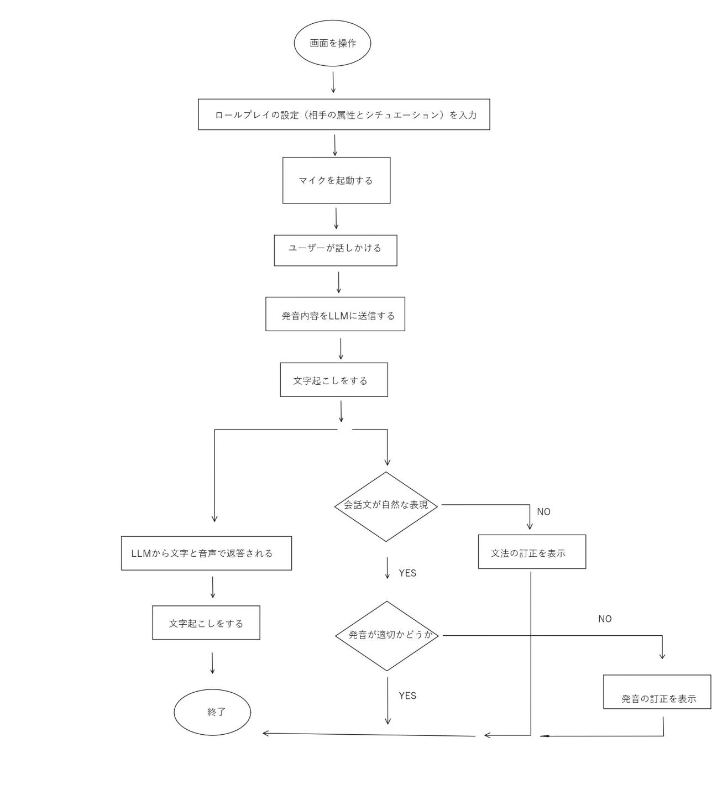
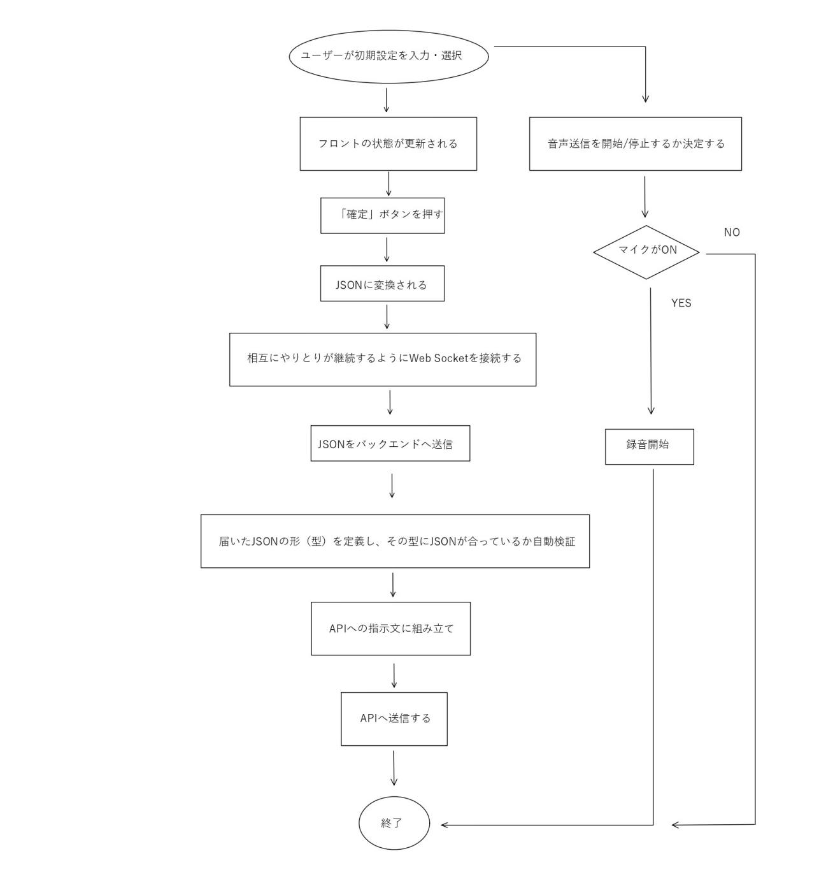

# Mingo — リアルタイム会話機能（論文）

> OpenAI Realtime API と Google Gemini Live API を用いたリアルタイム会話機能の実装と比較（WER・コスト・レイテンシ）。

## 序論

近年では、世界の言語学習アプリ市場は2034年までに438億ドルに達すると予測され、この期間の年間平均成長率は17.1％という高い水準にあります。(Debadatta Patel,2026)

特にこの言語学習アプリにおいて、AIチャットボットとの会話、特にリアルタイム会話機能では流暢さ、発音、語彙想起力を大幅に改善させることが分かっています。

しかしこれには、文法・発音・語彙の使用においてリアルタイムで修正案が提示されたり、音声認識技術と音声合成技術を組み合わせることで多様なアクセントや速度でのリスニング練習が可能になり、さらにAIは正しい発音や文構造のモデルを提示するため、学習者はそれを繰り返し聞くことで単語の音を識別する「ボトムアップ処理」能力を高めることができます。これらの要因によりユーザーの第二言語学習における言語スキルの向上に飛躍的な影響を与えることができます。(Watcharapol Wiboolyasarin,2025)

しかし一般的な個人向け有料プランでは月額9.99ドルから最大19.9ドルへと個人で気軽に言語学習を行いたいユーザーへの負担はいまだに高いままです。

## 実装

ここで今回は、リアルタイム会話機能（発音訂正、文法訂正機能を含む）を作成し、有料会員に転換したユーザー１人あたりの平均月間収益である約8.34ドルを、最大月額の19.9ドル以下で提供しても上回る収益を出せるまでの低価格の原価を実現し、尚且つそれに対するレイテシ、聞き取り・文字起こしの精度を比較することで使用するAPI候補のトレードオフを探ります。

今回実装する大まかなシステムの流れは以下の通りです。まずユーザーは画面からAIの属性、どのようなシチュエーションかをテキスト入力で決定し、学習言語、解説言語、そしてどの会話速度を想定するかをボタンで決定します。入力が確定されたら、ユーザーはマイク機能をONにします。これでユーザーはいつでもAIに対して会話を行うことができ、途中で割り込みが起きても自動で検出・対応ができます。まずユーザーの発言は画面上で文字起こしされ、この時の発言内容が文法的に正しいかどうかをLLMが判定し、正しくなければ訂正された文章と、なぜその文章が適切なのかを自然言語で返答します。この時、LLM-as-a-Judgeでその文章が文法的に正しいかを確認指せて、それでも正しくなければ表示することで精度の向上を目指します。

もし正しければユーザーの発言を音素レベルで解析し、解析結果をLLMで二段階で解析することで、ユーザーの発音・リンキングをどう改善するべきかをこれも同じく自然言語で返答します。もしこれらの訂正があろうと、なかろうとAIはユーザーの回答に対する返答と質問を返すこととします。さらにそれは文字起こしされ、将来的にはAIの返答やヒント機能に対するリピート再生機能、そして入力した母国語を学習言語に翻訳、学習言語を入力することで文法、単語、イディオムを視覚的（色や矢印）に表示する検索機能を追加できるようにしたいと考えます。また同じく89％のユーザーがモバイルデバイスから教育コンテンツにアクセスしている現状を踏まえて将来的にはアプリ化することも視野に入れる構造とします。



[図1：全体のシステムの流れ]

まず初期設定についての流れをハッキリさせます。

ここでは、ユーザーはまずAIの属性とシチュエーションをテキスト入力で決定します。

そして学習言語、解説言語、そしてどの会話速度を想定するかをボタンで決定します。

また、ここでマイクをONにするかOFFにするかを決定します。

これらの情報はフロントで行われ、JSONという形でバックエンドへと送られます。そしてバックエンドがAPI（OpenAIまたはGemini）へAIへの指示文に組み立ててOpenAIに送ります。またマイクのONとOFFはフロントのみで処理されます。



[図2：初期設定の流れ]

まず「ユーザーが初期設定を入力・選択」する時に使う関数を作成します。

まず設定は二種類あります。ここでまず、設定の状態を保存する変数（A）とその変数を変更する関数（B）、そして変数の最初の中身（C）を以下のように決めます。

```
import { useState } from "react";

const[A,B] = useState('C')
```

これに従い、それぞれのボタン（言語選択、AIの属性とシチュエーション、マイクの設定）を保存する項目を用意します。

```
//== ボタンの設定を保存する項目 ==//

const[role,setRole] = useState('')//AIの属性を決定する。ここではテキスト入力を想定し初期状態は0にする
const[situation,setSituation] =  useState('')//AIのシチュエーションを決定する。ここではテキスト入力を想定し初期状態は0にする
const[targetLang,setTargetLang] = useState('en')//学習言語を設定する。初期状態は英語
const[explainLnag,setExplainLang] =  useState('ja')//説明に使用する言語を設定する。初期状態は日本語
const[speed,setSpeed] = useState(0)//スレイダー式で速度を変更する。この時初期状態は0
const[micOn,setMicOn] = useState(true)//マイクをオンにする。初期状態はON
```

次にこのボタン、スライダー、テキストを入力し変更できるUI部分を作成します。

まず今回使用するReactで基本的な文法は以下のようになります。

```
<Input.../>//HTMLの入力欄
value={A}//設定の状態を保存する変数（A）が入力欄に表示される

e//onChange や onClick のようなイベントは、起きたときに React が自動で「イベント情報」を渡す。それをeが受け取る
(引数) =>　処理 //引数を受け取り、その引数で処理をする
B//設定の状態を変更する関数
e.target//イベントが起きた相手である入力欄
e.target.value//その入力欄の今の値
(e) => B(e.target.value)//入力された値を状態を変える関数Bに渡すと状態Aが更新される
onChange = {}//入力を状態に書き込む
```

これに基づいて、テキスト入力は以下のようになります。

```
<Input value={A} onChange = {(e) => B(e.target.value)}/>
```

ここでまずAIの属性とシチュエーションは以下のようになります。

```
<Input value={role} onChange = {(e) => setRole(e.target.value)} placeholder = "AIの属性"/>
<Input value={situation} onChange = {(e) => setSituation(e.target.value)} placeholder = "シチュエーション"/>
```

次に言語設定に移ります。

今回は後の拡張性を考慮し、言語の一覧を個別に作成します。具体的には以下のように言語のかたまり（オブジェクト）を作ります。

```
{code:'A',label:'B'}
A//保存用の値
B//表示用の値
```

これをリスト形式に並べたデータになります。

```
//== 言語選択におけるオブジェクトをリストに並べたもの ==//
const LANGUAGE =[
  {code:'en',label:'英語'},
  {code:'ja',label:'日本語'},
  {code:'ru',label:'ロシア語'},
```

これを選択できる状態にします。

今回目指すUIは「学習言語:」をクリックすると、英語、日本語、ロシア語、といった度トップダウン形式の箱が出現し、そこからクリックできる各選択肢が出現します。

```
<label>//学習言語:のかたまり全体を表示
<select>//ドロップダウンの箱
<option>//クリックで出る各選択肢
```

これを使うと、以下のようにUIを設計できます。

```
<label>
学習言語:
  <select value={targetLang} onChange = {(e) => setTargetLang(e.target.value)}>
    <option value = "en">英語</option>
    <option value = "ja">日本語</option>
    <option value = "ru">ロシア語</option>
  </select>
</label>
```

次はスピードメータを作成します。

完成形のUIはバーを右へ動かすと0から0.5、1と増加し最大2まで0.5ずつ増加します。

左はそのマイナスバージョンになります。

```
<label>
  会話速度
  <input
    type = "range"
    min={-2}
    max={2}
    step={0.5}
    value={speed}
    onChange={(e) => setSpeed(Number(e.target.value))}//Numberで文字を数値に直す
    />
</label>
```

次はマイクのONとOFFを決める

今回は単純なONとOFFの切り替えなので、値は読まないので引数は要らないです。これを踏まえると以下のようになります。

```
<label>
  マイク:
  <button onClick={() => setMicOn(!micOn)}>
    {micOn ? 'ON':'OFF'}
  </button>
</label>
```

次にこれらの設定を状態に保存していますが、これらの情報はまだバックエンドに送信できません。そのためこれからまずバックエンドを先に作ってから「確定」ボタンをフロントで作成したいと思います。つまりこれらの状態をJSONの形式で送信する時に、そのJSONの形を定義して検証する機構と、それをAPIへの指示文に組み立てる必要があります。ではそれをバックエンドに移り作成します。

```
from pydantic import BaseModel #型チェックの土台を取り出す。これがあるおかげで自動でJSONがチェックされる。

class SessionConfig(BaseModel):#フロントから届くJSONの「型」を定義
    role:str#AIの属性（文字）
    situation:str#シチュエーション（文字）
    targetLang:str#学習言語（文字）
    explainLang:str#母国語（文字）
    speed:float#会話速度（少数）
```

まずこれでJSONの型を定義し、それぞれの値がどのような型なのかを定義します。次にこれらの設定オブジェクトを入れるとAIへの指示文を出力する関数を作ります。

```
##== APIにわかるようにJSONからの返答の形式を整える ==##
def build_instructions(config:SessionConfig):
    return(
        f"You are {config.role}.The situation is:{config.situation}."
        f"When you answer use {config.explainLang}."
        f"Keep your replies 7 sentences."
    )
```

これで、AIに送る形に整える関数ができました。

次にエンドポイントを作ります。このエンドポイント①はフロントが音声会話を始めようとしたときにバックエンドに受け口を用意し、これまで用意したbuild_instructionsなどの関数を起動します。これによりAPIに初期設定を送信したあと、音声通信をずっと開放し、出力としてAPI側の音声や文字をフロントへ送信する中継地点になります。また他に将来的に必要なエンドポイントとして会話文が自然かどうかを判定するエンドポイント②、そして発音に対するアドレスをするエンドポイント③が必要になります。

これを作るためにFastAPIというエンドポイントの作成、リクエストの受理、データチェック、返事をJSONにするを肩代わりしてくれます。

```
from fastapi import FastAPI
app = FastAPI() #サーバーを作る

@app.websocket("/realtime")        # ①
async def realtime(...): ...
@app.post("/grammar")               # ②
async def grammar(...): ...
@app.post("/pronunciation")         # ③
async def pronunciation(...): ...
```

流れとしては、フロントで「確定」ボタンを押すと/realtimeエンドポイントが起動し会話が開始されます。まずユーザーが何かを話すと、OpenAIが文字起こしをして/realtimeエンドポイントが中継しフロントにユーザーの文字起こしが届く。そのときにフロントのコードが自動で反応し、フロントが/grammarエンドポイントと/pronunciationエンドポイントが起動するといった流れになります。ではまず/realtimeエンドポイントを作成していきます。またエンドポイントでは、エンドポイントのすぐ下の一つの関数のみが処理されます。

まず/realtimeエンドポイントはブラウザから来る音声を聞いてAIへ流し、AIから来る音声を聞いてブラウザに流します。つまりこれを同時にやる必要があるため、async def で定義した関数を同時に回す必要があります。

```
import asyncio
```

次にOpenAIを使う場合に証明書エラーで止まることを防ぐために以下を使います。

```
import truststore
truststore.injcet_into_ssl()
```

そしてAPIキーを安全に使うために「.envファイルを読み込む関数」を用意します。

```
from dotenv import load_dotenv
```

さて、これから/realtimeエンドポイントの中身を書いていきます。流れとしてはWebSocketで送受信を開き、フロントで設定した初期設定を受け取ります。そして作成したSessionConfig関数で送られてきた初期設定が型通りか検査し、build_instructions関数で中身からAPI向けの指示文を生成します。

まず/realtimeエンドポイントにWS接続が来たら、フロントの接続要求を受理します。

```
await websocket.accept()
```

次にフロントが送信したJSON文字を受信し、変数firstに保存します。

```
 first = await websocket.receive_text()
```

そして保存した変数が欲しい型通りかどうか、そしてその型通りのオブジェクトを作って返す。

```
 config = SessionConfig(role=d["role"], situation=d["situation"], targetLang=d["targetLang"],
              explainLang=d["explainLang"], speed=d["speed"])
```

しかし、これでは長すぎるため、まず

```
json.loads(first)
```

これで文字をJSON文字をPythonのdictに直します。次に

```
**json.loads(first)
```

これで元の欲しい形（ key=value の引数）にします。

最終的に送る形にして以下のように変数に指示文を格納します

```
  instructions = build_instructions(config)
```

次にAPIキーを取り出して変数に格納します。

```
api_key = os.environ.get("OPENAI_API_KEY")
```

OpenAIはリクエスト字にキー、つまり身分証を見せないと門前払いします。

そこでAPIに送るリクエストにあるヘッダーを付けます。

まず「認証情報をここに書きます」といった決まった名前であるAuthorizationです。そしてBearer token方式（トークンを持っている人を本人とみなす）を使うために以下のコードを使います。

```
headers = [("Authorization","Bearer"+api_key )]
```

そしてOpenAIのリアルタイム窓口にキーを添えて（最大16MBまで受信OK）で電話をかけ、その回線をopenai_ws	と付け、withを抜けたら自動で切るwebsocketとの間で中継する準備が整えます。まず

```
 async with
```

で「開いて使って自動で閉じる」構文を作ります。

普通の関数では相手の返信が来るまで待ち続けると、それのためだけに他の全ての処理が止まりますが、この async でそれを回避します。またユーザーが会話の終了ボタンを押したとしても、それはフロントとバックエンドの回線が切れるだけで、バックエンドとOpenAIとの回線を切るわけではありません。そこでフロントとバックエンドの回線切断をきっかけにwithがバックエンドとOpenAIとの回線を自動で切断します。

次にOpenAIのURLにWebSocket接続を開きます。ここではOpenAIの住所（API）に認証情報（headers）を付けて、最後に大きな音声も受け取れる設定でWebSocket接続を開きます。そして開いた回線をopenai_wsと命名し、ブルックを抜けたら自動で閉じるようにします。ここでWebSocketライブラリは初期設定だと「１メッセージ最大１MBくらい」という制限がるため、max_size上限を16MBまで上げます。1024で1KB、そしてさらに1024をかけて1MBにして、それに16をかけることで16MBにします。

```
async with websocket.connect(
        REALTIME_URL,
        additional_headers=headers,
        max_size=16*1024*1024,
    )as openai_ws:
```

最後に、この回線を使用してAIに会話のプロンプトを送信します。具体的には最初に変数に格納したAIのプロンプトの他に、AIがどのように声で返すか、そして割り込みができて尚且つ声を文字起こしするかどうかまで指示します。

この回線の使い方は以下のようになります。

```
await openai_ws.send(json.dumps({設定}))
```

awaitでopenai_wsを.sendを完了しきるまで待ちます。送る中身は辞書形式なので、json.dumpsで辞書をJSON文字列に変換します。

```
await openai_ws.send(json.dumps({
    "type":"session.update",#メッセージの種類を「設定の更新」にする
    "session":{#設定の中身
        "type":"realtime",
        "output_modalities":["audio"],#返事を音声にする
        "instructions":instructions,#build_instructions(config)で作ったAIに対する指示文
        "audio":{
            "input":{},#マイク側の設定
            "output":{}#スピーカー側の設定
        }
    }

}))
```

そしてマイクの設定は、リアルタイム会話を実現したい、つまり「届いた瞬間に処理したい」ので解凍不要のPCM形式にします。またモデルは音声を十分拾える24HZに設定します。またユーザーが話し終わったのを自動で判断する設定にすることにします。するとマイクの設定は以下のようになります。

```
 "input":{
                    "format":{"type":"audio/pcm","rate":24000},
                    "turn_detection":{"type":"server_vad"},#沈黙したら（無音が継続すれば終わり）と認識する
                    "transcription":{"model":"gpt-4o-trasncribe"},
                },#マイク側の設定
```

スピーカーの設定は以下のようになります。

```
 "output":{
                    "format":{"type":"audio/pcm","rate":24000},
                 "voice": "marin",
                }#スピーカー側の設定
```

全体の関数はこれになります。

```
async def realtime(websocket:WebSocket): 
    await websocket.accept()
    first = await websocket.receive_text()
    config = SessionConfig(**json.loads(first))
    instructions = build_instructions(config)
    api_key = os.environ.get("OPENAI_API_KEY")
    headers = [("Authorization","Bearer "+api_key )]
    async with websockets.connect(
        REALTIME_URL,
        additional_headers=headers,
        max_size=16*1024*1024,
    )as openai_ws:

        await openai_ws.send(json.dumps({
         "type":"session.update",#メッセージの種類を「設定の更新」にする
        "session":{#設定の中身
            "type":"realtime",
            "output_modalities":["audio"],#返事を音声にする
            "instructions":instructions,#build_instructions(config)で作ったAIに対する指示文
            "audio":{
                "input":{
                    "format":{"type":"audio/pcm","rate":24000},
                    "turn_detection":{"type":"server_vad"},#沈黙したら（無音が継続すれば終わり）と認識する
                    "transcription":{"model":"gpt-4o-transcribe"},
                },#マイク側の設定
                "output":{
                    "format":{"type":"audio/pcm","rate":24000},
                 "voice": "marin",
                }#スピーカー側の設定
            },
        },
    }))
```

ここまではAPIへの送信設定だけを一回送信しましたが、次は音声を中継する必要があります。まずユーザーがフロントからOpenAIへ送信する回線（A)、そしてOpenAIがフロントへ返信する回線（B）の二つが必要です。この回線を同時に開き、どちらか一方が切断された時点で処理を止めます。

まず回線（A）を実装します。

```
async def frontend_to_openai():
    try:
        while True:
            msg = await websocket.receive_text()

            await openai_ws.send(msg)
        
        except WebSocketDisconnect:
            pass
```

ここではまずフロントから１つ情報を受け取り、完了するまで待ちます。

その後、その内容をOpenAIにそのまま送り、もしフロントが切れたら（WebSocketDisconnect）、エラーを受け止めてループを抜けます。

回線（B）は以下のようになります。

```
async def openai_to_frontend():
    try:
        async for msg in openai_ws:
            await websocket.send_text(msg)
    
    except websocket.exceptions.ConnectonClosed:

        pass
```

これはOpenAIから１つずつ情報を受け取り、一個ずつそれをフロントへ送信します。

もしOpenAIが切れたら（websocket.exceptions.ConnectonClosed）、エラーを受け止めてループを抜けます。

ではこの二つの関数を同時実行するためにasyncioというスケジューラーを使用します。

```
task_a = asyncio.create_task(frontend_to_openai())
task_b = asyncio.create_task(openai_to_frontend())
```

これにより、二つの関数を同時に実行します。

```
await asyncio.wait({task_a, task_b}, return_when=asyncio.FIRST_COMPLETED)
        task_a.cancel()
        task_b.cancel()
```

これにより、最初の１つが終わったら戻るとします。

次にフロントで確定ボタンを作っていきます。

まず確定ボタンを押されたら以下の関数が起動するようにします。

```
 function startConversation(){
    const config = {role,situation,targetLang,explainLang,speed};
    const ws = new WebSocket("ws://localhost:8000/realtime");
    ws.onopen = () =>{
      ws.send(JSON.stringify(config));
    }
  }
```

ここにおいて

```
WebSocket("ws://localhost:8000/realtime");
```

これは、バックエンドのエンドポイントである/realtimeを呼びます。

```
 ws.onopen = () =>{
      ws.send(JSON.stringify(config));
    }
```

このうち、以下の行はconfigという変数に格納したオブジェクトを文字列に変換してws.send()でバックエンドに送ります。

```
  ws.send(JSON.stringify(config));
```

またこれを送るタイミングはwebsocketが開いたタイミングであるので、接続が開いたときのイベントであるonopenという枠を使い、繋がったらws.send()が実行されるようにします。

最後にstartConversation関数を確定ボタンで起動できるようにします。

```
<button onClick={startConversation}>確定</button>
```

最後に図２のフローチャートの右側を作りたいと思います。

ここではマイクボタンを押すたびに、確定ボタンとは関係なく音声データがバックエンドに送信されます。

まずマイクが押されると、useStateで値(micOn)が変更されます。

しかし値が変わるだけで、値が変わったら何かを実行する関数が必要があります。ここでReactからuseEffectという関数をインポートしたいと思います。

この関数は以下のような構造を持つことができます。

```
useEffect(() => {
  //実行したいコード
},[監視する値]);
```

今回監視する値はmicOnであり、その値によって中のコードが実行されます。例えばmicOnがONになれば録音を開始する関数(startRecording)を起動し、OFFになれば録音を停止する関数(stopRecording)を起動します。

```
useEffect(() => {
  if(micOn) startRecording();
  else stopRecording();
},[micOn]);
```

startRecording関数では、録音機を準備して音のかたまりが来るたびにバックエンドに送る役割を担います。具体的には一回だけ録音機を準備し、音声のかたまりが来たら送るを登録します。するとマイクがONの間だけずっとかたまりが来たら送るを繰り返すようにします。

ここでwavtoolsライブラリをインストールし、音声処理をそのメソッドで一部簡略化します。

```
async  function startRecording(){//関数内でawaitを使うため、asyncを使う
    if(!recorderRef.current){
      recorderRef.current = new WavRecorder({sampleRate:24000});//録音機が無ければ録音機を作成する
      const recorder = recorderRef.current;
    }
    if(recorder.getStatus()==="ended"){//録音機の状態が終了したいたら、録音機をスタートする
        await recorder.begin();
    }

    if(recorder.getStatus()!== "recording"){
        await recorder.record((data)=>{
          sendAudio(data.mono);//monoはチャンネル数は１本とすることを明示し、音の塊を送る
        });
    }
  }
```

ここで、生の音声をJSONで送れるように文字にする必要があります。ここでバイナリを文字に変換するのがbase64となります。

```
function sendAudio(pcm16){
  const ws = wsRef.current;//接続(ws)を保存する箱から接続を取り出す

  const isConnected = ws && ws.readyState === WebSocket.OPEN;//接続が存在しない、または開いていないならここで終了
  if(!isConnected)return;
  const base64 = pcm16TOBase64(pcm16);//音をbase64にする
  const message = {
    type:"input_audio_buffer.append",
    audio:base64,
  };
  ws.send(JSON.stringify(message));
}
```

また音をbase64にする際には、まず音声を一個ずつの小さな数字の並びとしてみて、文字をためる空の入れ物に、数字を文字に変換したものをどんどんつなげていき、文字列をbase64に変換して返すといった処理を挟む必要があります。

```
function pcm16TOBase64(pcm16: Int16Array){
  const bytes = new Uint8Array(pcm16.buffer);//音声をバイトの並びとして見る
  let binary = "";//空の文字列を用意
  for(let i = 0; i<bytes.length;i++)
    binary += String.fromCharCode(bytes[i]);//各バイトを文字にしてためる
  return btoa(binary);//文字列をbase64にして返す
}
```

これにて初期設定は全て終わりました。

次にAIの返信を受信し、文字起こしする機能を追加したいと思います。

そこでユーザー側とAIの発言を文字起こしする機能を実装します。

```
    ws.onmessage = (e) => {//メッセージが届き次第実行する
      const msg = JSON.parse(e.data);//parseは文字列をオブジェクトに変更する
      if(msg.type === "conversation.item.input_audio_transcription.completed"){//自分の発言
        setMyText(msg.transcript);
      }

      if(msg.type === "response.output_audio_transcript.done"){//AIの発言
        setAiText(msg.transcript);
      }
```

以上にて基本的な機能の実装が完了しました。

## 評価・実験

今回はリアルタイム会話機能を可能にするLLMのAPIであるOpenAI Realtime APIとGoogle Gemini Live APIを比較したいと思います。実装に必要な処理を可能な限り小さくするために今回は自前パイプライン（音声認識（ユーザーの発話をテキストに変換）、音声モデル（そのテキストを受け取り、返答テキストを生成）、音声合成（返答テキストを音声に変換して再生））の実装は控えることにします。

まず今回測定する精度については、WERを使用したいと思います。

WERは音声認識システムなどの性能を測定するための代表的な指標です。(Debadatta Patel,2026)。これでは認識された文章が正解の文章からどれだけ乖離しているかを以下の計算式で算出します。

$$
WER = \frac{S + D + I}{N}
$$

（単語誤り率 WER）

Sは誤った単語に置き換わった数、Dはあるべき単語が消えた数、Iは無いはずの単語が追加された数、Nは正解文章の総単語数になります。これはWERの数値が低いほど、音声認識の精度が高いことを示します。そしてコストとレイテシも同時に計測し、それらのトレードオフから実装するAPIを決定します。今回はFLEURSと呼ばれる102言語をカバーする多言語音声認識・処理のためのベンチマークおよびデータセット(Conneau, A., et al. ,2022)を利用したいと思います。流れとしては、まずFLEURSで正解文を取得し、音声をAPIに送ります。そしてAPIがした文字起こしを取得し、正解文と返答文の両方から句読点や小文字を除去します。そしてそれぞれの文章をリストに貯めて、まとめてWERをjiwerというWER（誤り率）を計算してくれる、専用のPythonライブラリを使用して測定したいと思います。

しかしまずOpenAIと同じ

## 考察

## 結論

デプロイ・本番運用

開発ログ

（2026/08/02①）

会話内容が毎回上書きされるという問題が生じたため、チャット形式で会話履歴が残るように変更する。

```
const[messages,setMessages] = useState<{who:string,text:string}[]([]);
```

ここで{who:...,text:...}はオブジェクト１個の形とし、[]でその配列、<>でこの型をuseStateに伝える書き方になります。

次にmessagesの今のリスト(prev)に新しいリストを次々と足していく。

```
 setMessages(prev => [...prev,{who:"You",text:msg.transcript}]);
```

ここで、prevという今のリストに...prevで全部展開をする。ここで[...prev,新]で古いの全部＋新しい１つの新しいリストの形になる。

```
style = {{display:"flex",flexDerection:"column",gap:"8px",maxWidth:"500px"}}
```

ここでは、flexで並べ、columnで縦に積む。そしてgapで8pxとして吹き出しの隙間を開けて、横いっぱいに吹き出しが広がらないようにmaxWidthを500pxに調整した。

```
messages.map((m,i) => <div>...</div>
```

これで各メッセ―ジごとに<div>を一個ずつ作ることで、全メッセージが吹き出しになる。

```
<div style = {{display:"flex",flexDirection:"column",gap:"8px",maxWidth:"500px"}}>
  {messages.map((m,i) => (
    <div key={i} style={{
      alignSelf:m.who === "You"?"flex-end":"flex-start",
      background:m.who === "You"?"#cce5ff":"#eeeeee",
      padding:"8px 12px",
      borderRadius:"12px",
    }}>
      {m.text}
    </div>
    ))}
    </div>
```

（2026/08/02②）

会話に成功したが、こちらの会話が途中で細かく区切られてしまうという問題が発生したため、沈黙を待つ時間を長くする。ここではバックエンドでAPIに送るJSONの中身を以下のように設定します。

```
"turn_detection":{
                            "type":"server_vad",
                            "silence_duration_ms":1200,#沈黙を1.2秒待つ
                        },
```

しかし、これでも意味的な区切りを理解できていないようなので、以下のように設定し直します。

```
"turn_detection":{
                            "type":"server_vad",
                            "eagerness":"low",
                            "silence_duration_ms":1200, 
                        },#沈黙したら（無音が継続すれば終わり）と認識する
```

しかし、これではeagernessはsemantic_vad の設定なので無効になるため、

```
"turn_detection":{
                            "type":"semantic_vad",
                            "eagerness":"low",
                        },#意味的に話し終わったかで区切る（eagerness:low=しっかり待つ）
```

これに変更しました。

結果的に長文の返答に対応できるようになった。

（2026/08/02③）

履歴削除ボタンを追加

```
<button onClick={() => setMessages([])}>履歴を削除</button>
```

(2026/08/02④)

AIの返答を音声再生させるようにし、任意に各返答を繰り返し再生できるようにします。この時、まずスライダーで初回のAIの返答速度が決定されるようにするだけではなく、後からスライダーの値を変更して、その値を反映した上でテキストを再びAPIに送信し、音声をその都度新規再生し、自然な音階で再生できるようにします。具体的な流れとして、テキストとスライダーの速度を受けとり、音声を生成させて返答するだけになります。

(2026/08/02⑤)

spaCyに文まるごとを1回だけ解析させる（文脈ありなので矢印が正しい）

LLMには「どこで節を区切るか」の境界だけ教えてもらう

描画時に、各単語の矢印を所属する節の行に振り分けて、節ごとにカード／行を分けて見せる

さらにその中で文法を聞きたいとき、その箇所について自由に質問できる（それ以外は検索できないようにすることでAPIの無駄遣いを防ぐ）

AIの返答を音声再生させるようにし、任意に各返答を繰り返し再生できるようにします。

(2026/08/02⑥)

学習者が英語で発話（音声会話モデルが直接受ける）

コード分析が必要な場面で、会話モデルがfunction calling でツールを呼ぶ

そのツールが Claude Agent SDK を起動 → リポジトリを探索・分析 → 構造化した所見（JSON）を返す

会話モデルがその所見を英語で噛み砕いて音声で説明

CI/CD（GitHub Actions）でテストコードを書きます。

「なぜその責務分離にするのか」「なぜそのDB設計なのか」「なぜそのAPI設計なのか」を明確にする。

またどうしてこの処理順か、DBへの問い合わせが増えたときは何が起こるのかを明確にする

なぜそのアプリを作ったのか、なぜその技術を選んだのか、どんな課題にぶつかったのか、どう解決したのかを説明できる状態を目指します。 実際、面接で評価される人は、「この機能を作りました」という話だけではなく、「最初はこう設計したけれど問題があったのでこう変えました」「パフォーマンスの問題があったのでこう改善しました」といった思考プロセスを語れます。 そこにエンジニアとしての考え方が見えるからです。 例えばAIを使って作ったとしても、 「認証部分はAIに提案してもらいましたが、理解できなかったので調べ直して実装し直しました」 とか、 「最初はテーブル設計が悪くてデータの整合性に問題が出たので修正しました」

開発過程を残しておくことがかなり重要だと思っています。 GitHubのコミット履歴でもいいですし、設計メモでもいいですし、開発日記でもいいです。

Debadatta Patel(2026),Language Learning Apps Market Outlook

Watcharapol Wiboolyasarin(2025), AI-driven chatbots in second language education: A systematic review of their efficacy and pedagogical implications

Debadatta Patel(2026),Language Learning Apps Market Research Report 2034,

Language Learning Apps Market Research Report 2034

Conneau, A., et al. (2022). FLEURS: Few-shot Learning Evaluation of Universal Representations of Speech.
