# Mingo

## 序論 / Introduction

言語学習において、最も危惧される問題は調べた言語を使わずに放置してしまうと、すぐに忘れてしまいます。これを「massed practice」と呼びます。そしてそれらの表現を使ったり復習したりしないと、「忘却曲線」に従って記憶は時間と共に指数関数敵に減衰し、最終的には思い出せなくなります。(Settles & Meeder ,2016)

> In language learning, the biggest concern is that if you leave the language you looked up unused, you quickly forget it. This is called "massed practice." If those expressions are not used or reviewed, memory decays exponentially over time following the "forgetting curve," and eventually you can no longer recall them. (Settles & Meeder, 2016)

例えば記憶の理論であるエビングハウスのモデルによれば、最後に練習してからの経過時間が、その単語が記憶に留まる期間である「半減期」にたいして長くなると、その単語を正しく思い出す確率はほぼゼロになります。

> For example, according to Ebbinghaus's model of memory, when the time since the last practice becomes long relative to the "half-life"—how long the word stays in memory—the probability of correctly recalling the word drops to almost zero.

これに対し、間隔を空けて繰り返し使う間隔反復をすることで、長期記憶における半減期を伸ばすことができ、記憶を定着させることが可能になります。

> In contrast, spaced repetition—using the word repeatedly at intervals—can extend the half-life in long-term memory and make the memory stick.

しかしながら、現在の言語学習アプリ（Duolingoのようなアプリ）ではその単語や表現を翻訳問題のような形式的なレッスンで振り返ることはできても、自由な会話を通じて単語の使用を追跡し、それを間隔反復のアルゴリズムにフィードバックしているものは少ないです。

> However, while current language-learning apps (such as Duolingo) let you review words and expressions in formal lessons like translation exercises, few track word use in free conversation and feed it back into a spaced-repetition algorithm.

また記憶の定着において、自由な会話や対話型AIとのやり取りは、文脈の中で特定の単語や表現を自力で思い出す必要があるため、強力な想起練習として機能します。(Dongliang Ding1,2　& Ahmad Muhyiddin B Yusof,2025)

> Moreover, for memory retention, free conversation and interaction with conversational AI act as powerful retrieval practice, because learners must recall specific words and expressions on their own in context. (Dongliang Ding1,2 & Ahmad Muhyiddin B Yusof, 2025)

他にも研究では単なる再学習を行ったグループに比べ、想起練習と間隔を開けた学習を組み合わせたグループの方が、語彙の習得と保持において約２倍の改善を示しました。(Nur Basak Karatas,2025)

> Other research has also shown that, compared with a group that simply relearned, a group that combined retrieval practice with spaced learning showed about twice the improvement in vocabulary acquisition and retention. (Nur Basak Karatas, 2025)

以上より、AIによる自由会話で知らなかった語彙や表現を自ら使用することがスピーキングの向上に不可欠でありますが、既存の多くのAI会話ボットはあらかじめ用意された設定に基づいたロールプレイや、一般的なトピックでの質問応答に留まりがちです。しかし、学習者が過去に自分で調べ、一度はインプットしたものの、まだ話す時に引き出せない独自の語彙を会話の文脈の中で動的に再活性化させ、自発的な言語使用を促すレベルには達していません。(Theme 4,Dongliang Ding1,2　& Ahmad Muhyiddin B Yusof,2025)

> From the above, actively using unfamiliar vocabulary and expressions in free conversation with AI is essential for improving speaking. However, many existing AI conversation bots tend to stop at role-play based on preset scenarios or question-and-answer on general topics. They have not reached the level of dynamically reactivating, within the context of conversation, the learner's own vocabulary—words the learner looked up and took in once but still cannot retrieve when speaking—to encourage spontaneous language use. (Theme 4, Dongliang Ding1,2 & Ahmad Muhyiddin B Yusof, 2025)

またこれまでの間隔反復モデルや単語定着予測アルゴリズムは、主にドリル演習やフラッシュカード、穴埋め問題といった個別的な「静的学習」を対象に適用されてきました。(2.2 Spaced Repetition and Practice,Settles & Meeder ,2016)

> In addition, existing spaced-repetition models and word-retention prediction algorithms have mainly been applied to isolated "static learning" such as drills, flashcards, and fill-in-the-blank exercises. (2.2 Spaced Repetition and Practice, Settles & Meeder, 2016)

これらの語彙保持のためのシステムを、実際のリアルタイム会話のコンテキストとシームレスに結合させ、AIからの動的な会話に対して最も適合するメモした表現をRAGによってマッチングして、「回答のヒント」としてリアルタイムに差し出す技術的アプローチはまだ十分に開拓されていません。つまり従来のアプリではこれらの語彙をその場面で咄嗟に調べたりすることは困難です。ここで本研究では、学習者個人のメモを意味検索(embedding)で取り出し、習得度・間隔反復で並べ替えて会話のその場で提示するシステム Mingo を設計・実装し、その有効性を検証します。

> A technical approach that seamlessly combines these vocabulary-retention systems with the context of actual real-time conversation—matching, via RAG, the memorized expressions that best fit the AI's dynamic conversation and offering them as "answer hints" in real time—has not yet been sufficiently explored. In other words, with conventional apps it is difficult to look up such vocabulary on the spot. In this study, we design and implement Mingo, a system that retrieves the learner's own memos by semantic search (embedding), ranks them by mastery and spaced repetition, and presents them on the spot during conversation, and we evaluate its effectiveness.

今回実装する大まかなシステムの流れは以下の通りです。まずユーザーは画面からAIの属性、どのようなシチュエーションかをテキスト入力で決定し、学習言語、解説言語、そしてどの会話速度を想定するかをボタンで決定します。入力が確定されたら、ユーザーはマイク機能をONにします。これでユーザーはいつでもAIに対して会話を行うことができ、途中で割り込みが起きても自動で検出・対応ができます。まずユーザーの発言は画面上で文字起こしされ、この時の発言内容が文法的に正しいかどうかをLLMが判定し、正しくなければ訂正された文章と、なぜその文章が適切なのかを自然言語で返答します。

> The overall flow of the system implemented here is as follows. First, on the screen, the user decides the AI's role and the situation by text input, and chooses the learning language, the explanation language, and the expected conversation speed with buttons. Once the input is confirmed, the user turns the microphone ON. From then on, the user can speak to the AI at any time, and interruptions are detected and handled automatically. The user's speech is first transcribed on the screen; an LLM then judges whether the utterance is grammatically correct, and if not, it replies in natural language with a corrected sentence and an explanation of why that sentence is appropriate.

もし正しければユーザーの発言を音素レベルで解析し、解析結果をLLMで解析することで、ユーザーの発音・リンキングをどう改善するべきかをこれも同じく自然言語で返答します。もしこれらの訂正があろうと、なかろうとAIはユーザーの回答に対する返答と質問を返すこととします。さらにそれは文字起こしされ、将来的にはAIの返答やヒント機能に対するリピート再生機能、そして入力した母国語を学習言語に翻訳、学習言語を入力することで文法、単語、イディオムを視覚的（色や矢印）に表示する検索機能、メモした表現をヒントとして提示し、習得度を可視化する機能を追加できるようにしたいと考えます。

> If it is correct, the user's speech is analyzed at the phoneme level, and the results are analyzed by an LLM, which replies—again in natural language—with how the user should improve their pronunciation and linking. Whether or not there are corrections, the AI responds to the user's answer and asks a follow-up question. This is also transcribed. In the future, we would like to be able to add a replay feature for the AI's replies and hints, translation from the native language into the learning language, a search feature that visually displays grammar, words, and idioms (with colors and arrows) when the user enters text in the learning language, and a feature that presents memorized expressions as hints and visualizes the user's level of mastery.

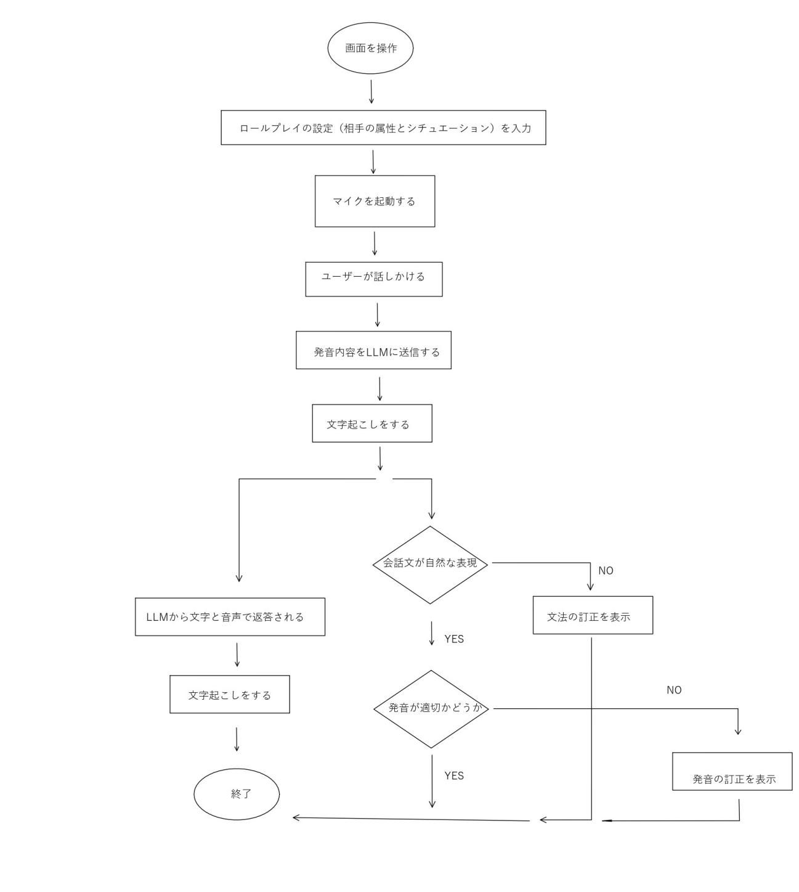

*図1：全体のシステムの流れ*

> *Figure 1: Overall system flow*

まず初期設定についての流れをハッキリさせます。

> First, let us clarify the flow of the initial settings.

ここでは、ユーザーはまずAIの属性とシチュエーションをテキスト入力で決定します。

> Here, the user first decides the AI's role and the situation by text input.

そして学習言語、解説言語、そしてどの会話速度を想定するかをボタンで決定します。

> Then the user chooses the learning language, the explanation language, and the expected conversation speed with buttons.

また、ここでマイクをONにするかOFFにするかを決定します。

> The user also decides here whether to turn the microphone ON or OFF.

これらの情報はフロントで行われ、JSONという形でバックエンドへと送られます。そしてバックエンドがAPI（OpenAIまたはGemini）へAIへの指示文に組み立てて今回はまずOpenAIに送ります。またマイクのONとOFFはフロントのみで処理されます。

> This information is handled on the front end and sent to the back end as JSON. The back end then assembles it into instructions for the AI and sends them to the API (OpenAI or Gemini)—this time, to OpenAI first. Turning the microphone ON and OFF is handled only on the front end.

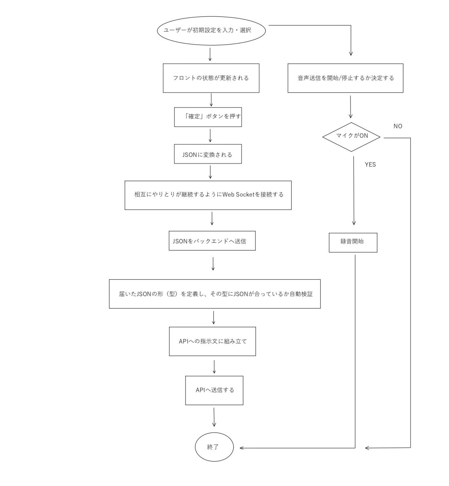

*図2：初期設定の流れ*

> *Figure 2: Flow of the initial settings*

まず「ユーザーが初期設定を入力・選択」する時に使う関数を作成します。

> First, we create the functions used when "the user enters and selects the initial settings."

まず設定は二種類あります。ここでまず、設定の状態を保存する変数（A）とその変数を変更する関数（B）、そして変数の最初の中身（C）を以下のように決めます。

> There are two kinds of settings. First, we define a variable that stores the state of a setting (A), a function that changes that variable (B), and the variable's initial value (C), as follows.

```tsx
import { useState } from "react";

const[A,B] = useState('C')
```

これに従い、それぞれのボタン（言語選択、AIの属性とシチュエーション、マイクの設定）を保存する項目を用意します。

> Following this, we prepare items that store each button (language selection, AI role and situation, microphone setting).

```tsx
//== ボタンの設定を保存する項目 ==//

const[role,setRole] = useState('')//AIの属性を決定する。ここではテキスト入力を想定し初期状態は0にする
const[situation,setSituation] =  useState('')//AIのシチュエーションを決定する。ここではテキスト入力を想定し初期状態は0にする
const[targetLang,setTargetLang] = useState('en')//学習言語を設定する。初期状態は英語
const[explainLnag,setExplainLang] =  useState('ja')//説明に使用する言語を設定する。初期状態は日本語
const[speed,setSpeed] = useState(0)//スレイダー式で速度を変更する。この時初期状態は0
const[micOn,setMicOn] = useState(true)//マイクをオンにする。初期状態はON
```

次にこのボタン、スライダー、テキストを入力し変更できるUI部分を作成します。

> Next, we create the UI where these buttons, sliders, and text can be entered and changed.

まず今回使用するReactで基本的な文法は以下のようになります。

> First, the basic syntax in React, which we use this time, is as follows.

```tsx
<Input.../>//HTMLの入力欄
value={A}//設定の状態を保存する変数（A）が入力欄に表示される

e//onChange や onClick のようなイベントは、起きたときに React が自動で「イベント情報」を渡す。それをeが受け取る
(引数) =>　処理 //引数を受け取り、その引数で処理をする
B//設定の状態を変更する関数
e.target//イベントが起きた相手である入力欄
e.target.value//その入力欄の今の値
(e) => B(e.target.value)//入力された値を状態を変える関数Bに渡すと状態Aが更新される
onChange = {}//入力を状態に書き込む
```

これに基づいて、テキスト入力は以下のようになります。

> Based on this, the text input looks like this.

```tsx
<Input value={A} onChange = {(e) => B(e.target.value)}/>
```

ここでまずAIの属性とシチュエーションは以下のようになります。

> Here, the AI role and situation look like this.

```tsx
<Input value={role} onChange = {(e) => setRole(e.target.value)} placeholder = "AIの属性"/>
<Input value={situation} onChange = {(e) => setSituation(e.target.value)} placeholder = "シチュエーション"/>
```

次に言語設定に移ります。

> Next, we move on to the language settings.

今回は後の拡張性を考慮し、言語の一覧を個別に作成します。具体的には以下のように言語のかたまり（オブジェクト）を作ります。

> With future extensibility in mind, we create the list of languages separately. Specifically, we create a chunk of data (an object) for each language, as follows.

```tsx
{code:'A',label:'B'}
A//保存用の値
B//表示用の値
```

これをリスト形式に並べたデータになります。

> These are arranged into a list.

```tsx
//== 言語選択におけるオブジェクトをリストに並べたもの ==//
const LANGUAGE =[
  {code:'en',label:'英語'},
  {code:'ja',label:'日本語'},
  {code:'ru',label:'ロシア語'},
```

これを選択できる状態にします。

> We then make them selectable.

今回目指すUIは「学習言語:」をクリックすると、英語、日本語、ロシア語、といった度トップダウン形式の箱が出現し、そこからクリックできる各選択肢が出現します。

> The UI we are aiming for is one where clicking "Learning language:" opens a drop-down box listing English, Japanese, Russian, and so on, from which each option can be clicked.

```tsx
<label>//学習言語:のかたまり全体を表示
<select>//ドロップダウンの箱
<option>//クリックで出る各選択肢
```

これを使うと、以下のようにUIを設計できます。

> Using this, the UI can be designed as follows.

```tsx
<label>
学習言語:
  <select value={targetLang} onChange = {(e) => setTargetLang(e.target.value)}>
    <option value = "en">英語</option>
    <option value = "ja">日本語</option>
    <option value = "ru">ロシア語</option>
  </select>
</label>
```

次はスピードメータを作成します。

> Next, we create the speed meter.

完成形のUIはバーを右へ動かすと0から0.5、1と増加し最大2まで0.5ずつ増加します。

> In the finished UI, moving the bar to the right increases the value from 0 to 0.5, then 1, in steps of 0.5 up to a maximum of 2.

左はそのマイナスバージョンになります。

> The left side is the negative version of this.

```tsx
<label>
  会話速度
  <input
    type = "range"
    min={-2}
    max={2}
    step={0.5}
    value={speed}
    onChange={(e) => setSpeed(Number(e.target.value))}//Numberで文字を数値に直す
    />
</label>
```

次はマイクのONとOFFを決める

> Next, we decide how the microphone is turned ON and OFF.

今回は単純なONとOFFの切り替えなので、値は読まないので引数は要らないです。これを踏まえると以下のようになります。

> Since this is a simple ON/OFF toggle, no value needs to be read, so no argument is needed. With that in mind, it looks like this.

```tsx
<label>
  マイク:
  <button onClick={() => setMicOn(!micOn)}>
    {micOn ? 'ON':'OFF'}
  </button>
</label>
```

次にこれらの設定を状態に保存していますが、これらの情報はまだバックエンドに送信できません。そのためこれからまずバックエンドを先に作ってから「確定」ボタンをフロントで作成したいと思います。つまりこれらの状態をJSONの形式で送信する時に、そのJSONの形を定義して検証する機構と、それをAPIへの指示文に組み立てる必要があります。ではそれをバックエンドに移り作成します。

> These settings are now saved in state, but they cannot yet be sent to the back end. So we will first build the back end and then create the "Confirm" button on the front end. In other words, when sending this state as JSON, we need a mechanism that defines and validates the shape of that JSON, and we need to assemble it into instructions for the API. Let us move to the back end and build that.

```python
from pydantic import BaseModel #型チェックの土台を取り出す。これがあるおかげで自動でJSONがチェックされる。

class SessionConfig(BaseModel):#フロントから届くJSONの「型」を定義
    role:str#AIの属性（文字）
    situation:str#シチュエーション（文字）
    targetLang:str#学習言語（文字）
    explainLang:str#母国語（文字）
    speed:float#会話速度（少数）
```

まずこれでJSONの型を定義し、それぞれの値がどのような型なのかを定義します。次にこれらの設定オブジェクトを入れるとAIへの指示文を出力する関数を作ります。

> This defines the JSON type and the type of each value. Next, we create a function that takes this settings object and outputs instructions for the AI.

```python
##== APIにわかるようにJSONからの返答の形式を整える ==##
def build_instructions(config:SessionConfig):
    return(
        f"You are {config.role}.The situation is:{config.situation}."
        f"When you answer use {config.explainLang}."
        f"Keep your replies 7 sentences."
    )
```

これで、AIに送る形に整える関数ができました。

> We now have a function that formats the settings for sending to the AI.

次にエンドポイントを作ります。このエンドポイント①はフロントが音声会話を始めようとしたときにバックエンドに受け口を用意し、これまで用意したbuild_instructionsなどの関数を起動します。これによりAPIに初期設定を送信したあと、音声通信をずっと開放し、出力としてAPI側の音声や文字をフロントへ送信する中継地点になります。また他に将来的に必要なエンドポイントとして会話文が自然かどうかを判定するエンドポイント②、そして発音に対するアドレスをするエンドポイント③が必要になります。

> Next, we create the endpoints. Endpoint ① provides an entry point on the back end when the front end starts a voice conversation, and runs the functions prepared so far, such as build_instructions. After sending the initial settings to the API, it keeps the audio connection open and acts as a relay that sends the API's audio and text back to the front end. Other endpoints needed in the future are endpoint ②, which judges whether an utterance is natural, and endpoint ③, which gives advice on pronunciation.

これを作るためにFastAPIというエンドポイントの作成、リクエストの受理、データチェック、返事をJSONにするを肩代わりしてくれます。

> To build these, we use FastAPI, which takes care of creating endpoints, accepting requests, checking data, and turning replies into JSON.

```python
from fastapi import FastAPI
app = FastAPI() #サーバーを作る

@app.websocket("/realtime")        # ①
async def realtime(...): ...
@app.post("/grammar")               # ②
async def grammar(...): ...
@app.post("/pronunciation")         # ③
async def pronunciation(...): ...
```

流れとしては、フロントで「確定」ボタンを押すと/realtimeエンドポイントが起動し会話が開始されます。まずユーザーが何かを話すと、OpenAIが文字起こしをして/realtimeエンドポイントが中継しフロントにユーザーの文字起こしが届く。そのときにフロントのコードが自動で反応し、フロントが/grammarエンドポイントと/pronunciationエンドポイントが起動するといった流れになります。ではまず/realtimeエンドポイントを作成していきます。またエンドポイントでは、エンドポイントのすぐ下の一つの関数のみが処理されます。

> The flow is as follows: pressing the "Confirm" button on the front end starts the /realtime endpoint and the conversation begins. When the user says something, OpenAI transcribes it, the /realtime endpoint relays it, and the user's transcript reaches the front end. The front-end code then reacts automatically and calls the /grammar and /pronunciation endpoints. Let us start by creating the /realtime endpoint. Note that for each endpoint, only the single function directly below it is executed.

まず/realtimeエンドポイントはブラウザから来る音声を聞いてAIへ流し、AIから来る音声を聞いてブラウザに流します。つまりこれを同時にやる必要があるため、async def で定義した関数を同時に回す必要があります。

> First, the /realtime endpoint listens to audio from the browser and forwards it to the AI, and listens to audio from the AI and forwards it to the browser. Since these must happen at the same time, we need to run functions defined with async def concurrently.

```python
import asyncio
```

次にOpenAIを使う場合に証明書エラーで止まることを防ぐために以下を使います。

> Next, to prevent OpenAI calls from failing with certificate errors, we use the following.

```python
import truststore
truststore.injcet_into_ssl()
```

そしてAPIキーを安全に使うために「.envファイルを読み込む関数」を用意します。

> Then, to use the API key safely, we prepare a "function that loads the .env file."

```python
from dotenv import load_dotenv
```

さて、これから/realtimeエンドポイントの中身を書いていきます。流れとしてはWebSocketで送受信を開き、フロントで設定した初期設定を受け取ります。そして作成したSessionConfig関数で送られてきた初期設定が型通りか検査し、build_instructions関数で中身からAPI向けの指示文を生成します。

> Now we will write the contents of the /realtime endpoint. The flow is: open sending and receiving over WebSocket, receive the initial settings configured on the front end, check with the SessionConfig function that the settings have the expected types, and generate instructions for the API from them with the build_instructions function.

まず/realtimeエンドポイントにWS接続が来たら、フロントの接続要求を受理します。

> First, when a WS connection arrives at the /realtime endpoint, we accept the front end's connection request.

```python
await websocket.accept()
```

次にフロントが送信したJSON文字を受信し、変数firstに保存します。

> Next, we receive the JSON text sent by the front end and store it in the variable first.

```python
 first = await websocket.receive_text()
```

そして保存した変数が欲しい型通りかどうか、そしてその型通りのオブジェクトを作って返す。

> We then check whether the stored value has the desired type, and create and return an object of that type.

```python
 config = SessionConfig(role=d["role"], situation=d["situation"], targetLang=d["targetLang"],
              explainLang=d["explainLang"], speed=d["speed"])
```

しかし、これでは長すぎるため、まず

> However, this is too long, so first,

```python
json.loads(first)
```

これで文字をJSON文字をPythonのdictに直します。次に

> This converts the JSON text into a Python dict. Next,

```python
**json.loads(first)
```

これで元の欲しい形（ key=value の引数）にします。

> This turns it into the desired form (key=value arguments).

最終的に送る形にして以下のように変数に指示文を格納します

> Finally, we store the instructions in a variable in the form that will be sent, as follows.

```python
  instructions = build_instructions(config)
```

次にAPIキーを取り出して変数に格納します。

> Next, we read the API key and store it in a variable.

```python
api_key = os.environ.get("OPENAI_API_KEY")
```

OpenAIはリクエスト字にキー、つまり身分証を見せないと門前払いします。

> OpenAI turns away any request that does not show a key—in other words, an ID card.

そこでAPIに送るリクエストにあるヘッダーを付けます。

> So we add a header to the requests sent to the API.

まず「認証情報をここに書きます」といった決まった名前であるAuthorizationです。そしてBearer token方式（トークンを持っている人を本人とみなす）を使うために以下のコードを使います。

> First comes Authorization, the standard name meaning "credentials go here." To use the Bearer token scheme (whoever holds the token is treated as the user), we use the following code.

```text
headers = [("Authorization","Bearer"+api_key )]
```

そしてOpenAIのリアルタイム窓口にキーを添えて（最大16MBまで受信OK）で電話をかけ、その回線をopenai_ws と付け、withを抜けたら自動で切るwebsocketとの間で中継する準備が整えます。まず

> Then we call OpenAI's real-time endpoint with the key attached (accepting messages of up to 16 MB), name that connection openai_ws, and get ready to relay between it and websocket, closing it automatically when we leave the with block. First,

```text
 async with
```

で「開いて使って自動で閉じる」構文を作ります。

> creates the "open, use, and close automatically" construct.

普通の関数では相手の返信が来るまで待ち続けると、それのためだけに他の全ての処理が止まりますが、この async でそれを回避します。またユーザーが会話の終了ボタンを押したとしても、それはフロントとバックエンドの回線が切れるだけで、バックエンドとOpenAIとの回線を切るわけではありません。そこでフロントとバックエンドの回線切断をきっかけにwithがバックエンドとOpenAIとの回線を自動で切断します。

> With an ordinary function, waiting for the other side to reply would stop all other processing just for that, but async avoids this. Also, even if the user presses the end-conversation button, that only cuts the connection between the front end and the back end, not the one between the back end and OpenAI. So, triggered by the front-end/back-end disconnection, with automatically closes the connection between the back end and OpenAI.

次にOpenAIのURLにWebSocket接続を開きます。ここではOpenAIの住所（API）に認証情報（headers）を付けて、最後に大きな音声も受け取れる設定でWebSocket接続を開きます。そして開いた回線をopenai_wsと命名し、ブルックを抜けたら自動で閉じるようにします。ここでWebSocketライブラリは初期設定だと「１メッセージ最大１MBくらい」という制限がるため、max_size上限を16MBまで上げます。1024で1KB、そしてさらに1024をかけて1MBにして、それに16をかけることで16MBにします。

> Next, we open a WebSocket connection to OpenAI's URL. Here we attach the credentials (headers) to OpenAI's address (the API) and open the WebSocket connection with a setting that allows large audio messages. We name the opened connection openai_ws and close it automatically when leaving the block. By default, the WebSocket library limits messages to "about 1 MB each," so we raise max_size to 16 MB: 1024 is 1 KB, multiplying by another 1024 gives 1 MB, and multiplying that by 16 gives 16 MB.

```python
async with websocket.connect(
        REALTIME_URL,
        additional_headers=headers,
        max_size=16*1024*1024,
    )as openai_ws:
```

最後に、この回線を使用してAIに会話のプロンプトを送信します。具体的には最初に変数に格納したAIのプロンプトの他に、AIがどのように声で返すか、そして割り込みができて尚且つ声を文字起こしするかどうかまで指示します。

> Finally, we use this connection to send the conversation prompt to the AI. Specifically, in addition to the AI prompt stored in the variable earlier, we specify how the AI should respond by voice, that it can be interrupted, and whether to transcribe the speech.

この回線の使い方は以下のようになります。

> This connection is used as follows.

```python
await openai_ws.send(json.dumps({設定}))
```

awaitでopenai_wsを.sendを完了しきるまで待ちます。送る中身は辞書形式なので、json.dumpsで辞書をJSON文字列に変換します。

> await waits until openai_ws.send has fully completed. Since the payload is a dictionary, we convert it to a JSON string with json.dumps.

```python
await openai_ws.send(json.dumps({
    "type":"session.update",#メッセージの種類を「設定の更新」にする
    "session":{#設定の中身
        "type":"realtime",
        "output_modalities":["audio"],#返事を音声にする
        "instructions":instructions,#build_instructions(config)で作ったAIに対する指示文
        "audio":{
            "input":{},#マイク側の設定
            "output":{}#スピーカー側の設定
        }
    }

}))
```

そしてマイクの設定は、リアルタイム会話を実現したい、つまり「届いた瞬間に処理したい」ので解凍不要のPCM形式にします。またモデルは音声を十分拾える24HZに設定します。またユーザーが話し終わったのを自動で判断する設定にすることにします。するとマイクの設定は以下のようになります。

> For the microphone settings, we want real-time conversation—"process it the moment it arrives"—so we use the PCM format, which needs no decoding. We also set the model to 24 kHz, which captures the voice well enough, and choose a setting that automatically detects when the user has finished speaking. The microphone settings then look like this.

```text
 "input":{
                    "format":{"type":"audio/pcm","rate":24000},
                    "turn_detection":{"type":"server_vad"},#沈黙したら（無音が継続すれば終わり）と認識する
                    "transcription":{"model":"gpt-4o-trasncribe"},
                },#マイク側の設定
```

スピーカーの設定は以下のようになります。

> The speaker settings look like this.

```text
 "output":{
                    "format":{"type":"audio/pcm","rate":24000},
                 "voice": "marin",
                }#スピーカー側の設定
```

全体の関数はこれになります。

> The whole function looks like this.

```python
async def realtime(websocket:WebSocket): 
    await websocket.accept()
    first = await websocket.receive_text()
    config = SessionConfig(**json.loads(first))
    instructions = build_instructions(config)
    api_key = os.environ.get("OPENAI_API_KEY")
    headers = [("Authorization","Bearer "+api_key )]
    async with websockets.connect(
        REALTIME_URL,
        additional_headers=headers,
        max_size=16*1024*1024,
    )as openai_ws:

        await openai_ws.send(json.dumps({
         "type":"session.update",#メッセージの種類を「設定の更新」にする
        "session":{#設定の中身
            "type":"realtime",
            "output_modalities":["audio"],#返事を音声にする
            "instructions":instructions,#build_instructions(config)で作ったAIに対する指示文
            "audio":{
                "input":{
                    "format":{"type":"audio/pcm","rate":24000},
                    "turn_detection":{"type":"server_vad"},#沈黙したら（無音が継続すれば終わり）と認識する
                    "transcription":{"model":"gpt-4o-transcribe"},
                },#マイク側の設定
                "output":{
                    "format":{"type":"audio/pcm","rate":24000},
                 "voice": "marin",
                }#スピーカー側の設定
            },
        },
    }))
```

ここまではAPIへの送信設定だけを一回送信しましたが、次は音声を中継する必要があります。まずユーザーがフロントからOpenAIへ送信する回線（A)、そしてOpenAIがフロントへ返信する回線（B）の二つが必要です。この回線を同時に開き、どちらか一方が切断された時点で処理を止めます。

> So far we have only sent the API settings once; next we need to relay the audio. We need two connections: (A) from the front end to OpenAI for the user, and (B) from OpenAI back to the front end. We open both at the same time and stop processing as soon as either one is disconnected.

まず回線（A）を実装します。

> First, we implement connection (A).

```python
async def frontend_to_openai():
    try:
        while True:
            msg = await websocket.receive_text()

            await openai_ws.send(msg)
        
        except WebSocketDisconnect:
            pass
```

ここではまずフロントから１つ情報を受け取り、完了するまで待ちます。

> Here we first receive one piece of data from the front end and wait until it completes.

その後、その内容をOpenAIにそのまま送り、もしフロントが切れたら（WebSocketDisconnect）、エラーを受け止めてループを抜けます。

> We then send that content straight to OpenAI, and if the front end disconnects (WebSocketDisconnect), we catch the error and exit the loop.

回線（B）は以下のようになります。

> Connection (B) looks like this.

```python
async def openai_to_frontend():
    try:
        async for msg in openai_ws:
            await websocket.send_text(msg)
    
    except websocket.exceptions.ConnectonClosed:

        pass
```

これはOpenAIから１つずつ情報を受け取り、一個ずつそれをフロントへ送信します。

> It receives data from OpenAI one piece at a time and sends each piece to the front end.

もしOpenAIが切れたら（websocket.exceptions.ConnectonClosed）、エラーを受け止めてループを抜けます。

> If OpenAI disconnects (websocket.exceptions.ConnectionClosed), we catch the error and exit the loop.

ではこの二つの関数を同時実行するためにasyncioというスケジューラーを使用します。

> To run these two functions at the same time, we use the asyncio scheduler.

```python
task_a = asyncio.create_task(frontend_to_openai())
task_b = asyncio.create_task(openai_to_frontend())
```

これにより、二つの関数を同時に実行します。

> This runs the two functions concurrently.

```python
await asyncio.wait({task_a, task_b}, return_when=asyncio.FIRST_COMPLETED)
        task_a.cancel()
        task_b.cancel()
```

これにより、最初の１つが終わったら戻るとします。

> This makes it return as soon as the first one finishes.

次にフロントで確定ボタンを作っていきます。

> Next, we create the Confirm button on the front end.

まず確定ボタンを押されたら以下の関数が起動するようにします。

> First, we make the following function run when the Confirm button is pressed.

```tsx
 function startConversation(){
    const config = {role,situation,targetLang,explainLang,speed};
    const ws = new WebSocket("ws://localhost:8000/realtime");
    ws.onopen = () =>{
      ws.send(JSON.stringify(config));
    }
  }
```

ここにおいて

> Here,

```tsx
WebSocket("ws://localhost:8000/realtime");
```

これは、バックエンドのエンドポイントである/realtimeを呼びます。

> this calls /realtime, the back-end endpoint.

```tsx
 ws.onopen = () =>{
      ws.send(JSON.stringify(config));
    }
```

このうち、以下の行はconfigという変数に格納したオブジェクトを文字列に変換してws.send()でバックエンドに送ります。

> Of these, the following line converts the object stored in the variable config into a string and sends it to the back end with ws.send().

```tsx
  ws.send(JSON.stringify(config));
```

またこれを送るタイミングはwebsocketが開いたタイミングであるので、接続が開いたときのイベントであるonopenという枠を使い、繋がったらws.send()が実行されるようにします。

> Since this should be sent when the WebSocket opens, we use onopen, the event fired when the connection opens, so that ws.send() runs once connected.

最後にstartConversation関数を確定ボタンで起動できるようにします。

> Finally, we make the startConversation function run from the Confirm button.

```tsx
<button onClick={startConversation}>確定</button>
```

最後に図２のフローチャートの右側を作りたいと思います。

> Finally, we build the right-hand side of the flowchart in Figure 2.

ここではマイクボタンを押すたびに、確定ボタンとは関係なく音声データがバックエンドに送信されます。

> Here, every time the microphone button is pressed, audio data is sent to the back end independently of the Confirm button.

まずマイクが押されると、useStateで値(micOn)が変更されます。

> First, when the microphone button is pressed, the value (micOn) is changed with useState.

しかし値が変わるだけで、値が変わったら何かを実行する関数が必要があります。ここでReactからuseEffectという関数をインポートしたいと思います。

> However, changing the value alone is not enough; we need a function that does something when the value changes. Here we import a function called useEffect from React.

この関数は以下のような構造を持つことができます。

> This function can have the following structure.

```tsx
useEffect(() => {
  //実行したいコード
},[監視する値]);
```

今回監視する値はmicOnであり、その値によって中のコードが実行されます。例えばmicOnがONになれば録音を開始する関数(startRecording)を起動し、OFFになれば録音を停止する関数(stopRecording)を起動します。

> The value we watch this time is micOn, and the code inside runs depending on that value. For example, when micOn becomes ON, it calls the function that starts recording (startRecording), and when it becomes OFF, it calls the function that stops recording (stopRecording).

```tsx
useEffect(() => {
  if(micOn) startRecording();
  else stopRecording();
},[micOn]);
```

startRecording関数では、録音機を準備して音のかたまりが来るたびにバックエンドに送る役割を担います。具体的には一回だけ録音機を準備し、音声のかたまりが来たら送るを登録します。するとマイクがONの間だけずっとかたまりが来たら送るを繰り返すようにします。

> The startRecording function prepares the recorder and sends each chunk of audio to the back end as it arrives. Specifically, it prepares the recorder only once and registers "send each chunk when it arrives." This keeps repeating "send each chunk as it arrives" only while the microphone is ON.

ここでwavtoolsライブラリをインストールし、音声処理をそのメソッドで一部簡略化します。

> Here we install the wavtools library and simplify part of the audio processing with its methods.

```tsx
async  function startRecording(){//関数内でawaitを使うため、asyncを使う
    if(!recorderRef.current){
      recorderRef.current = new WavRecorder({sampleRate:24000});//録音機が無ければ録音機を作成する
      const recorder = recorderRef.current;
    }
    if(recorder.getStatus()==="ended"){//録音機の状態が終了したいたら、録音機をスタートする
        await recorder.begin();
    }

    if(recorder.getStatus()!== "recording"){
        await recorder.record((data)=>{
          sendAudio(data.mono);//monoはチャンネル数は１本とすることを明示し、音の塊を送る
        });
    }
  }
```

ここで、生の音声をJSONで送れるように文字にする必要があります。ここでバイナリを文字に変換するのがbase64となります。

> Here, the raw audio needs to be turned into text so it can be sent as JSON. base64 is what converts binary data into text.

```tsx
function sendAudio(pcm16){
  const ws = wsRef.current;//接続(ws)を保存する箱から接続を取り出す

  const isConnected = ws && ws.readyState === WebSocket.OPEN;//接続が存在しない、または開いていないならここで終了
  if(!isConnected)return;
  const base64 = pcm16TOBase64(pcm16);//音をbase64にする
  const message = {
    type:"input_audio_buffer.append",
    audio:base64,
  };
  ws.send(JSON.stringify(message));
}
```

また音をbase64にする際には、まず音声を一個ずつの小さな数字の並びとしてみて、文字をためる空の入れ物に、数字を文字に変換したものをどんどんつなげていき、文字列をbase64に変換して返すといった処理を挟む必要があります。

> To convert audio to base64, we need an intermediate step: treat the audio as a sequence of small numbers, convert each number to a character and keep appending it to an empty container for characters, then convert the resulting string to base64 and return it.

```tsx
function pcm16TOBase64(pcm16: Int16Array){
  const bytes = new Uint8Array(pcm16.buffer);//音声をバイトの並びとして見る
  let binary = "";//空の文字列を用意
  for(let i = 0; i<bytes.length;i++)
    binary += String.fromCharCode(bytes[i]);//各バイトを文字にしてためる
  return btoa(binary);//文字列をbase64にして返す
}
```

これにて初期設定は全て終わりました。

> This completes all of the initial settings.

次にAIの返信を受信し、文字起こしする機能を追加したいと思います。

> Next, we add a feature that receives the AI's replies and transcribes them.

そこでユーザー側とAIの発言を文字起こしする機能を実装します。

> So we implement a feature that transcribes both the user's and the AI's speech.

```tsx
    ws.onmessage = (e) => {//メッセージが届き次第実行する
      const msg = JSON.parse(e.data);//parseは文字列をオブジェクトに変更する
      if(msg.type === "conversation.item.input_audio_transcription.completed"){//自分の発言
        setMyText(msg.transcript);
      }

      if(msg.type === "response.output_audio_transcript.done"){//AIの発言
        setAiText(msg.transcript);
      }
```

以上にて基本的な機能の実装が完了しました。

> This completes the implementation of the basic features.

今回はリアルタイム会話機能を可能にするLLMのAPIであるOpenAI Realtime APIとGoogle Gemini Live APIを比較したいと思います。実装に必要な処理を可能な限り小さくするために今回は自前パイプライン（音声認識（ユーザーの発話をテキストに変換）、音声モデル（そのテキストを受け取り、返答テキストを生成）、音声合成（返答テキストを音声に変換して再生））の実装は控えることにします。

> Here we compare two LLM APIs that make real-time conversation possible: the OpenAI Realtime API and the Google Gemini Live API. To keep the required processing as small as possible, we will not implement our own pipeline (speech recognition to turn the user's speech into text, a language model to take that text and generate a reply, and speech synthesis to turn the reply into audio and play it).

まず今回測定する精度については、WERを使用したいと思います。

> For the accuracy measured here, we use WER.

WERは音声認識システムなどの性能を測定するための代表的な指標です。(Debadatta Patel,2026)。これでは認識された文章が正解の文章からどれだけ乖離しているかを以下の計算式で算出します。

> WER is a standard metric for measuring the performance of speech recognition systems. (Debadatta Patel, 2026) It calculates how far the recognized text deviates from the reference text using the following formula.


*単語誤り率*

> *Word error rate*

Sは誤った単語に置き換わった数、Dはあるべき単語が消えた数、Iは無いはずの単語が追加された数、Nは正解文章の総単語数になります。これはWERの数値が低いほど、音声認識の精度が高いことを示します。そしてコストとレイテシも同時に計測し、それらのトレードオフから実装するAPIを決定します。今回はFLEURSと呼ばれる102言語をカバーする多言語音声認識・処理のためのベンチマークおよびデータセット(Conneau, A., et al. ,2022)を利用したいと思います。流れとしては、まずFLEURSで正解文を取得し、音声をAPIに送ります。そしてAPIがした文字起こしを取得し、正解文と返答文の両方から句読点や小文字を除去します。そしてそれぞれの文章をリストに貯めて、まとめてWERをjiwerというWER（誤り率）を計算してくれる、専用のPythonライブラリを使用して測定したいと思います。

> S is the number of words substituted with wrong words, D is the number of words that should be there but were deleted, I is the number of words inserted that should not be there, and N is the total number of words in the reference text. A lower WER indicates higher speech-recognition accuracy. We also measure cost and latency at the same time and decide which API to implement based on the trade-offs. This time we use FLEURS, a benchmark and dataset for multilingual speech recognition and processing that covers 102 languages (Conneau, A., et al., 2022). The flow is: obtain the reference text from FLEURS and send the audio to the API; obtain the API's transcription; remove punctuation and lowercase both the reference and the response; collect each text in a list; and measure the WER all at once with jiwer, a dedicated Python library for computing WER (error rate).

まず両方のAPIでの比較実験ではFLEURSの読み込み、小文字化や句読点削除などの正規化、WER計算、結果のCSV保存、音声変換を共通のファイルで行うことにします。

> For the comparison experiment with both APIs, loading FLEURS, normalization (lowercasing, removing punctuation, etc.), WER calculation, saving results to CSV, and audio conversion are done in a shared file.

まず正規表現をするために以下のライブラリを用意します。

> First, we prepare the following library for regular expressions.

```python
import re #正規表現
```

しかし、FLEURSの音声であるs\[“audio”\]\[“array”\]は\[0.01,-0.03,0.06...\]という配列が一秒に16000個送られてきます。つまり16kHzでFloat型です。しかしAPIに送るには、JSONには数字の塊ではなく、文字のメッセージにする必要があります。ここでまずこれらを－1から１までの数字の配列にし、さらに16kHzを24kHzにする必要があり、さらにその配列をbase64で文字に変換します。そこで配列の計算をするために以下のライブラリを用意します。

> However, the FLEURS audio s\["audio"\]\["array"\] arrives as an array like \[0.01, -0.03, 0.06, ...\], 16,000 values per second—that is, 16 kHz floats. To send it to the API, JSON needs a text message rather than a block of numbers. So we first turn these into an array of numbers from -1 to 1, then resample from 16 kHz to 24 kHz, and finally convert that array to text with base64. To compute on the arrays, we prepare the following library.

```python
import numpy#配列の計算をする。
```

次に16kHzを24kHzにするために以下のライブラリを用意します。

> Next, to convert 16 kHz to 24 kHz, we prepare the following library.

```python
import librosa#16kHzを24kHzに変換する
```

そして配列を文字に変換するためのライブラリを用意します。

> Then we prepare a library to convert the array into text.

```python
import base64#音声をbase64にする
```

残りは、WER計算とFLEURS読み込みをするライブラリを用意します。

> For the rest, we prepare libraries for WER calculation and for loading FLEURS.

まずFLEURSからn件だけ音声を取得する関数を用意します。

> First, we prepare a function that fetches only n audio samples from FLEURS.

```python
#==FLEURSからn件だけ音声を取得する関数 ==#
def load_flerus_clips(lang,n,split="test"):
    ds = load_dataset("google/fleurs",lang,split=split,streaming=True)#streaming=Trueで一件ずつダウンロードする
    clips = []
    for s in ds:
        clips.append((s["audio"]["array"],s["audio"]["sampling_rate"],s["transcription"]))#波形、レート（16000）、正解文
        if len(clips) >= n:#n件より多ければループを停止
            break
    return clips
```

音声変換は以下のように関数を用意します。

> The audio conversion function is prepared as follows.

```python
#==音声変換をする関数 ==#
def audio_to_pcm16_base64(audio,from_rate,to_rate):#audio=波形,from_rate=元のレート（16000）,to_rate=目標レート（OpenAIは24000,Geminiは16000)
    if from_rate != to_rate:#OpenAIの時
        audio = librosa.resample(audio,orig_sr=from_rate,target_sr=to_rate)#16000を24000にする
    pcm16 = (np.clip(audio,-1,1)*32767).astype(np.int16)#PCM(-32767から32767)に小数(-1.0から1.0)を変換する。.astype(np.int16)でそれを整数(16bit)に変換する（PCM16）
    return base64.b64encode(pcm16.tobytes()).decode()#b64encodeでバイトをbase64という文字だけの形にし、decodeで文字列に変換する
```

正規化は以下のようにします。

> Normalization is done as follows.

```python
#==正規化をする関数 ==#
def normalize(text):
    text = tet.lower()#小文字化
    text = re.sub(r"[^\w\s]","",text)#句読点を除去
    text = re.sub(r"\s+","",text).strip()#連続空白を一つにして、前後の空白を除去する
    return text
```

WERは以下のように計算します。

> WER is computed as follows.

```python
#==WER計算をする関数 ==#
def score(refs,hyps):
    refs = [normalize(r) for r in refs]#正解を全部正規化
    hyps = [normalize(h) for h in hyps]#出力を全部正規化
    return jiwer.wer(refs,hyps)
```

これらを使い、まずOpenAI(gpt-realtime-2.1)のWERを50件の例文を対象に測定したところ、0.051643192488262914と結果が表示されました。またOpenAIは入力が0.06＄/分、出力が0.24＄/分(OpenAI)であることからコストも算出できます。

> Using these, we first measured the WER of OpenAI (gpt-realtime-2.1) on 50 sample sentences, and the result was 0.051643192488262914. Since OpenAI costs $0.06/min for input and $0.24/min for output (OpenAI), we can also calculate the cost.

Gemini（gemini-3.1-flash-live-preview)のWERも同じく50件の例文を対象に測定したとこと 0.046948356807511735と結果が表示されました。入力は\$0.005/分、出力は \$0.018/分(Google)であることからこちらもコストが算出できます。結果を比較すると、WERの精度はGeminiの方が良く、コストの面からもGeminiの方が圧倒的にコストパフォーマンスが良いことがわかりました。よってGeminiをリアルタイム会話の主力APIとして代替えしたいと思います。

> We also measured the WER of Gemini (gemini-3.1-flash-live-preview) on the same 50 sample sentences, and the result was 0.046948356807511735. Since input costs \$0.005/min and output \$0.018/min (Google), its cost can be calculated as well. Comparing the results, Gemini has better WER accuracy and is overwhelmingly more cost-effective. Therefore, we will switch to Gemini as the main API for real-time conversation.

しかし、今まで作っていたJSONの型を定義し、APIにわかるようにJSONからの返答の形式を整える部分はそのまま流用できます。

> However, the parts we already built—defining the JSON types and formatting the JSON so the API can understand it—can be reused as is.

まずGeminiに話しかけるには、Geminiがネット上のどこにいるか、そしてAPIキーでこちらが使う権利があること、最後に通信のルールに従ってつなぐという手順を毎回する必要があります。しかしこれを毎回やるのは時間がかかるので、genaiライブラリの中にある設計図（クラス）であるClientを使って、APIキー付きで実物の道具箱を一個作り、それを変数に格納します。

> To talk to Gemini, we would have to go through the same steps every time: find where Gemini is on the network, prove with the API key that we are allowed to use it, and connect following the communication rules. Since doing this every time takes time, we use Client, a blueprint (class) in the genai library, to create one actual toolbox with the API key attached and store it in a variable.

```python
client = genai.client(api_key = API_KEY)
```

この最初の設定を型にはめ、AIへの指示文を送信します。

> We fit these initial settings into the type and send the instructions to the AI.

まず設定を型にはめる作業をしていきます。これをすることで後にAIに送る文を作ることができます。json.loads(first)で文字列を辞書の形にし、SessionConfig(\*\*...)で辞書を型にはめた箱にすることでSessionConfig(role="英語の先生", situation="カフェ", ...)みたいにすることができ、それを build_instructionsに渡すことでAIに渡す文を形成することができます。

> First, we fit the settings into the type. This lets us build the text to send to the AI later. json.loads(first) turns the string into a dictionary, and SessionConfig(\*\*...) turns the dictionary into a typed box, such as SessionConfig(role="English teacher", situation="cafe", ...). Passing it to build_instructions forms the text sent to the AI.

```python
 config = SessionConfig(**json.loads(first))
    instructions = build_instructions(config)#指示文を作る
```

最終的に、Geminiに対する指令文を以下のように作ります。

> Finally, we create the instructions for Gemini as follows.

```text
gemini_config = {
        "response_modalities":["AUDIO"],#返事を音声にする
        "system_instruction":instructions,#指示文を入れる
        "input_audio_transcription":{},#自分の発言を文字起こしする
        "output_audio_transcription":{},#AIの発言を文字起こしする
    }
```

次にこの設定を元にAIとの回線を接続します。この時、非同期処理をすることで送受信をするようにします。またリアルタイムの部門と.connectで接続を開くことで実際に電話をかけます。

> Next, based on these settings, we connect to the AI. We use asynchronous processing so that sending and receiving happen together, and we actually place the call by opening the connection with the real-time section's .connect.

```python
async with client.aio.live.connect(model = MODEL,config = gemini_config) as session:
```

次にフロントのマイク音声をずっと受けっとって、Geminiに送り続ける部品を作ります。

> Next, we build the part that keeps receiving microphone audio from the front end and keeps sending it to Gemini.

全体の流れとしてはbase64を受信し、base64文字を生バイトにし、Gemini Live APIは入力音声は16kHzでないと受け付けない仕様であり、生PCMはただの数字の列であり、これを「16kHzの音声」だと宣言する必要があるので、ラベル（箱）（Blob）を用意する必要があります。

> The overall flow is: receive base64 and turn the base64 text into raw bytes. The Gemini Live API only accepts input audio at 16 kHz, and raw PCM is just a sequence of numbers, so we must declare that it is "16 kHz audio"—which is why we need a label (box), a Blob.

まずメッセージを受けとり、それを辞書化して見れる形にします。

> First, we receive the message and turn it into a dictionary so we can read it.

```python
   raw = await websocket.receive_text()#メッセージを受け取る
   msg = json.loads(raw)#辞書化して見れる形にする
```

次にフロントで録音を送信する関数にあるマイク音声の識別に

> Next, since the function that sends the recording on the front end uses

```text
"input_audio_buffer.append"
```

という変数を使っているので、これが届いたらそれがマイク音声だとわかります。

> as the variable that identifies microphone audio, we know it is microphone audio when this arrives.

全体の関数は以下のようになります。

> The whole function looks like this.

```python
        async def frontend_to_gemini():
            try:
                while True:
                    raw = await websocket.receive_text()#メッセージを受け取る
                    msg = json.loads(raw)#辞書化して見れる形にする
                    if msg.get("type") == "input_audio_buffer.append"#フロントからの送信が音声である場合
                        pcm = base64.b64decode(msg["audio"])#メッセージの中の音声部分msg["audio"]を、生バイトに戻す
                        await session.send_realtime_input(
                            audio = types.Blob(data=pcm,mime_type="audio/pcm;rate=16000")
                        )
            except WebSocketDisconnect:
                pass
```

次はGeminiから送られた返事を受け取り、それをAI音声はすぐにフロントエンドに送って再生する。文字起こしは貯め、区切りでフロントエンドに送るということをします。

> Next, we receive the replies from Gemini: the AI's audio is sent to the front end immediately for playback, while the transcript is accumulated and sent to the front end at each break.

まずAI音声があれば即フロントへ送ります。この時フロントでは

> First, if there is AI audio, we send it to the front end right away. On the front end,

```tsx
    if(msg.type === "response.output_audio.delta"){//AIの音声
        const buf = base64ToArrayBuffer(msg.delta);//声を音声データに戻したもの
        playerRef.current.add16BitPCM(buf);//再生機にその音声データを渡してその場で再生する
      }
```

というようにメッセージが届き次第実行されます。

> it runs as soon as a message arrives, like this.

この条件にある

> The

```text
"response.output_audio.delta"
```

をバックエンドに追加する必要があります。

> in this condition needs to be added to the back end.

これにより、

> This completes the part

```python
  if response.data is not None:#何か音声があれば以下を実行する
                        b64 = base64.b64encode(response.data).decode()#生バイトに直す
                        await websocket.send_text(json.dumps({
                            "type":"response.output_audio.delta",
                            "delta";b64,
                        }))
```

とする部分が完成します。

> that does this.

またフロントエンドには以下のような条件があるので、

> Also, since the front end has conditions like the following,

```tsx
  if(msg.type === "conversation.item.input_audio_transcription.completed"){//自分の発言
        setMessages(prev => [...prev,{who:"You",text:msg.transcript}]);
      }

      if(msg.type === "response.output_audio_transcript.done"){//AIの発言
        setMessages(prev => [...prev,{who:"AI",text:msg.transcript}]);
      }
```

これを踏まえると以下のような関数になります。

> taking this into account, the function looks like this.

```python
           if sc is None:#文字情報が無ければ、そのまま飛ばして継続
                        continue
                    if sc.input_transcription and sc.input_transcription.text:#そもそも文字起こしがあり、その中に文字があれば、自分の発言を貯める
                        user_text += sc.input_transcription.text
                    if sc.output_transcription and sc.output_transcription.text:#AIの発言に文字起こしがあり、その中に文字があれば、AIの発言を貯める
                        ai_text += sc.output_transcription.text
                    
                    if sc.turn_complete:#一区切りが完了したら
                        if user_text:
                            await websocket.send_text(json.dumps({
                                "type":"conversation.item.input_audio_transcription.completed",
                                "transcript":user_text,
                            }))
                        if ai_text:
                            await websocket.send_text(json.dumps({
                                "type":"response.output_audio_transcript.done",
                                "transcript":ai_text,
                            }))
                        user_text = ""#リセットする
                        ai_text=""#リセットする
```

ここでフロントエンドとバックエンドを実行したところ、文字起こしが機能していなかったので、フロントエンドのマイクの周波数が24000のままだったので16000にします。

> When we ran the front end and back end here, transcription did not work because the front end's microphone sample rate was still 24000, so we change it to 16000.

```tsx
 if(!playerRef.current){
      playerRef.current = new WavStreamPlayer({sampleRate:24000});//再生機が無ければ再生機を準備
      playerRef.current.connect();//スピーカーに接続
    }
```

また、音声を正しく拾えず、割り込みにも対応できないといった問題や、途中で会話が途切れたり、返答音声が返ってこないといった問題が見受けられました。

> We also saw problems such as audio not being picked up correctly, interruptions not being handled, the conversation cutting off midway, and reply audio not coming back.

問題として、英語で話しているのに外国語として認識されるという点。

> One problem is that speech in English is recognized as a foreign language.

次に、割り込みで話してもすぐに反映されない時があるということ。

> Next, speaking to interrupt is sometimes not reflected immediately.

速度を変更できないこと。

> The speed cannot be changed.

最後に音声を認識しない時があるという点です。

> Finally, audio is sometimes not recognized.

まず目標言語を認識できるようにします。今回は

> First, we make the target language recognizable. This time,

```text
gemini_config = {
        "response_modalities":["AUDIO"],#返事を音声にする
        "system_instruction":instructions,#指示文を入れる
        "input_audio_transcription":{},#自分の発言を文字起こしする
        "output_audio_transcription":{},#AIの発言を文字起こしする
    }
```

において、以下の部分を変えたいと思います。

> we will change the following part in

```text
"input_audio_transcription":{},#自分の発言を文字起こしする
```

これを以下のように変更します。

> We change it as follows.

```text
 "input_audio_transcription":{"language_codes":[config.targetLang]},#自分の発言を文字起こしする
```

他にも録音する関数や、録音を停止する関数のレートも24kHzから16kHzに変更しました。これにて目標言語を設定できるようになりましたが、割り込みにすぐ反応しないのは依然変わりません。

> We also changed the rate in the recording function and the stop-recording function from 24 kHz to 16 kHz. This made it possible to set the target language, but the slow reaction to interruptions remains.

目標は

> The goals are:

- AIが音声で返答している最中、リアルタイムで文字起こしが起こる

  > While the AI is replying by voice, transcription happens in real time

- 途中で割り込むと、AIの音声返答・文字起こしが中断されて、こちらの文字起こしがリアルタイムで起こる

  > When the user interrupts, the AI's voice reply and transcription stop, and the user's own transcription happens in real time

  ということです。

  > That is the goal.

  まず「AIが音声で返答している最中、リアルタイムで文字起こしが起こる」ようにします。

  > First, we make sure that "while the AI is replying by voice, transcription happens in real time."

```python
 if sc is None:#文字情報が無ければ、そのまま飛ばして継続
                            continue
                        if sc.input_transcription and sc.input_transcription.text:#そもそも文字起こしがあり、その中に文字があれば、自分の発言を貯める
                            user_text += sc.input_transcription.text
                        if sc.output_transcription and sc.output_transcription.text:#AIの発言に文字起こしがあり、その中に文字があれば、AIの発言を貯める
                            ai_text += sc.output_transcription.text
                    
                        if sc.turn_complete:#一区切りが完了したら
                            if user_text:
                                await websocket.send_text(json.dumps({
                                    "type":"conversation.item.input_audio_transcription.completed",
                                    "transcript":user_text,
                                }))
                            if ai_text:
                                await websocket.send_text(json.dumps({
                                    "type":"response.output_audio_transcript.done",
                                    "transcript":ai_text,
                                }))
                            user_text = ""#リセットする
                            ai_text=""#リセットする
```

この行より、文字起こしはturn_completeで貯めてあった文字が一気に吹き出しに表示されるような仕組みになっています。ここで、turn_completeが届く前に、音声のかけらが届いた瞬間から文字起こしされるようにし、turn_completeが届いた段階で次の吹き出しが表示されるようにします。

> Because of this line, the transcript accumulated until turn_complete is displayed in the speech bubble all at once. We change it so that transcription appears from the moment the first piece of audio arrives, before turn_complete, and the next bubble is shown when turn_complete arrives.

```python
 if sc.input_transcription and sc.input_transcription.text:#そもそも文字起こしがあり、その中に文字があれば、自分の発言を貯める
                            user_text += sc.input_transcription.text
                            await websocket.send_text(json.dumps({
                                    "type":"conversation.item.input_audio_transcription.completed",
                                    "transcript":user_text,
                            }))

                        if sc.output_transcription and sc.output_transcription.text:#AIの発言に文字起こしがあり、その中に文字があれば、AIの発言を貯める
                            ai_text += sc.output_transcription.text
                            await websocket.send_text(json.dumps({
                                    "type":"response.output_audio_transcript.done",
                                    "transcript":ai_text,
                            }))
                        if sc.turn_complete:#一区切りが完了したら
            
                            user_text = ""#リセットする
                            ai_text=""#リセットする
```

以上のように、すぐに送信されるようにします。

> As shown above, we make it send immediately.

しかし結果は以下のようになりました。

> However, the result was as follows.

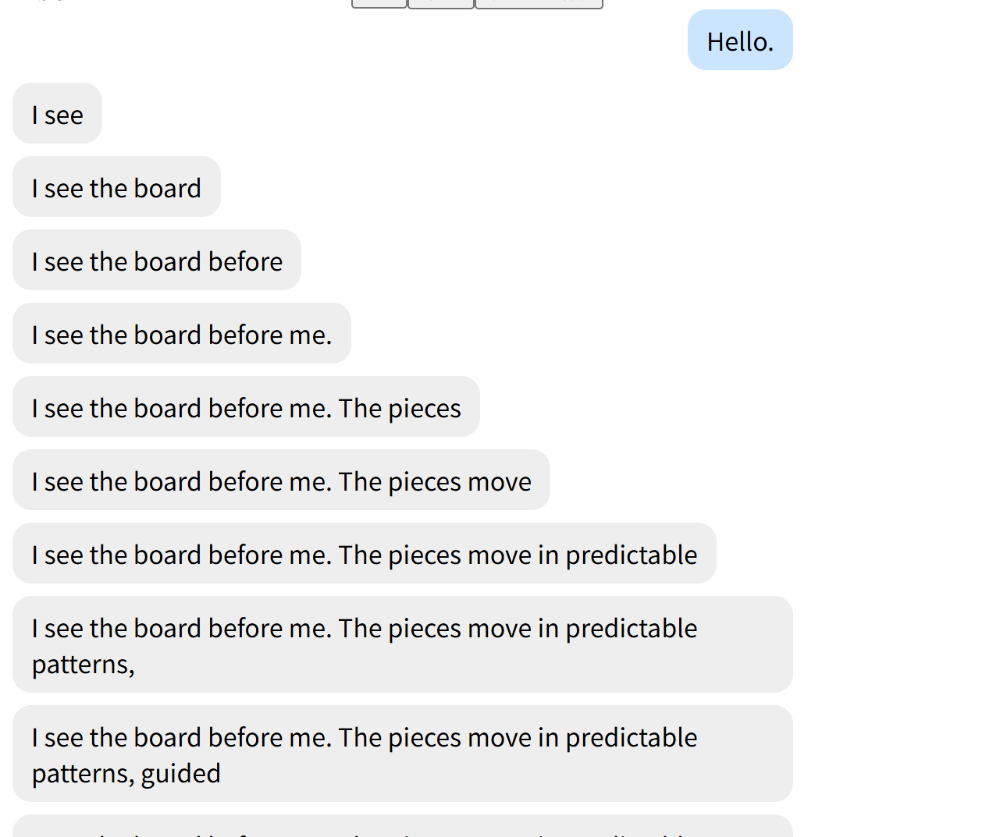

これはバックエンドから音声データが送られるたびに、毎回新しい吹き出しが生成されるためです。

> This is because a new speech bubble is created every time audio data is sent from the back end.

```tsx
ws.onmessage = (e) => {//メッセージが届き次第実行する
      const msg = JSON.parse(e.data);//parseは文字列をオブジェクトに変更する
      
      if(msg.type === "response.output_audio.delta"){//AIの音声
        const buf = base64ToArrayBuffer(msg.delta);//声を音声データに戻したもの
        playerRef.current.add16BitPCM(buf);//再生機にその音声データを渡してその場で再生する
      }

      if(msg.type === "conversation.item.input_audio_transcription.completed"){//自分の発言
        setMessages(prev => [...prev,{who:"You",text:msg.transcript}]);
      }
      if(msg.type === "response.output_audio_transcript.done"){//AIの発言
        setMessages(prev => [...prev,{who:"AI",text:msg.transcript}]);
      }
    }
```

ここで、以下の行に着目します。

> Here, let us focus on the following line.

```tsx
 setMessages(prev => [...prev,{who:"You",text:msg.transcript}]);
```

ここで\[...prev, X\]は、今までの吹き出しを全部残し、新しく一個足していく形になります。これがws.onmessage = (e) =\> {により毎回呼び出されるため、吹き出しが重なって表示されています。しかしReactは画面をstateの写し鏡として保つという仕組みがあります。ここで

> Here, \[...prev, X\] keeps all of the existing bubbles and adds one new one. Since this is called every time by ws.onmessage = (e) =\> {, the bubbles pile up on the screen. However, React keeps the screen as a mirror image of the state. So here,

```tsx
 const[liveAI,setLiveAI] = useState("");//今流れているAIの文字
```

という変数を用意し、これを随時更新できるようにします。

> we prepare this variable and make it updatable at any time.

```tsx
  if(msg.type === "response.output_audio_transcript.done"){//AIの発言
       setLiveAI(msg.transcript);//随時更新表示される
      }
```

これを以下のように吹き出しで表示されるようにします。

> We display it in a speech bubble as follows.

```tsx
{liveAI && (<div></div>)}
```

これはliveAIが空で無ければ右の（）を表示するようにするということです。

> This means that if liveAI is not empty, the () on the right is displayed.

そして\<div\>\</div\>は吹き出しの箱になります。

> And \<div\>\</div\> is the box for the speech bubble.

```tsx
{liveAI && (<div style={{...}}>{liveAI}</div>)}
```

これにより、吹き出しのスタイルを決定し、{liveAI}で中身に文字を足すようにできます。

> This sets the style of the bubble, and {liveAI} adds the text inside it.

完成形は以下のようになります。

> The finished version looks like this.

```tsx
 {liveAI && (<div style={{
    alignSelf:"flex-start",//左寄せ（AIなので）
    background:"eeeeee",//AIなので灰色
    padding:"8px 12px",//上下8px,左右12px
    borderRadius:"12px",//角を丸く
  }}>{liveAI}</div>)}
```

これでリアルタイムで文字起こしがされ、文字起こしが終わりしだいに以下で表示が履歴として残ります。

> Now transcription happens in real time, and once transcription finishes, it remains in the history below.

```tsx
{messages.map((m,i) => (
    <div key={i} style={{
      alignSelf:m.who === "You"?"flex-end":"flex-start",//Youなら右寄せ（flex-start）、それ以外（AI）なら左寄せ（flex-end）
      background:m.who === "You"?"#cce5ff":"#eeeeee",//Youなら青、AIなら灰色
      padding:"8px 12px",//上下8px,左右12px
      borderRadius:"12px",//角を丸く
    }}>
      {m.text}
    </div>
    ))}
```

またずっとリアルタイム文字起こしのsetLiveAIがクリアされないという状況を防ぐため、一度AIの返答が終わり次第リセットされるようにし、発言が履歴に保存されるようにします。

> Also, to prevent setLiveAI for real-time transcription from never being cleared, we reset it as soon as each AI reply finishes, and save the utterance to the history.

```tsx
 if(msg.type === "response.output_audio_transcript.finish"){//AIの発言が完了したら、リアルタイムの文字起こしを履歴に保存し、リアルタイム表示をリセットする
       setMessages(prev => [...prev,{who:"AI",text:msg.transcript}]);//履歴に保存する
       setLiveAI("");//リアルタイムの文字起こしをリセットする
      }
```

これにより、リアルタイムで文字起こしが発生し、尚且つ履歴に残るようになりました。

> Now transcription happens in real time and is also kept in the history.

次に割り込みに関してですが、Geminiは再生より速く音声を送っています。例えばGeminiは８秒分の返事を２秒でフロントに送り切っています。この時、フロントは８秒かけてその返事を音声データとして再生します。もしユーザーがＡＩの発言中に被せて話すと、Geminiは返答の作成を中断しますが、フロントはGeminiが返答をやめても既に受け取っている音声があるので、スピーカーから音声が鳴り続けることになります。

> Next, regarding interruptions: Gemini sends audio faster than it is played. For example, Gemini sends 8 seconds' worth of reply to the front end in 2 seconds, and the front end then spends 8 seconds playing that reply as audio. If the user talks over the AI while it is speaking, Gemini stops generating the reply, but the front end already has received audio even after Gemini stops, so the speaker keeps playing.

またフロントはAI音声再生中でもマイク音声を送っているので、Geminiは常にユーザーの音声を聞いています。ここでGeminiのVAD（音声区間検出）が自動でユーザーがしゃべり始めたか終わったかを判定していて、割り込みが入ったと検出すると「interrupted」と送信してきます。これをバックエンドからフロントに伝えて、そのタイミングでフロントに溜まった音声を削除し、尚且つAIの文字起こしをリセットすれば割り込みに対応できるようになります。まず、バックエンドで割り込みを検知して、フロントに伝える関数を作ります。

> Also, since the front end keeps sending microphone audio even while the AI's audio is playing, Gemini is always listening to the user. Gemini's VAD (voice activity detection) automatically judges whether the user has started or stopped speaking, and when it detects an interruption it sends "interrupted." If the back end passes this on to the front end, and at that moment the front end discards its queued audio and resets the AI transcript, interruptions can be handled. First, we create a function on the back end that detects interruptions and notifies the front end.

```python
 if sc.turn_interrupted#一区切りが完了したら
                            await websocket.send_text(json.dumps({
                                    "type":"interrrupted",
                                     "transcript":ai_text,
                            })) 
                            ai_text=""#途中で切れたのでリセット
```

次にフロントに移ります。まずadd16BitPCMはwavtoolsのライブラリで、音声のデータがバックエンドから来るごとに、t0が1つのトラックだとすると、add16BitPCM(buf1, "t0"),add16BitPCM(buf2, "t0"),,,という風に音声データbuf1,buf2...がそれぞれライブラリに渡されますが、これら全てのデータはt0という名前のトラックの音声だと識別され、同じ名前のトラックのデータは、まとめて一本の音声として扱われます。つまり、

> Next, the front end. add16BitPCM comes from the wavtools library. Each time audio data arrives from the back end, if t0 is one track, the audio data buf1, buf2, ... are passed to the library as add16BitPCM(buf1, "t0"), add16BitPCM(buf2, "t0"), and so on; all of this data is identified as audio of the track named t0, and data with the same track name is treated together as one stream of audio. In other words,

```tsx
 playerRef.current ?. interrupt()
```

とした時点で、そのトラックは閉鎖され、以後ずっと音声は再生が停止してしまいます。ここで、割り込みが入る度に新しいトラックを生成するようにします。

> as soon as we do this, that track is closed and audio playback stops from then on. So we create a new track every time an interruption occurs.

まず

> First,

```tsx
const trackIdRef = useRef("t0");//AI音声のトラック
```

として、新しいトラックの変数を用意します。次に実際に再生する時に、トラックを指定できるようにします。

> we prepare a variable for the new track. Next, we make it possible to specify the track when actually playing.

```tsx
playerRef.current.add16BitPCM(buf,trackIdRef.current);//再生機にその音声データを渡してその場で再生する
```

実際に、このトラックを更新するには以下のようにします。

> To actually update this track, we do the following.

```tsx
trackIdRef.current = "t" + Date.now();//更新のたびに時間を更新して入力し、新しいトラックにする
```

また、途中までAIが何か音声を送っていたら、その内容を表示できるようにすると以下のようになります。

> Also, if the AI had sent some audio partway, displaying that content looks like this.

```tsx
   if(msg.type === "interrupted"){
        playerRef.current ?. interrupt()//correntがnullなら何もしないが、それ以外なら溜まった音声を捨てる
        trackIdRef.current = "t" + Date.now();//更新のたびに時間を更新して入力し、新しいトラックにする
        if(msg.transcript){//途中までAI音声が何かしゃべっていたら
          setMessages(prev => [...prev,{who:"AI",text:msg.transcript}]);//履歴に保存する
        }
        setLiveAI("");//リアルタイムの文字起こしをリセットする
    }
```

これにより割り込みにも対応できるようになりました。

> Interruptions can now be handled.

### 2026/08/21：文法訂正・発音矯正機能 / 2026/08/21: Grammar Correction and Pronunciation Correction Features

今回はユーザーが発した文章が文法的に正しいか、正しくないかを判定し、正しくなければフロントでフィードバックを返す機能をまず追加します。

> First, we add a feature that judges whether the sentence spoken by the user is grammatically correct and, if not, returns feedback on the front end.

まず発言の文法チェックを行う関数を設計します。今回はあくまで、文字起こしの精度を重視しており、文法チェックは最低限の精度で満足するとします。

> First, we design a function that checks the grammar of an utterance. This time the priority is transcription accuracy, so we are satisfied with minimal accuracy for the grammar check.

それを踏まえて今回は暫定的にLLMをGeminiでそのまま流用し、その中で最も小型で費用対効果が高いモデルであるgemini-2.5-flash-liteを使用したいと思います。もし使用しながら、精度に問題が見られれば後にモデルを変更したいと思います。

> With that in mind, we tentatively reuse Gemini as the LLM and use gemini-2.5-flash-lite, its smallest and most cost-effective model. If we find accuracy problems while using it, we will change the model later.

まずバックエンドで発言の文法をチェックする関数を作りたいと思います。

> First, we create a function on the back end that checks the grammar of an utterance.

この関数ではまずLLMに投げるプロンプトを設計します。

> In this function, we first design the prompt sent to the LLM.

```text
   prompt = (
        "次の文章が文法的に正しいか判定して、必ずJSONだけで返す:\n"
        '{"corrr":true/false,"corrected":"修正分","explanation":"理由の解説"}\n'
        f"explanationは{config.explainLang}で書くこと\n"
        f"文:{text}"
    )
```

今回はまず文章が文法的に正しいかどうかをまず判定し、修正文となぜそうしたかを書きます。さらにここでは母国語で解説するようにします。

> This time, we first judge whether the sentence is grammatically correct, and then write the corrected sentence and the reason for the correction. We also have it explain in the native language.

次にこのプロンプトをLLMに送信して、返答をもらうようにします。

> Next, we send this prompt to the LLM and get a reply.

```python
response = await client.aio.models.generate_content(#非同期にすることで、他の処理（特にリアルタイム会話）が止まらないようにする

        )
```

これではclientはGeminiでの道具箱であり、今回はリアルタイム会話を中断しないための非同期版であaioの中の一回生成するだけの.modelsに対して、「文章を１回生成して」という命令である.generate_content()を追加しました。これの中にモデルや、プロンプト、そしてLLMからの返答形式や役割を送信し、返信をresponseという変数に格納します。

> Here, client is the Gemini toolbox. On .models inside aio—the asynchronous version, used so as not to interrupt the real-time conversation—we call .generate_content(), the command meaning "generate text once." We pass it the model, the prompt, and the LLM's reply format and role, and store the reply in a variable called response.

```python
 response = await client.aio.models.generate_content(#非同期にすることで、他の処理（特にリアルタイム会話）が止まらないようにする
            model=GRAMMER_MODEL,
            contents = prompt,
            config=types.GenerateContentConfig(
                response_mime_type = "application/json",#形式（JSON）
                temperature = 0.2,#答えのブレ具合（低いと堅実）
            )
        )
```

全体の関数は以下のようになります。

> The whole function looks like this.

```python
async def check_grammar(text,websocket,config:SessionConfig):
    prompt = (
        "次の文章が文法的に正しいか判定して、必ずJSONだけで返す:\n"
        '{"corrr":true/false,"corrected":"修正分","explanation":"理由の解説"}\n'
        f"explanationは{config.explainLang}で書くこと\n"
        f"文:{text}"
    )
    try:
        response = await client.aio.models.generate_content(#非同期にすることで、他の処理（特にリアルタイム会話）が止まらないようにする
            model=GRAMMER_MODEL,
            contents = prompt,
            config=types.GenerateContentConfig(
                response_mime_type = "application/json",#形式（JSON）
                temperature = 0.2,#答えのブレ具合（低いと堅実）
            )
        )
        await websocket.send_text(json.dumps({
            "type":"grammar_feedback",
            "result":response.text,#判定結果のJSON文字列
        }))
    except Exception as e:
        print("文法チェック　エラー",e)
```

次はこれがこちらの会話で同時並行で起動するようにします。

> Next, we make this run concurrently with our conversation.

asyncio.create_task()で並列で走らせるということをします。

> We run it in parallel with asyncio.create_task().

```python
if sc.input_transcription and sc.input_transcription.text:#そもそも文字起こしがあり、その中に文字があれば、自分の発言を貯める
                            user_text += sc.input_transcription.text
                            await websocket.send_text(json.dumps({
                                    "type":"conversation.item.input_audio_transcription.completed",
                                    "transcript":user_text,
                            }))
                            asyncio.create_task(check_grammar(user_text,websocket,config))
```

これにより、リアルタイム会話でこちらは発言するたびに発言の文法をチェックする関数が起動し、フロントに結果が送信されるようになりました。

> Now, in the real-time conversation, each time we speak, the function that checks the grammar of the utterance runs and the result is sent to the front end.

さらに、発言ごとにIDを付けて、IDと文法チェックを紐づけてフロントで表示できるようにします。今回は現在の時刻を数字にし、それを文字列に変換してIDとして使用します。具体的には

> In addition, we give each utterance an ID and link the ID to its grammar check so it can be displayed on the front end. This time, we turn the current time into a number, convert it to a string, and use it as the ID. Specifically,

```python
turn_id = str(time.time())
```

という形になります。これはtime.time()で今の時刻を数字で返し、str()でその数字を文字列に変換しています。

> it takes this form. time.time() returns the current time as a number, and str() converts that number to a string.

これをバックエンドで送信すると、以下のようになります。

> Sending this from the back end looks like this.

```python
 await websocket.send_text(json.dumps({
            "type":"grammar_feedback",
            "result":response.text,#判定結果のJSON文字列
            "id":turn_id,#どの発言に対する訂正か判別する
        }))
```

これをフロントで受け取り、setMessages()でmessagesを更新します。

> The front end receives it and updates messages with setMessages().

この時、

> At this point,

```tsx
 if(msg.type === "grammer_feedback"){
        const result = JSON.parse(msg.result);//オブジェクトにJSONを変換する
        setMessages(prev =>prev.map(m => m.id === msg.id ? {...m,grammar:result}:m));
      }
```

ここで、prev=\>で今のmessagesをprevとして渡し、返した値が新しいmessagesになります。今回は既にあるYouの発言に後から文法チェックをくっつけます。つまり「あの時のYou発言に後から付ける」＝既にある一個を書き換える必要があります。

> here, prev=\> passes the current messages as prev, and the returned value becomes the new messages. This time we attach the grammar check afterward to an existing "You" utterance. In other words, "attaching it later to that earlier You utterance" means rewriting one item that already exists.

ここでmapを使います。これはprevの全要素（全メッセージ）を1つずつ処理し、

> Here we use map. It processes every element of prev (every message) one at a time,

m.idは今見ているメッセージのidで、msg.idが届いた文法チェック結果のidとし、これが一致していたら、{...m, grammar:result}を実行、していなければmのままにします。

> m.id is the id of the message currently being looked at, and msg.id is the id of the grammar-check result that arrived. If they match, {...m, grammar:result} is used; otherwise m is left as is.

因みに{...m}はmの中身を全部コピーし、grammar:resultでそこにgrammarを追加する形にします。

> Incidentally, {...m} copies everything inside m, and grammar:result adds grammar to it.

表示は以下のようにします。

> The display looks like this.

```tsx
{m.grammar && (
        <div style={{marginTop:"4px",fontSize:"13px"}}>
          {m.grammar.correct
          ?"文法問題無し"
        :<span>{m.grammar.corrected}<br/>{m.grammar.explanation}</span>}
        </div>
      )}
```

ここでm.grammar && (…)でgrammarがある時だけ表示するようにして、m.grammar.correct ? … : …で正しければ「文法問題無し」と表示し、間違っていれば正解を表示するようにします。

> Here, m.grammar && (…) displays it only when grammar exists, and m.grammar.correct ? … : … shows "No grammar issues" if correct and the correct sentence if wrong.

しかし起動しませんでした。これはモデルのgemini-2.5-flash-liteが新規ユーザー不可であったことが原因だとして、gemini-3.5-flash-liteに切り替えたところ、問題なく動作しました。

> However, it did not start. The cause was that the model gemini-2.5-flash-lite was not available to new users; after switching to gemini-3.5-flash-lite, it worked without problems.

音素レベルで解析した後に、LLMに情報を渡して具体的な改善箇所を述べる発音矯正機能を考えます。例えばAzure Pronunciation Assessmentのように音素・単語ごとの正確さスコアや流暢さを返答した場合、LLMに「thの音を/s/で発音（正確さ40点）、'banana'の強勢が第1音節に誤り」を「thは舌先を上下の歯に軽く当てて息を出すと出せます。bananaは真ん中を強く『バナナ』と読みましょう」といったようにLLMが音素エンジンがどこが悪いかというデータをどう直すかとフィードバックを返答します。

> Next, we consider a pronunciation-correction feature that analyzes speech at the phoneme level and then passes the information to an LLM to describe concrete points for improvement. For example, if a service like Azure Pronunciation Assessment returns accuracy scores and fluency for each phoneme and word, the LLM turns the phoneme engine's data about what is wrong—e.g., "the th sound was pronounced as /s/ (accuracy 40), and the stress in 'banana' was wrongly placed on the first syllable"—into feedback on how to fix it, such as "You can make the th sound by lightly placing the tip of your tongue between your upper and lower teeth and breathing out. Read 'banana' with the stress on the middle syllable."

Azure Pronunciation Assessmentでは総合スコア（正確さ、流暢さ）や音素ごとに点数を付けます。次の流れとして、Azuraで採点した点の低い単語・音素を抜き出し、それをLLMに渡してどこをどう直すかをアドバイスに変換した後に、それをフロントで表示します。

> Azure Pronunciation Assessment gives overall scores (accuracy, fluency) and a score for each phoneme. The next flow is: extract the low-scoring words and phonemes scored by Azure, pass them to the LLM to turn them into advice on what to fix and how, and then display that on the front end.

Azuraはある単語を認識したら、{ 単語名, 点数, 音素リスト\[ {音素, 点数}, ... \] }と表示されます。また音素の記号はIPA（θ, ʃ など）にも切り替えることができます。

> When Azure recognizes a word, it shows { word, score, phoneme list \[ {phoneme, score}, ... \] }. The phoneme symbols can also be switched to IPA (θ, ʃ, etc.).

今回は文法チェックを行い、文法が正しい場合のみに発音矯正が行われる仕様にしてコストを削減します。しかし現在の仕様ではマイク音声はGeminiに流すだけで、後には残っていません。しかしそれをAzuraに渡すにはその発言を保存しておく必要があります。

> To reduce cost, this time we run the grammar check first and perform pronunciation correction only when the grammar is correct. However, in the current design the microphone audio is only streamed to Gemini and not kept afterward. To pass it to Azure, we need to save that utterance.

さらに、文法が正しいと判断された文章を「お手本」とし、例えば「I think...」という文章であればAzuraは「thinkと言うはず」と比べて採点し、「thの所を/s/で言った、40点」といったように間違いを指摘できる精度を手に入れることができます。

> Furthermore, by using the sentence judged grammatically correct as the "reference," Azure can score it by comparison—for example, for "I think...", it compares with "this should be 'think'"—giving us the precision to point out mistakes such as "the th was pronounced as /s/, 40 points."

全体のシステムの流れは以下の通りです。

> The overall flow of the system is as follows.

1.  ユーザーが話す

    > The user speaks

2.  Geminiが文字起こし＋音声を箱に貯める

    > Gemini transcribes and stores the audio in a buffer

3.  「input_transcription」フラグが立つ

    > The "input_transcription" flag is set

4.  音声をコピーする

    > The audio is copied

5.  文法判定が起動する

    > The grammar check starts

6.  文法OKならAzura採点し弱点を算出する

    > If the grammar is OK, Azure scores the audio and identifies weak points

7.  弱点をLLMに送信し、返答をフロントで表

    > The weak points are sent to the LLM, and the reply is displayed on the front end

    まずAzuraはWAVファイルを受け取るため、メモリの生音（pcm）をWAVファイルに変換するために以下のライブラリを追加する必要があります。

    > First, since Azure accepts WAV files, we need to add the following library to convert the raw audio (PCM) in memory into a WAV file.

```python
import wave
```

さらにwaveファイルに書き出す場合、どこにどんな名前で置くかが必要です。

> In addition, when writing to a WAV file, we need to know where to put it and what to name it.

ここで以下のライブラリを用意します。

> Here we prepare the following library.

```python
import tempfile
import azure.cognitiveservices.speech as speechsdk#Azureの音声機能をspeechsdkと名前つけた
```

tempfile.mkstemp()は、かぶらないユニークな一時ファイルのパスを自動で用意します。

> tempfile.mkstemp() automatically prepares a unique, non-conflicting path for a temporary file.

そしてos.removeでそれを捨てます。

> Then os.remove deletes it.

次に文法チェックをする関数であるcheck_grammar関数において、文法チェックの必要がある場合は呼び出し元にその判定結果を読めるようにします。またそれ以外ではNoneをすることにします。全体の関数は以下のようになります。

> Next, in check_grammar, the function that checks grammar, we make the result readable by the caller when a grammar check is needed, and return None otherwise. The whole function looks like this.

```python
async def check_grammar(text,websocket,config:SessionConfig,turn_id):
    prompt = (
        "次の文章が文法的に正しいか判定して、必ずJSONだけで返す:\n"
        '{"correct":true/false,"corrected":"修正分","explanation":"理由の解説"}\n'
        f"explanationは{config.explainLang}で書くこと\n"
        f"文:{text}"
    )
    try:
        response = await client.aio.models.generate_content(#非同期にすることで、他の処理（特にリアルタイム会話）が止まらないようにする
            model=GRAMMER_MODEL,
            contents = prompt,
            config=types.GenerateContentConfig(
                response_mime_type = "application/json",#形式（JSON）
                temperature = 0.2,#答えのブレ具合（低いと堅実）
            )
        )
        await websocket.send_text(json.dumps({
            "type":"grammar_feedback",
            "result":response.text,#判定結果のJSON文字列
            "id":turn_id,#どの発言に対する訂正か判別する
        }))
        return json.loads(response.text)

    except Exception as e:
        print("文法チェック　エラー",e)
        return None
```

次にAzuraで生音声を解析し、弱点データの文字列を返す関数を作ります。この関数はAzuraのライブラリを使用します。このライブラリは終わるまで終了しない、つまり同期タイプの関数になります。この関数に対する入力はPCM音声データと文法チェックが終わった正しい文章になります。

> Next, we create a function that analyzes the raw audio with Azure and returns a string of weak-point data. This function uses Azure's library, which does not return until it finishes—in other words, it is a synchronous function. The inputs to this function are the PCM audio data and the correct sentence that has passed the grammar check.

まずこの関数では、音声データをWAVファイルに変換します。つまり最初に一時WAVファイルのパスを作ります。具体的には

> First, this function converts the audio data into a WAV file. That is, it first creates a path for a temporary WAV file. Specifically,

```text
(3, 'C:\\Users\\USER\\AppData\\Local\\Temp\\tmp8f3k2a.wav')
```

のようなパスを作成したいと思います。

> we want to create a path like this.

この時、tempfile.mkstemp()は以下のようになります。

> Here, tempfile.mkstemp() returns the following.

```python
fd, path = tempfile.mkstemp(suffix=".wav")
```

この時点ではファイルが開いた状態で渡されるので、一度閉じてからwaveで開き直すという処理を挟む必要があります。

> At this point the file is handed over in an open state, so we need to close it once and reopen it with wave.

```python
os.close(fd)#一旦閉じる
```

次にPCMデータをWAVとして書き出す処理をします。

> Next, we write the PCM data out as WAV.

```python
with wave.open(path,"wb") as wf:
```

これはwithで処理が終わると自動で閉じるようにして、”wb”で書き込むモードにします。

> Using with, the file is closed automatically when processing ends, and "wb" opens it in write mode.

そして、WAVとして書き込むデータの情報を書き込みます。フロントでは録音設定がモノラル16bitで録音している関係から、16bitで16kHzという情報を保存します。

> Then we write the information about the data being written as WAV. Since the front end records in mono 16-bit, we save the information "16-bit at 16 kHz."

```python
       wf.setnchannels(1)#モノラル（1本）
        wf.setsampwidth(2)#16bit＝2バイト
        wf.setframerate(16000)#16kHz
        wf.writeframes(pcm)
```

次に誰がどのサーバーを使うかを教える設定を作ります。

> Next, we create the settings that say who uses which server.

```python
speech_config = speechsdk.SpeechConfig(subscription=AZURE_KEY,region=AZURE_REGION)
```

そしてどの音声を聞くかを設定します。

> Then we set which audio to listen to.

```python
audio_config = speech.audio.AudioConfig(filename = path)
```

次に発音採点のやり方を設定します。

> Next, we set how pronunciation is scored.

```python
pron_config = speechsdk.PronunciationAssessmentConfig(
            reference_text=reference,#お手本＝文字起こし
            grading_system=speechsdk.PronunciationAssessmentGradingSystem.HundredMark,#100点単位で採点
            granularity=speechsdk.PronunciationAssessmentGranularity.Phoneme,#音素まで細かく
        )
```

次に聞き取り、採点をする「試験官」を作ります。

> Next, we create the "examiner" that listens and scores.

```python
recognizer = speechsdk.SpeechRecognizer(speech_config=speech_config,audio_config=audio_config)
```

具体的にはどのサーバーが（今回はAzura）がどの録音（今回はPCM）を聞くかを決めます。そしてその「試験官」に発音採点のやり方を適用します。

> Specifically, we decide which server (Azure, this time) listens to which recording (PCM, this time), and then apply the pronunciation-scoring method to that "examiner."

```python
pron_config.apply_to(recognizer)
```

そして実際に「一回だけ聞き取る」という処理をします。

> Then we actually perform "listen just once."

```python
result =  recognizer.recognizer_once()
```

次のロジックとして、まず音声を認識できなければ弱点はないとしてreturnを、もし認識できたらその結果から発音の採点表だけを取り出し、文の中の単語を1つずつ取り出します。例えば「I think...」なら、w=I,w=think(p=th,p=i,p=n,p=k),w=water(p=w,p=ao,p=t,p=er)として、音素を見ていきます。この時、p.accuracy_scoreで80点未満ならその音を弱点として空の配列であるweak\[\]につなげていきます。

> The next logic is: if the audio cannot be recognized, there are no weak points, so return; if it is recognized, take only the pronunciation score sheet from the result and go through the words in the sentence one by one. For example, for "I think...", w=I, w=think (p=th, p=i, p=n, p=k), w=water (p=w, p=ao, p=t, p=er), and we look at each phoneme. If p.accuracy_score is below 80, we treat that sound as a weak point and append it to the empty array weak\[\].

そして最終的にそれを一本の文字列にしてまとめて返すようにします。

> Finally, we join it into a single string and return it.

```python
pron = speechsdk.PronunciationAssessmentResult(result)
```

これでまず一回だけ聞き取った結果のうち、発音添削結果（単語、音素、点数）のみを格納します。

> This first stores only the pronunciation assessment results (word, phoneme, score) from the single recognition pass.

```python
 for w in pron.words:
            for p in w.phonemes:
```

これでまず単語を取り出し、その中からさらに各部分の音素情報を取り出します。

> This first takes out each word, and then takes out the phoneme information for each part of it.

今回は80点以下の音素は弱点として認識するようにします。

> This time, phonemes scoring 80 or below are treated as weak points.

```python
if p.accuracy_score < 80:
                    weak.append(f"{w.word}の{p.phoneme}({int(p.accuracy_score)}点)")
```

全体の関数は以下のようになります。

> The whole function looks like this.

```python
 def assess_pronunciation(pcm,reference):
    fd, path = tempfile.mkstemp(suffix=".wav")
    os.close(fd)#一旦閉じる
    with wave.open(path,"wb") as wf:
        wf.setnchannels(1)#モノラル（1本）
        wf.setsampwidth(2)#16bit＝2バイト
        wf.setframerate(16000)#16kHz
        wf.writeframes(pcm)
    try:
        speech_config = speechsdk.SpeechConfig(subscription=AZURE_KEY,region=AZURE_REGION)
        audio_config = speechsdk.audio.AudioConfig(filename = path)
        pron_config = speechsdk.PronunciationAssessmentConfig(
            reference_text=reference,#お手本＝文字起こし
            grading_system=speechsdk.PronunciationAssessmentGradingSystem.HundredMark,#100点単位で採点
            granularity=speechsdk.PronunciationAssessmentGranularity.Phoneme,#音素まで細かく
        )
        recognizer = speechsdk.SpeechRecognizer(speech_config=speech_config,audio_config=audio_config)
        pron_config.apply_to(recognizer)
        result =  recognizer.recognize_once()

        if result.reason != speechsdk.ResultReason.RecognizedSpeech:
            return ""#音声を認識できなければ弱点は無し
        pron = speechsdk.PronunciationAssessmentResult(result)
        weak = []#弱点をためるリスト
        for w in pron.words:#
            for p in w.phonemes:
                if p.accuracy_score < 80:
                    weak.append(f"{w.word}の{p.phoneme}({int(p.accuracy_score)}点)")
        return "、".join(weak)
    finally:
        os.remove(path)#一時ファイルを消す
```

次にこれらの発音情報を元にLLMに送信し、アドバイスを返す関数を作成します。

> Next, we create a function that sends this pronunciation information to the LLM and returns advice.

これは文法アドバイスの関数を一部書き換える形で済みます。

> This can be done by partially rewriting the grammar-advice function.

```python
async def pronunciation_advice(weak_spots,websocket,config:SessionConfig,turn_id):
    prompt = (
        "これは目標言語学習者の発音の弱点データです。各弱点について、口や舌の動かし方を初心者にもわかる具体的なアドバイスにして。必ずJSONだけで返す:\n"
        '{"advice":[{"target":"対象の単語や音","tip":"直し方"}]}\n'
        f"tipは{config.explainLang}で書くこと\n"
        f"弱点データ:{weak_spots}"
    )
    try:
        response = await client.aio.models.generate_content(#非同期にすることで、他の処理（特にリアルタイム会話）が止まらないようにする
            model=PRON_MODEL,
            contents = prompt,
            config=types.GenerateContentConfig(
                response_mime_type = "application/json",#形式（JSON）
                temperature = 0.2,#答えのブレ具合（低いと堅実）
            )
        )
        await websocket.send_text(json.dumps({
            "type":"pronunciation_feedback",
            "result":response.text,#判定結果のJSON文字列
            "id":turn_id,#どの発言に対する訂正か判別する
        }))

    except Exception as e:
        print("発音アドバイス　エラー",e)
```

次に、文法アドバイス関数の結果が「文法問題無し」であれば発音アドバイス関数を起動する司令塔となる関数を作成します。

> Next, we create a function that acts as the control tower: if the result of the grammar-advice function is "No grammar issues," it starts the pronunciation-advice function.

まず前提として、今回のAzura採点の関数は終わるまで重い処理を長い時間行うため、リアルタイム会話が停止してしまいます。そこでasyncio.to_threadを使うことで、終わるまでの重い処理を別スレッドに任せます。

> As a premise, the Azure scoring function runs heavy processing for a long time until it finishes, which would stop the real-time conversation. So we use asyncio.to_thread to hand the heavy processing off to a separate thread.

```python
async def analyze_turn(user_text,websocket,config:SessionConfig,turn_id)
    result = await check_grammar(user_text,websocket,config,turn_id)

    if result.get("correct")#文法アドバイス関数が文がおかしいかどうか判断し、おかしくないと判定した場合
        weak = await asyncio.to_thread(assess_pronunciation,user_text)
        if weak:#弱点があるとき
            await pronunciation_advice(weak,websocket,config,turn_id)
```

しかしこれでは、音声の文字データはあれど、実際の音声データは渡していません。

> However, this only passes the text of the speech, not the actual audio data.

そこでutterance_audioという変数に音声データをコピーするとすると、以下のようになります。

> So if we copy the audio data into a variable called utterance_audio, it looks like this.

```python
async def analyze_turn(user_text,utterance_audio,websocket,config:SessionConfig,turn_id):
    result = await check_grammar(user_text,websocket,config,turn_id)

    if result and result.get("correct") and utterance_audio:#文法OK＆音声があるとき
        weak = await asyncio.to_thread(assess_pronunciation,utterance_audio,user_text)
        if weak:#弱点があるとき
            await pronunciation_advice(weak,websocket,config,turn_id)
```

これからutterance_audioの変数を詳しく作っていきます。

> Now we build the utterance_audio variable in detail.

```python
audio_buffer = bytearray()#音声用のリスト
```

とし、 gemini_to_frontend関数内で

> We define it like this, and inside the gemini_to_frontend function,

```python
utterance_audio=bytes(audio_buffer)#この発言の音声をコピー
audio_buffer.clear()#次の発言用に空にする
```

とします。

> we do this.

次はフロントをいじります。

> Next, we modify the front end.

```tsx
if(msg.type === "pronunciation_feedback"){
        const result = JSON.parse(msg.result);//オブジェクトにJSONを変換する
        setMessages(prev =>prev.map(m => m.id === msg.id ? {...m,pron:result}:m));
      }
```

表示は以下のようになります。

> The display looks like this.

```tsx
 {m.pron && (
        <div style={{marginTop:"4px",fontSize:"13px"}}>
          {(m.pron.advice && m.pron.advice.length > 0)?(
            <div>
              {m.pron.advice.map((a:any,j:number)=>(
                <div key = {j}>・{a.target}:{a.tip}</div>
              ))}
              </div>
          ):(
            "発音問題無し"
          )}
          </div>
      )}
```

しかし、Azuraエラーより、一時WAVのロック（WinError 32＝Azureがファイルを握ったままos.removeで消せない）という問題が発生していました。これはつまり音声をファイルに書いて渡す → Azureが読み終わる前にos.removeで捨てようとして「まだ使ってる」となったためです。よって

> However, Azure raised an error: the temporary WAV file was locked (WinError 32 = Azure was still holding the file, so os.remove could not delete it). In other words, we wrote the audio to a file and passed it, and then tried to delete it with os.remove before Azure had finished reading it, resulting in "still in use." So

```python
 stream_format = speechsdk.audio.AudioStreamFormat(samples_per_second=16000,bits_per_sample=16,channels=1)
    push_stream = speechsdk.audio.PushAudioInputStream(stream_format)
    push_stream.write(pcm)#音声データを流し込む
    push_stream.close()#これで終わり、と伝える
    audio_config = speechsdk.audio.AudioConfig(stream=push_stream)
```

とすることで、渡し方を変えました。

> we changed how it is passed, like this.

しかしこちらの前の発言と、AIの返答、そして今の発言がまとめて録音されていたため、一区切りが終了したら、

> However, our previous utterance, the AI's reply, and the current utterance were being recorded together, so after each turn ends,

```python
audio_buffer.clear()#AIの返事ぶんの音声を捨てる（次の発話をきれいに録るため）
```

として、AIの返答文を捨てるようにしました。

> we discard the AI's reply audio like this.

これにより、問題なく文法チェックと発音チェックが機能していることを確認できました。

> With this, we confirmed that the grammar check and the pronunciation check work without problems.

### メモ・ヒント機能 / Memo and Hint Feature


Mingoのメモ・ヒント機能の実装により、特に個人で言語学習を行う必要がある一般ユーザーに特に大きな影響を与えることが予測されます。

> Implementing Mingo's memo and hint feature is expected to have a particularly large impact on general users who need to study languages on their own.

本研究で要求される機能は、主にリアルタイム会話と個人メモによる文脈ヒントです。

> The features required in this study are mainly real-time conversation and contextual hints based on personal memos.

ここで、英会話中に「ヒント」ボタンで過去のメモから最適な表現を呼び出す機能において、単なる検索を超えた「文脈理解」を果たすのにはRAGが最適だと考えます。

> For the feature that recalls the best expression from past memos with a "Hint" button during an English conversation, we believe RAG is the best way to achieve "contextual understanding" beyond simple search.

まずRAG（検索拡張生成）とは、大規模言語モデル（LLM）の内部知識と、外部の信頼できるデータベースから取得した情報を組み合わせて回答を生成する技術のことです。(Patrick Lewis,Ethan Perez,2005)

> First, RAG (retrieval-augmented generation) is a technique that generates answers by combining the internal knowledge of a large language model (LLM) with information retrieved from an external, trusted database. (Patrick Lewis, Ethan Perez, 2005)

ここで、RAGは直近の会話の流れをクエリとして、保存されたメモとの意味的な類似性を計算することができます。

> Here, RAG can use the recent flow of the conversation as a query and compute semantic similarity with the saved memos.

これにより、単なる単語の一致ではなく、会話のトピックやニュアンスに基づいて「今この場面で最もふさわしい表現」を抽出できます。

> This makes it possible to extract "the expression that best fits this moment" based on the topic and nuance of the conversation, rather than simple word matching.

またRAGはモデルが学習を通じて蓄積した知識と、外部から取り出す知識を使い分けます。

> RAG also distinguishes between knowledge the model accumulated through training and knowledge retrieved from outside.

一般的なフレーズ集を出すのではなく、「ユーザーが過去に学び、価値を感じてメモした表現」を優先的に提示できます。

> Instead of presenting a generic phrasebook, it can prioritize "expressions the user learned in the past, found valuable, and wrote down."

さらにLLMを再学習させることなく、新しいメモを追加するだけで検索対象を即座に更新できるため、日々の学習成果をすぐに会話に反映できます。

> Furthermore, since the search target can be updated instantly just by adding new memos, without retraining the LLM, daily learning results can be reflected in conversation right away.

ここでまずシステムの目標を決めます。まずユーザーはメモに知らなかった単語や表現をに保存します。メモでは単語だけではなく、長文でもコピペしたらその中から構文、イディオム、単語を自動で分けて保存するようにします。つまりユーザーがメモに文章や長文を入力した際、全文をそのままデータベースに貯めこむのではなく、学習価値のある「単語」「イディオム」「構文」のみ抽出し、分類して保存します。これによりシステムで処理・保存する個人データの量を目的達成に必要な最小限に抑える方針であるMINIMISE戦略をとることができます。(5.1 Data oriented strategies,Jaap-Henk Hoepman,2024)

> First, we set the system's goals. The user saves unfamiliar words and expressions to memos. Memos are not limited to single words: if a long passage is pasted, syntax patterns, idioms, and words are automatically separated and saved. In other words, when the user enters a sentence or a long passage into a memo, instead of storing the full text in the database as is, we extract and classify only the "words," "idioms," and "syntax patterns" that have learning value and save those. This lets us follow the MINIMISE strategy—keeping the amount of personal data processed and stored by the system to the minimum needed to achieve the purpose. (5.1 Data oriented strategies, Jaap-Henk Hoepman, 2024)

次にリアルタイム会話の中でAIからの質問に対して、メモの中からまず返答としてふさわしいもの、特にAIの質問文と「意味が似ているもの」をいくつか候補として挙げます。例えばAIが「好きな果物はなんですか」という質問に対しては「リンゴ」や「果物」「ジューシー」「好き」「嫌い」という単語は意味的に似ていて、尚且つ返答文に使えます（例：「私は”リンゴ”が”ジューシー”だから”果物”の中で”好き”です」）が、「車」や「うれしい」といった表現は反対に関連性が低いのでヒントの上位には来ません。

> Next, in response to the AI's question during real-time conversation, we first pick several candidates from the memos that are suitable as a reply—especially those "semantically similar" to the AI's question. For example, for the question "What is your favorite fruit?", words such as "apple," "fruit," "juicy," "like," and "dislike" are semantically similar and can be used in a reply (e.g., "I 'like' 'apples' best among 'fruits' because they are 'juicy'"), whereas expressions like "car" or "happy" are less related and do not rank high among the hints.

さらにそのヒントの中から、「習得度が低いもの」を上位に並べます。つまり、「特定の空白期間を経ても正しく想起できる確率」を「習得度」として定義して、その習得度が低いものをさらに上位に並べます。特にこれはハーフライフ回帰というモデルを用いて決定します。ハーフライフ回帰は、以下の式で表します。(3.3 Half-Life Regression: A New Approach,Settles & Meeder ,2016)

> Then, among those hints, we rank "those with low mastery" higher. That is, we define "the probability of correctly recalling something after a certain gap" as "mastery," and rank items with low mastery even higher. Specifically, this is determined using a model called half-life regression, which is expressed by the following formula. (3.3 Half-Life Regression: A New Approach, Settles & Meeder, 2016)

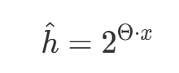

*図１,ハーフライフ回帰の式*

> *Figure 1: Half-life regression formula*

hは推定される半減期であり、xは学習履歴の特徴量ベクトル（ヒントなしで正しく使えた回数や、間違えた回数）、Θは各特徴量に対する重みパラメータのベクトルとなります。

> h is the estimated half-life, x is the feature vector of the learning history (such as the number of times used correctly without a hint and the number of mistakes), and Θ is the vector of weight parameters for each feature.

エビングハウスの忘却曲線モデルに基づき、最後の学習（会話での使用）から特定の空白期間（経過時間）を経たあとの「習得度（想起確率 p）」は、以下の式で定義されます。

> Based on Ebbinghaus's forgetting-curve model, "mastery (recall probability p)" after a certain gap (elapsed time) since the last learning (use in conversation) is defined by the following formula.

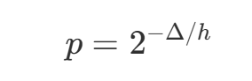

*図2,習得度の式*

> *Figure 2: Mastery formula*

Δは最後にその表現を会話で使用してからの経過時間（日）であり、hはその半減期となります。

> Δ is the time (in days) since the expression was last used in conversation, and h is its half-life.

ここでは学習した単語のうち、記憶から消えかかる「半減期」を推定し、正解確率が50％まで落ち込んだものを優先的に表示するようにします。つまりpが0.5以下のものを自動的に最上位にリストアップします。

> Here, we estimate the "half-life" at which learned words begin to fade from memory, and prioritize displaying those whose probability of correct recall has dropped to 50%. That is, items with p of 0.5 or less are automatically listed at the top.

この時、次にヒントボタンを押さずにその表現を会話で使用できた回数が一定以上の基準を超えたとき、具体的にはヒントを一度も使わずに会話で正しく使えた回数が5回に達し、HLRモデルで算出されたその表現の半減期（h）が180日（半年）以上に達する時に習得度がMAXになったとし、その表現をメモから自動削除するようにします。

> Then, when the number of times the expression was used in conversation without pressing the hint button exceeds a certain threshold—specifically, when it has been used correctly in conversation 5 times without ever using a hint, and the expression's half-life (h) calculated by the HLR model reaches 180 days (half a year) or more—mastery is considered to be at MAX, and the expression is automatically removed from the memos.

ヒントではそれらの単語だけではなく、メモした構文やイディオムを組み合わせた例文を作成し、総合的に構文やイディオム、単語を一度にユーザーが復習することで、能動的にそれらの表現を使用することができるようにします。

> The hints include not only those words but also example sentences that combine memorized syntax patterns and idioms, so that the user can review syntax, idioms, and words together at once and actively use those expressions.

またユーザーがそれらの表現を覚えた数を進捗ダッシュボードに表示することで、現在の言語能力の指標に利用します。

> The number of expressions the user has learned is also shown on a progress dashboard, as an indicator of current language ability.

このシステムは以下の５ステップに分けることができます。

> This system can be divided into the following five steps.

#### ①入力のインデックス化 / Indexing the Input

ここでまずユーザーがメモに長文を入力すると、LLMに対してJSONの決まった形で、単語/イディオム/構文に分けて返してと頼み、単語・イディオム・構文をまとめて保存します。

> First, when the user enters a long passage into a memo, we ask the LLM to split it into words / idioms / syntax patterns and return them in a fixed JSON format, then save the words, idioms, and syntax patterns together.

次に分類された各要素に対して、意味を数値化した「ベクトル」に変換し、SQLite（ベクトルデータベース）に保存します。これにより単なるキーワード一致だけではなく、文脈に基づいた検索が可能となります。

> Next, each classified element is converted into a "vector" that represents its meaning numerically and saved in SQLite (used as a vector database). This enables context-based search rather than simple keyword matching.

#### ②ヒントの抽出 / Extracting Hints

リアルタイム会話中に、AIが質問を投げた瞬間にRAGの検索器が作動し、AIの質問文とメモにある各表現との「意味の近さ」を計算します。これにより、「果物」の質問に対して「車」を除外し、「リンゴ」や「ジューシー」といった関連性の高い表現を抽出します。

> During real-time conversation, the moment the AI asks a question, the RAG retriever runs and computes the "semantic closeness" between the AI's question and each expression in the memos. For a question about "fruit," for example, this excludes "car" and extracts highly relevant expressions such as "apple" and "juicy."

ここで抽出された候補は、ハーフライフ回帰を用いて、最後に使用してからの経過時間と記憶の強さを示す「半減期」から現在正解できる確率が50％まで落ち込んでいるものを優先的に上位に表示します。

> Using half-life regression, the extracted candidates whose current probability of correct recall has dropped to 50%—based on the time since last use and the "half-life" indicating memory strength—are displayed at the top with priority.

#### ③ヒントの提示 / Presenting Hints

最後に単に単語を出すだけではなく、上位に選ばれた単語、構文、イディオムをLLMが組み合わせ、今の会話でそのまま使える例文を現在のAIとの会話を解析して生成します。AIの返答を音声再生させるようにし、任意に各返答を繰り返し再生できるようにします。

> Finally, rather than just showing words, the LLM combines the top-ranked words, syntax patterns, and idioms and, by analyzing the current conversation with the AI, generates an example sentence that can be used as is in the current conversation. The AI's replies are played back as audio, and each reply can be replayed at will.

#### ④相互作用の記録と習得度の更新 / Recording Interactions and Updating Mastery

- ユーザーが提示されたヒントを見た上でヒントを使用したら「成功」と見なします。ここでHLRモデルにおける相互作用特徴量（ユーザー個人の学習履歴に関する重み）のうち、正解回数の重みが加算されます。しかしヒントなしの成功よりも低い重みでカウントされます。また記憶が強化されたと判断され、次にその表現を提示するまでの間隔（半減期）が少しだけ延びます。最後に想起確率がリセットされ、新たな半減期に基づいて再び減衰が始まります。しかし習得条件である「ヒントなしで５回成功」のカウントには含まれません。

  > If the user sees the presented hint and then uses it, it is counted as a "success." Among the interaction features in the HLR model (weights related to the individual user's learning history), the weight for the number of correct answers is increased—but with a lower weight than a success without a hint. The memory is judged to have been reinforced, and the interval until the expression is presented again (the half-life) is extended slightly. Finally, the recall probability is reset and begins decaying again based on the new half-life. However, this is not counted toward the mastery condition of "5 successes without a hint."

- ユーザーが提示されたヒントを見たにも関わらず、ユーザーがその表現を全く使わなかった場合は「失敗」と見なします。ここでHLRモデルにおける相互作用特徴量（ユーザー個人の学習履歴に関する重み）のうち、不正解回数の重み（負の重み）が加算されます。また記憶が忘却されたと判断され、半減期が短くなります。最後に想起確率が低いまま維持され、次回の会話でAIが質問した際、再び高い優先順位で「ヒント候補」として浮上します。習得条件である「ヒントなしで５回成功」のカウントには含まれません。

  > If the user saw the presented hint but did not use the expression at all, it is counted as a "failure." Among the interaction features in the HLR model (weights related to the individual user's learning history), the weight for the number of incorrect answers (a negative weight) is increased. The memory is judged to have been forgotten, and the half-life becomes shorter. Finally, the recall probability stays low, so the next time the AI asks a question in conversation, the expression surfaces again as a high-priority "hint candidate." This is not counted toward the mastery condition of "5 successes without a hint."

- ユーザーがヒントを必要とせずにメモの表現を利用できた場合、HLRモデルにおける相互作用特徴量（ユーザー個人の学習履歴に関する重み）のうち、正解回数の重みが大幅に加算されます。最後に想起確率がリセットされ、新たな半減期に基づいて再び減衰が始まり、次に表示されるまでの期間が大幅に延長されます。そして習得条件である「ヒントなしで５回成功」にカウントされ、このカウントが５回に達し、なおかつ算出された半減期が180日以上であれば習得度がMAXになったとして、メモから自動的に削除されます。

  > If the user was able to use a memo expression without needing a hint, the weight for the number of correct answers among the interaction features in the HLR model (weights related to the individual user's learning history) is increased substantially. Finally, the recall probability is reset and begins decaying again based on the new half-life, and the period until it is shown next is greatly extended. This counts toward the mastery condition of "5 successes without a hint"; when this count reaches 5 and the calculated half-life is 180 days or more, mastery is considered to be at MAX and the expression is automatically removed from the memos.

  #### ⑤進捗ダッシュボードの更新 / Updating the Progress Dashboard

  習得済みの数や、習得度は進捗ダッシュボードに可視化します。

  > The number of mastered expressions and the level of mastery are visualized on the progress dashboard.

  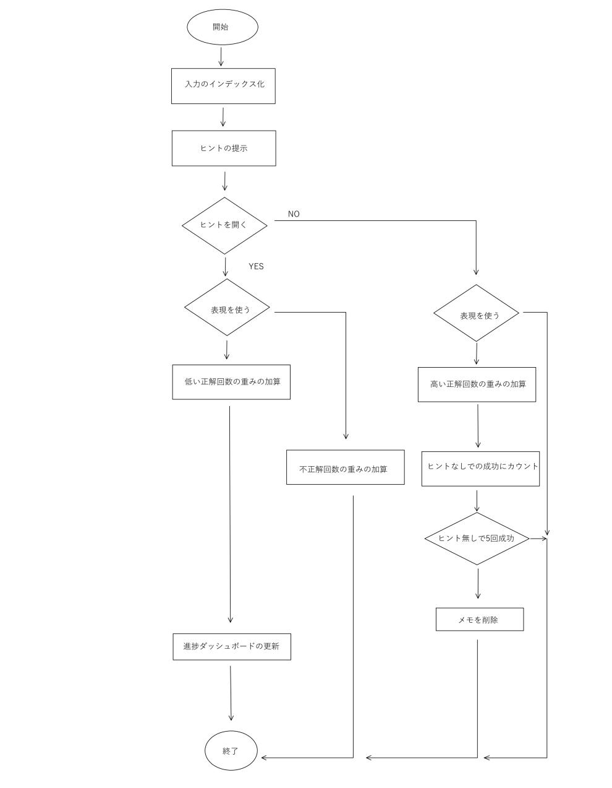

  今回はリアルタイム会話による会話の書き起こしをベースにし、リアルタイム会話機能に搭載されている文法修正機能はヒント使用時には停止されるようにします。

  > This time, the design is based on the transcript of the real-time conversation, and the grammar-correction feature built into the real-time conversation feature is paused while hints are being used.

  評価では、それぞれの精度（RAGAS）、レイテシとコストを計測し、精度の向上を図ります。

  > In the evaluation, we measure each component's accuracy (RAGAS), latency, and cost, and work to improve accuracy.

  RAGASとは、RAG（検索拡張生成）システムを自動で評価するための、参照（人間の手による正解データ）を必要としない（reference-free）評価フレームワークです。(Abstract,Shahul Es, Jithin James, Luis Espinosa-Anke, Steven Schockaert,2023）

  > RAGAS is a reference-free evaluation framework—it does not need reference data (human-made correct answers)—for automatically evaluating RAG (retrieval-augmented generation) systems. (Abstract, Shahul Es, Jithin James, Luis Espinosa-Anke, Steven Schockaert, 2023)

  このシステムでは、RAGASで主に2つの段階を測ります。1つ目は「検索」で、AIの質問に対してメモの中から本当に関係のある表現を選べているか、関係ないものを混ぜていないか（Context Precision）、関係あるものを取りこぼしていないか（Context Recall）を見ます。2つ目は「例文づくり」で、選んだ表現をきちんと使った例文になっているか（作り話をしていないか＝Faithfulness）、そしてその例文がAIの質問への返事として自然か（Answer Relevancy）を見ます。

  > In this system, RAGAS measures mainly two stages. The first is "retrieval": whether, for the AI's question, it picks expressions from the memos that are actually relevant without mixing in irrelevant ones (Context Precision), and without missing relevant ones (Context Recall). The second is "example-sentence generation": whether the example sentence properly uses the selected expressions (without making things up = Faithfulness), and whether the example sentence is a natural reply to the AI's question (Answer Relevancy).

  そして各部分で改良し、どれくらい改善したかを測ります。そして最も改善されたRAGシステムをシステム全体に組み込むことが目標になります。

  > We then improve each part and measure how much it improved. The goal is to integrate the most improved RAG system into the overall system.

  しかしここではアルゴリズムの公平性に問題があります。

  > However, there is a problem with algorithmic fairness here.

  まずメモ表現を単語やイディオム、構文に分解する際、必ずLLMを通します。

  > First, when memo expressions are broken down into words, idioms, and syntax patterns, they always go through an LLM.

  しかしもしメモ表現や分解後の解説テキストに日本語が含まれている場合、ChatGPTなどで使われているトークナイザーでは、漢字の65％以上が1文字あたり3トークンに分割されます。(2 Intriguing Properties of Tokenization Across Languages,Aleksandar Petrov, Emanuele La Malfa, Philip H.S. Torr, Adel Bibi,2023)

  > However, if the memo expressions or the explanatory text after breakdown contain Japanese, the tokenizers used by ChatGPT and others split over 65% of kanji into 3 tokens per character. (2 Intriguing Properties of Tokenization Across Languages, Aleksandar Petrov, Emanuele La Malfa, Philip H.S. Torr, Adel Bibi, 2023)

  ここで、同一内容のテキストで比較した場合、ChatGPTにおいては日本語は英語の約2.3倍のトークン数を必要とします。

  > Comparing texts with the same content, Japanese requires about 2.3 times as many tokens as English in ChatGPT.

  (4 Tokenization Length Differences Across Languages,Aleksandar Petrov, Emanuele La Malfa, Philip H.S. Torr, Adel Bibi,2023)

  商用LLM　APIの多くはトークン単位で課金されるため、分解処理を毎回行う際のAPI費用も英語に比べて高くなります。

  > Since most commercial LLM APIs charge per token, the API cost of running the breakdown each time is also higher than for English.

  またLLMの実行・処理時間はトークン数と強い直線的な相関関係にあり、単語や構文を分解する際、トークン数が多くなる言語ほどLLMからの応答を受け取るまでの時間が長くなります。(1 Introduction,Aleksandar Petrov, Emanuele La Malfa, Philip H.S. Torr, Adel Bibi,2023)

  > In addition, LLM execution and processing time is strongly and linearly correlated with the number of tokens, so when breaking down words and syntax, the more tokens a language needs, the longer it takes to receive the LLM's response. (1 Introduction, Aleksandar Petrov, Emanuele La Malfa, Philip H.S. Torr, Adel Bibi, 2023)

  今回のプロジェクトを実行するために必要となる、ツール、技術、データセットは以下のようになります。

  > The tools, technologies, and datasets needed to carry out this project are as follows.

  #### ツール / Tools

|  |  |
|----|----|
| FastAPI | エンドポイント |
| Uvicorn | バックエンド（ASGI）サーバの起動 |
| SQLite | メモ・習得表現の保存 |
| Pydantic | 入力JSONの型チェック |
| OpenAI Python SDK | 表現の埋め込みベクトル化 |
| Google GenAI SDK | 表現の抽出・例文生成・使用判定（Gemini呼び出し） |
| python-dotenv | APIキー（.env）の読み込み |
| React + Vite + TypeScript | フロントのメモ入力・ヒント／ダッシュボード表示 |

> |  |  |
> |----|----|
> | FastAPI | Endpoints |
> | Uvicorn | Running the back-end (ASGI) server |
> | SQLite | Storing memos and mastered expressions |
> | Pydantic | Type-checking the input JSON |
> | OpenAI Python SDK | Embedding expressions as vectors |
> | Google GenAI SDK | Extracting expressions, generating example sentences, judging usage (calling Gemini) |
> | python-dotenv | Loading API keys (.env) |
> | React + Vite + TypeScript | Front-end memo input and hint/dashboard display |

#### 技術 / Technologies

|  |  |
|----|----|
| テキスト埋め込み（Embeddings） | 表現を意味ベクトル化 |
| コサイン類似度 | AI発言と保存表現の**意味的な近さ**を測りヒント候補を選ぶ |
| LLMによる表現抽出・分類 | 入力文から単語／イディオム／構文を抽出 |
| 想起確率モデル（忘却曲線・間隔反復的手法） | 復習タイミングを推定し提示 |
| LLMによる使用判定 | ヒント表現を実際に使えたか判定 |
| 構造化出力（JSONモード） | LLM応答を決まったJSON形式で受け取る |
| REST API／WebSocket | フロントとの通信 |
| 意味検索（Semantic Search） | 埋め込み＋類似度による検索の総称 |

> |  |  |
> |----|----|
> | Text embeddings | Turning expressions into semantic vectors |
> | Cosine similarity | Measuring the **semantic closeness** between the AI's utterance and saved expressions to choose hint candidates |
> | Expression extraction and classification with an LLM | Extracting words / idioms / syntax patterns from the input text |
> | Recall probability model (forgetting curve, spaced-repetition methods) | Estimating and presenting review timing |
> | Usage judgment with an LLM | Judging whether the hint expressions were actually used |
> | Structured output (JSON mode) | Receiving LLM responses in a fixed JSON format |
> | REST API / WebSocket | Communication with the front end |
> | Semantic search | General term for search using embeddings + similarity |

#### データセット / Dataset

|                    |                                            |
|--------------------|--------------------------------------------|
| ユーザー生成データ | ユーザーが保存した表現・成否記録・習得表現 |

> |                    |                                            |
> |--------------------|--------------------------------------------|
> | User-generated data | Expressions saved by the user, success/failure records, mastered expressions |

まず入力のインデックスをベクトル化する必要がありますが、自前でRAGを運用する場合、Wikipedia全件程度のインデックスを扱うだけで、圧縮しても36GB、通常は100GB程度のCPUメモリを必要としてしまいます。マルチユーザー環境でこれらを管理・スケ―ルさせるのには技術的・コスト的に非常に高負荷ですが、APIを利用すればローカルのモデル保持容量は実質「ゼロ」で済みため、サーバーリソースを他の処理に割くことができます。またOpenAIのtext-embedding-3-largeなどのモデルは100万トークンあたり0.13ドルという極めて安価な料金で利用可能です。

> First, the input index needs to be vectorized. Running RAG ourselves would require, just to handle an index the size of all of Wikipedia, 36 GB of CPU memory even when compressed, and typically around 100 GB. Managing and scaling this in a multi-user environment is very demanding in both technology and cost, but by using an API, the local model storage is effectively "zero," so server resources can be devoted to other processing. Models such as OpenAI's text-embedding-3-large are also available at an extremely low price of USD 0.13 per million tokens.

以上より、今回はこのtext-embedding-3-largeを採用してベクトル化を行いたいと思います。

> For these reasons, we adopt text-embedding-3-large for vectorization.

OpenAI　EmbeddingsAPIは、単語や文の意味を文章ベクトルとしてベクトル化します。

> The OpenAI Embeddings API turns the meaning of words and sentences into sentence vectors.

ステップとしては、EmbeddingsAPIで文字列の文章ベクトルを取得し、取得した文章ベクトル同士の類似性を計算し、意味的に近いか計算します。

> The steps are: obtain sentence vectors for strings with the Embeddings API, then compute the similarity between the obtained vectors to determine whether they are semantically close.

ヒントの提示では、自分の発話ターン中に「ヒント」ボタンで、自分がメモした表現の中から、今の会話にちょうど合うもの・かつ習得度の低いものを思い出させる2段階構成にします。まず現在のAIの返答から意味検索をしてメモに保存された単語を持ってきます。そしてその単語からさらに習得度が低いものを選択します。次にメモにあるイディオム・構文から習得度が低いものを選択し、その単語とイディオム・構文を組み合わせてLLMにその返答に適切な回答を生成させます。これはヒントを開いた時ごとに生成させることでコストを削減します。

> Hint presentation has a two-stage design: during the user's own speaking turn, the "Hint" button reminds the user of expressions from their own memos that fit the current conversation and have low mastery. First, we perform semantic search based on the AI's current reply and fetch words saved in the memos. From those words, we then select the ones with low mastery. Next, we select idioms and syntax patterns from the memos with low mastery, combine them with the words, and have the LLM generate an appropriate answer to the reply. Generating this only each time the hint is opened reduces cost.

ではまず入力のインデックス化を行いたいと思います。

> First, let us index the input.

流れとしては、フロントでまず長文を貼り、保存します。この時、バックエンドではエンドポイントが起動し、長文をLLMで分解し、単語/イディオム/構文に分けます。そして各要素をベクトル化し、DBに保存します。

> The flow is: on the front end, paste a long passage and save it. The back-end endpoint then runs, splits the passage with the LLM into words / idioms / syntax patterns, vectorizes each element, and saves it to the DB.

今回は②から⑤までを考慮して、データモデルを以下のようにします。

> Taking steps ② to ⑤ into account, the data model is as follows.

|                   |                                                  |
|-------------------|--------------------------------------------------|
| id                | 表現に対する識別                                 |
| type              | word(単語）、idiom（イディオム）、syntax（構文） |
| text              | 表現                                             |
| vector            | 意味ベクトル（JSON文字列）                       |
| created_at        | 保存日時                                         |
| last_seen_at      | 最後に使った日時                                 |
| half_life         | 半減期                                           |
| good/bad          | 成功/失敗回数                                    |
| hint_free_success | ヒント無し成功回数                               |

> |                   |                                                  |
> |-------------------|--------------------------------------------------|
> | id                | Identifier for the expression                    |
> | type              | word, idiom, or syntax                           |
> | text              | The expression                                   |
> | vector            | Semantic vector (JSON string)                    |
> | created_at        | Date and time saved                              |
> | last_seen_at      | Date and time last used                          |
> | half_life         | Half-life                                        |
> | good/bad          | Number of successes / failures                   |
> | hint_free_success | Number of successes without a hint               |

今回はSQLiteを使用します。まずテーブルを作る関数をバックエンドで書いて、起動時に一回呼ぶようにします。

> This time we use SQLite. First, we write a function on the back end that creates the table and call it once at startup.

```python
conn = sqlite3.connect("memo.db")
```

これでは、memo.dbというデータベースに接続し、connという変数に返ってきた接続を入れます。

> This connects to a database called memo.db and puts the returned connection into the variable conn.

その後は、このconnという変数を通してテーブルを作成したり、変更を確定したりするといったDBとのやり取りを行います。

> After that, all interaction with the DB—creating tables, committing changes, and so on—happens through this conn variable.

まず型には以下の三種類があります。

> First, there are three kinds of types.

|         |        |
|---------|--------|
| INTEGER | 整数   |
| TEXT    | 文字列 |
| REAL    | 小数   |

> |         |        |
> |---------|--------|
> | INTEGER | Integer |
> | TEXT    | String |
> | REAL    | Decimal |

まずidですが、これは他の表現と被らないようにする必要があります。ここで使用するオプションとしてPRIMARY KEY AUTOINCREMENTがあります。これは保存の度に各行を区別する主キーが自動的に割り当てられます。

> First, id must not collide with other expressions. The option used here is PRIMARY KEY AUTOINCREMENT, which automatically assigns a primary key that distinguishes each row every time one is saved.

この型は整数（INTEGER）とします。

> Its type is integer (INTEGER).

次にtypeですが、これはword(単語）、idiom（イディオム）、syntax（構文）の三種類のどれかの文字列にする必要があります。

> Next, type must be one of three strings: word, idiom, or syntax.

まずこれらの文字列のどれかである必要があるため、NOT　NULL（必ず値を返す）であり、型は文字列（TEXT）とします。

> Since it must be one of these strings, it is NOT NULL (a value is always required), and its type is string (TEXT).

vectorは、最初は空なので、オプションは無く、型は文字列（TEXT）とします。

> vector is empty at first, so it has no options, and its type is string (TEXT).

created_atは自動で今の日時にする必要があるため、DEFAULT (datetime('now'))とします。型は文字列（TEXT）とします。これは「"2026-08-25 12:34:56"」のように人が読みやすい形にするためです。

> created_at must automatically be set to the current date and time, so it uses DEFAULT (datetime('now')). Its type is string (TEXT), so that it is in a human-readable form such as "2026-08-25 12:34:56".

last_seen_atは最初は空なのでオプションはなく、これも型は文字列（TEXT）とします。

> last_seen_at is empty at first, so it has no options, and its type is also string (TEXT).

half_lifeは半減期（記憶が半分に減るまでの時間）なので、もし初期値が０なら保存した瞬間に忘れるという矛盾した状態になります。つまりこれは正の値であるべきなので、初期値はDEFAULT 1.0とします。さらに半減期は小数にもなり得るので、型は小数型（REAL）にします。good/bad,は整数の回数なので型は整数（INTEGER）でDEFAULT 0、hint_free_successも同様になります。

> half_life is the half-life (the time until memory decreases by half), so if its initial value were 0, it would be in the contradictory state of being forgotten the moment it is saved. It should therefore be positive, so the initial value is DEFAULT 1.0. Since the half-life can be a decimal, its type is decimal (REAL). good/bad are integer counts, so their type is integer (INTEGER) with DEFAULT 0, and the same applies to hint_free_success.

コードは以下のようになります。

> The code looks like this.

```python
conn.execute("""CREATE TABLE IF NOT EXISTS memo_item(
        id INTEGER PRIMARY KEY AUTOINCREMENT,
        type TEXT NOT NULL,
        text TEXT NOT NULL,
        vector TEXT,
        created_at TEXT DEFAULT (datetime('now')),
        last_seen_at TEXT,
        half_life REAL DEFAULT 1.0,
        good INTEGER DEFAULT 0,
        bad INTEGER DEFAULT 0,
        hint_free_success INTEGER DEFAULT 0
    )""")
```

これはサーバー起動時にのみ作成され、空のテーブルが用意されます。

> This is created only when the server starts, preparing an empty table.

その後、ユーザーがメモを保存したら、エンドポイント（/memo)でテーブルに対してSQL命令である「INSERT」し、入力のインデックス化をします。またヒントを抽出したい時は、「SELECT」をして全メモからベクトルを取り出し、類似度とHLRで並べます。

> After that, when the user saves a memo, the endpoint (/memo) runs the SQL command "INSERT" on the table to index the input. When we want to extract hints, we "SELECT" to fetch the vectors of all memos and rank them by similarity and HLR.

また相互作用の記録と習得度の更新では「UPDATE」でそれぞれの表現のgood/bad/half_life/last_seen_at を更新します。またダッシュボードでは習得数を数えたりするために「SELECT」を命令します。

> In recording interactions and updating mastery, "UPDATE" updates good/bad/half_life/last_seen_at for each expression. The dashboard issues "SELECT" to count mastered expressions and so on.

全体の関数は以下のようになります。

> The whole function looks like this.

```python
def init_memo_db():
    conn = sqlite3.connect("memo.db")
    conn.execute("""CREATE TABLE IF NOT EXISTS memo_item(
        id INTEGER PRIMARY KEY AUTOINCREMENT,
        type TEXT NOT NULL,
        text TEXT NOT NULL,
        vector TEXT,
        created_at TEXT DEFAULT (datetime('now')),
        last_seen_at TEXT,
        half_life REAL DEFAULT 1.0,
        good INTEGER DEFAULT 0,
        bad INTEGER DEFAULT 0,
        hint_free_success INTEGER DEFAULT 0
    )""")

    conn.commit()#変更を確定し、テーブルを作成
    conn.close()#DBへの接続を閉じる
init_memo_db()#起動時にDBを起動
```

これからまず簡単なメモ機能をまず作り、手動でメモが保存されるかどうか確認します。

> From here, we first build a simple memo feature and check manually whether memos are saved.

最初にメモ保存で受け取るデータの型を定義します。これはフロントからはJSON（{"type":"word"}）を通信で送ってきます。これを自動でitemに変換すれば、item.typeが使えるので便利です。

> First, we define the type of the data received when saving a memo. The front end sends JSON ({"type":"word"}) over the network. If this is automatically converted into item, we can conveniently use item.type.

またもしフロントが片方を送り忘れたら、DBに届く前にエラーからDBを守る働きをします。データの型は以下のようになります。

> Also, if the front end forgets to send one of the fields, this protects the DB from errors before anything reaches it. The data type looks like this.

```python
class MemoIn(BaseModel):
    text:str#表現そのもの
```

またフロントでメモ保存ボタンを押したら、エンドポイント（post/memo)が起動し、以下の関数が実行されます。

> When the memo-save button is pressed on the front end, the endpoint (POST /memo) is called and the following function runs.

```python
@app.post("/memo")
def save_memo(item:MemoIn)
```

ここで(item: MemoIn)は届いたデータを定義した型で受け取り、これをitem.type＝"word"、として使えるようにします。

> Here, (item: MemoIn) receives the incoming data with the defined type, so it can be used as item.type = "word".

そして次にINSERT命令を実行して一行追加します。

> Next, we run an INSERT command to add a row.

```python
 conn.execute("INSERT INTO memo_item(type,text) VALUES(?,?)",("word",item.text,))
```

ここでは、INSERT INTO memo_item (type,text)でDBのtextに、VALUES ( ?\<?)で値を２つ入れ、(item.text)でその？に入る値を指定します。今回はDBでtypeがNOT NULLなので一時的に何かしらのタイプを入れておきます。

> Here, INSERT INTO memo_item (type,text) inserts two values into the DB with VALUES (?, ?), and (item.text) specifies the value that goes into each ?. Since type is NOT NULL in the DB, we temporarily put in some type.

関数全体は以下のようになります。

> The whole function looks like this.

```python
@app.post("/memo")
def save_memo(item:MemoIn):
    conn = sqlite3.connect("memo.db")
    conn.execute("INSERT INTO memo_item(type,text) VALUES(?,?)",("word",item.text,))
    conn.commit()
    conn.close()
    return{"status":"SAVED"}#フロントにJSONで返答する
```

ここで、フロントはメモ入力欄にメモを書き込み、保存ボタンを押すとエンドポイントが起動し、この関数が起動します。

> Now, when the front end writes a memo in the memo input field and presses the save button, the endpoint is called and this function runs.

具体的には、フロントでfetch()でメモの内容をバックエンドに送信します。そこでFastAPIが届いたfetch()で届いたリクエストのメソッド（POST）とパス（/memo）を見て、それに一致するsave_memo(item:MemoIn)関数を実行します。そして関数にあるように return{"status":"SAVED"}が返答され、これをFastAPIがこの辞書をJSONのレスポンスに変換してフロントへ返信します。ここでawait fetch()でこの返信を受け取るまで待ち処理を完了します。

> Specifically, the front end sends the memo content to the back end with fetch(). FastAPI looks at the method (POST) and path (/memo) of the request that arrived via fetch() and runs the matching function, save_memo(item:MemoIn). As written in the function, return {"status":"SAVED"} is returned, and FastAPI converts this dictionary into a JSON response and sends it back to the front end. await fetch() waits until this reply is received and then completes.

まずフロントでは以下のようにメモを入力するために項目を追加します。

> First, on the front end, we add an item for entering the memo, as follows.

```tsx
const[memoText,setMemoText] = useState('')//メモ表現を入力する。
```

これをUIで使用します。

> We use this in the UI.

```tsx
 <div style ={{marginTop:"24px",borderTop:"2px solid #ccc",paddingTop:"12px"}}>
    <h3>メモ</h3>
    <input  value={memoText} onChange = {(e) => setMemoText(e.target.value)} placeholder = "メモする表現"/>
  </div>
```

ここではまだメモを変数に格納しただけで、これをバックエンドに送信する関数がありません。ではこのバックエンドに送信する関数を実装していきます。

> At this point the memo is only stored in a variable; there is no function to send it to the back end yet. So let us implement the function that sends it to the back end.

まずメモの内容（オプション）（引数1）を特定のURL（つまりサーバー/バックエンド）（引数2）に送る場合、

> First, to send the memo content (the options, argument 2) to a specific URL (that is, the server / back end, argument 1),

以下の構文が必要になります。

> the following syntax is needed.

```text
fetch(引数1,{引数2})
```

今回の場合は引数１はhttp://localhost:8000/memo（エンドポイント/memo)であり、オプションでは以下のような情報が必要になります。

> In this case, argument 1 is http://localhost:8000/memo (the /memo endpoint), and the options need the following information.

```tsx
method:"POST",//どの操作か
 headers:{"Content-Type": "application/json"},//JSONで送ると指定
body:JSON.stringify({text:memoText}),//送るデータ本体
```

関数全体は以下のようになります。

> The whole function looks like this.

```tsx
async function saveMemo() {
  if(!memoText)return;//メモが空なら実行しない
  await fetch("http://localhost:8000/memo",{
    method:"POST",//どの操作か
    headers:{"Content-Type": "application/json"},//JSONで送ると指定
    body:JSON.stringify({text:memoText}),//送るデータ本体
  });
  setMemoText("");//メモの内容を空にする
}
```

ここでfetch関数が起動すると、バックエンドのsave_memo関数が起動します。ここで return{"status":"SAVED"}がフロントに返答するまでawaitで待つことでメモ内容がすぐに削除されるのを防ぎます。

> When the fetch function runs, the back end's save_memo function runs. By waiting with await until return {"status":"SAVED"} is returned to the front end, we prevent the memo content from being cleared immediately.

これをUIに挿入します。

> We insert this into the UI.

```tsx
<button onClick={saveMemo}>メモを保存</button>
```

しかしここでCORSというセキュリティが起動してしまいます。

> However, at this point a security mechanism called CORS kicks in.

なぜならこれは別のオリジンからのアクセスを、サーバーが許可する仕組みが常に働いているからです。まずオリジンとはプロトコルとホストとポートの組になります。

> This is because there is always a mechanism in which the server must permit access from a different origin. An origin is the combination of protocol, host, and port.

例えば

> For example,

```tsx
http://localhost:5173
```

これは、http:がプロトコルで、localhostはホスト、5173はポートになります。

> here, http: is the protocol, localhost is the host, and 5173 is the port.

もしフロントのポートが5173で、バックエンドのポートが8000ならポートが違うので、CORSが起動してしまいます。そこでサーバー側が「このオリジンからのアクセスは大丈夫」と許可のヘッダーを返す必要があります。

> If the front end's port is 5173 and the back end's port is 8000, the ports differ, so CORS kicks in. The server therefore needs to return a header that grants permission: "access from this origin is OK."

```python
app.add_middleware(
    CORSMiddleware,
    allow_origins = ["*"],#どこからのアクセスも許可
    allow_methods = ["*"],
    allow_headers = ["*"],
)
```

以上のようにバックエンドでフロントからの送信を許可します。

> As shown above, the back end permits requests from the front end.

ここでメモを保存できることが以下のように確認できました。

> We confirmed that memos can now be saved, as shown below.

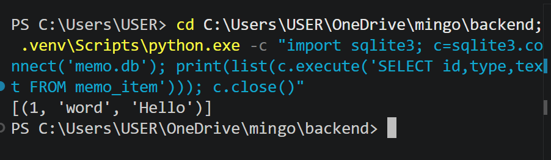

さらにここからLLMに対してJSONの決まった形で、単語/イディオム/構文に分けて返してと頼み、単語・イディオム・構文をまとめて保存し、分類された各要素に対して、意味を数値化した「ベクトル」に変換し、SQLite（ベクトルデータベース）に保存するという機構を追加する必要があります。

> From here, we need to add a mechanism that asks the LLM to split the text into words / idioms / syntax patterns and return them in a fixed JSON format, saves the words, idioms, and syntax patterns together, converts each classified element into a "vector" that represents its meaning numerically, and saves it in SQLite (used as a vector database).

まずメモした文章を単語/イディオム/構文に分けてJSONで返す関数を作成します。

> First, we create a function that splits the memo text into words / idioms / syntax patterns and returns them as JSON.

```python
def split_memo(text):
    promot = (
        "次の文章から、学習価値のある単語・イディオム・構文を抜き出して分類し、必ずJSONだけで返して:\n"
        '{"items":[{"type":"wordかidiomかsyntax","text":"抜き出した表現"}]}\n'
        f"抜き出した文章:{text}"
    )
    response = client.models.generate_content(
        model = GRAMMER_MODEL,
        contents = promot,
        config=types.GenerateContentConfig(
                response_mime_type = "application/json",#形式（JSON）
                temperature = 0.2,#答えのブレ具合（低いと堅実）
        ),
    )
    return json.loads(response.text)
```

またこの関数はこのJSONを返答します。これはバックエンドの中だけで使用するためです。

> This function returns that JSON, because it is used only inside the back end.

次にこの表現をベクトル化する関数を作成します。

> Next, we create a function that vectorizes these expressions.

まずOpenAIの窓口を作ります。

> First, we create the OpenAI client.

```python
openai_client = OpenAI(api_key = OPENAI_API_KEY)#openaiライブラリの中にある設計図Clientを使って、APIキー付きで“実物の道具箱”を1個作り、それをopenai_clientという変数に入れる
```

これを使用してsplit_memo関数から送られてくるテキストの複数の表現をまとめて意味ベクトルに変換します。

> Using it, we convert the multiple expressions in the text sent from the split_memo function into semantic vectors all at once.

```python
    response = openai_client.embeddings.create(
        model = "text-embedding-3-large",
        input = texts,
    )
```

これは、inputsでテキストを入力し、モデルを選択した結果がresponseに格納されます。

> Here, the text is passed as input, and the result of the selected model is stored in response.

```python
return[ json.dumps(d.embedding)for d in response.data]
```

最終的に、response.dataという元のリスト（それぞれの文のベクトル結果）からdという変数に一個ずつ結果を取り出します。そしてd.embeddingでそのdのベクトルを集めます。

> Finally, we take the results one at a time from the original list response.data (the vector result for each sentence) into the variable d, and collect d's vector with d.embedding.

そしてjson.dumps()に入れることで、ベクトルをJSON文字列に変換し、それを集めて\[\]でリストにします。

> Passing it to json.dumps() converts the vector into a JSON string, and collecting them in \[\] makes a list.

```python
def embed_texts(texts):
    response = openai_client.embeddings.create(
        model = "text-embedding-3-large",
        input = texts,
    )
    return[ json.dumps(d.embedding)for d in response.data]
```

結果の関数は以上のようになります。

> The resulting function is shown above.

次にはsave_memo関数の内容を、まず表現をLLMで分解し、その表現の中から既に保存されている表現が無いかをDBを検索し、その上で表現をまとめてベクトル化してDBに保存するといった仕様にします。

> Next, we change save_memo so that it first splits the expressions with the LLM, searches the DB to see whether any of them are already saved, and then vectorizes the remaining expressions together and saves them to the DB.

まずsplit_memo関数で分解した表現をresult変数に保存します。

> First, we save the expressions split by split_memo into the variable result.

```python
result = split_memo(item.text)
```

さらに各表現に対して同じ表現が既にDBに保存されているか調べます。

> Then, for each expression, we check whether the same expression is already saved in the DB.

```python
exists = conn.execute("SELECT 1 FROM memo_item WHERE text = ?",(el["text"],)).fetchone()
```

まずSELECT 1でその表現があるかどうか調べ、あれば仮に1を返します。

> First, SELECT 1 checks whether the expression exists, returning 1 if it does.

FROM memo_itemでテーブルを指定し、WHERE text=?でtext列が?と一致する行を、(el\["text"\],)でその?に入る値格納します。

> FROM memo_item specifies the table, WHERE text=? selects rows whose text column matches ?, and (el\["text"\],) provides the value that goes into that ?.

そして.fetchone()で一致する行を一件だけ取ります。もし見つかればその行を返し、無ければNoneを返します。

> Then .fetchone() takes just one matching row. If one is found, it returns that row; otherwise it returns None.

```python
for el in result["item"]
        exists = conn.execute("SELECT 1 FROM memo_item WHERE text = ?",(el["text"],)).fetchone()
        if not exists:
            new_items.append(el)#表現が重複していなければ、その値を新しい要素を格納する変数に格納する
```

そしてそれらの表現をベクトル化します。

> Then we vectorize those expressions.

```python
vectors = embed_texts([el["text"] for el in new_items])
```

これではnew_itemsからtextだけ取り出しリストを作り、それをvectors変数に格納します。

> This takes only text from new_items to make a list and stores the result in the vectors variable.

```python
for el,vector in zip(new_items,vectors):
```

たとえばnew_items=\[item0,item1\] vectors=\[vec0,vec1\]ならzipで\[(item0, vec0), (item1, vec1)\] でペアのリストを作成します。そしてfor el,vector in...でペアを二つの変数に分けて取り出します。

> For example, if new_items = \[item0, item1\] and vectors = \[vec0, vec1\], zip creates the list of pairs \[(item0, vec0), (item1, vec1)\]. Then for el, vector in ... takes each pair out into two variables.

例えば1周目：el = item0, vector = vec0、2周目：el = item1, vector = vec1となります。

> For example, on the first iteration el = item0 and vector = vec0; on the second, el = item1 and vector = vec1.

```python
    if new_items:
        vectors = embed_texts([el["text"] for el in new_items])
        for el,vector in zip(new_items,vectors):
            conn.execute("INSERT INTO memo_item(type,text,vector) VALUES(?,?,?)",(el["type"],el["text"],vector,))
```

よって全ての関数は以下のようになります。

> So the whole function looks like this.

```python
def save_memo(item:MemoIn):
    result = split_memo(item.text)
    conn = sqlite3.connect("memo.db")

    #重複を除いた新しい要素だけを集める
    new_items = []#新しい要素を格納する変数
    for el in result["item"]
        exists = conn.execute("SELECT 1 FROM memo_item WHERE text = ?",(el["text"],)).fetchone()
        if not exists:
            new_items.append(el)#表現が重複していなければ、その値を新しい要素を格納する変数に格納する
    #新しい要素のtextをまとめてベクトル化する
    if new_items:
        vectors = embed_texts([el["text"] for el in new_items])
        for el,vector in zip(new_items,vectors):
            conn.execute("INSERT INTO memo_item(type,text,vector) VALUES(?,?,?)",(el["type"],el["text"],vector,))
    conn.commit()
    conn.close()
    return{"status":"SAVED"}#フロントにJSONで返答する
```

次にヒント抽出を行えるようにしていきます。

> Next, we make hint extraction possible.

具体的には/hintエンドポイントを起動し、AIの発言をベクトル化し、全メモとコサイン類似度を計算し、意味が近い上位を出せるようにします。

> Specifically, the /hint endpoint is called, the AI's utterance is vectorized, the cosine similarity with all memos is computed, and the top semantically close ones are returned.

まずコサイン類似度を測る関数を実装していきます。二つのベクトルをA,Bとすると、その成す角度θのコサイン類似度cosθは二つのベクトルの内積をそれぞれのベクトルの大きさの積で割ることで求められます。（ダイレクト出版株式会社,2024）

> First, we implement a function that measures cosine similarity. For two vectors A and B, the cosine similarity cos θ of the angle θ between them is obtained by dividing the dot product of the two vectors by the product of their magnitudes. (Direct Publishing Co., Ltd., 2024)

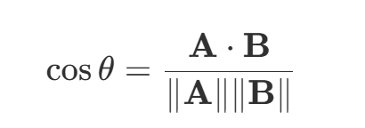

*図3,ベクトル内積の式*

> *Figure 3: Vector dot product formula*

```python
def cosine_similarity(a,b):
    dot = sum(x*y for x,y in zip(a,b))#各要素をかけた合計の内積
    norm_a = math.sqrt(sum(x*y for x in a))#aの長さ
    norm_b = math.sqrt(sum(x*y for x in b))#bの長さ
    return dot/(norm_a * norm_b)
```

関数は以上のようになります。

> The function is as shown above.

まずヒント検索で受け取るデータの型を以下のように定義します。

> First, we define the type of the data received for hint search as follows.

```python
class HintIn(BaseModel):
    query:str#AIの直前の発言
```

そしてAIの質問から意味が近い上位を出すようにします。

> Then we return the top expressions that are semantically close to the AI's question.

```python
def get_hint(item.HintIn):
    q_vec = json.loads(embed_texts([item.query])[0])#queryの一件目[0]をベクトル化し、それをPytonのリストに戻す
    conn = sqlite3.connect("memo.db")
    rows = conn..execute("SELECT type,text,vector FROM memo_item").fetchall()#全メモから拾い
    conn.close()
    scored=[]
    for type_,text_,vector_ in rows:#書くメモと類似度を計算
        v = json.loads(vector_)
        sim = cosine_similarity(q_vec,v)
        scored.append((sim,type_,text_))
    scored.sort(reverse=True)#類似度が高い順に並べる
    top = scored[:5]#上位５件
    return {"hints":[{"type":t,"text":tx,"sim":s} for s,t,tx in top]}
```

次はHLRでさらにその意味が近い上位から並び替えをします。

> Next, we further re-rank those top close expressions with HLR.

まずHLRモデルにおいて実際の予測モデルにおいては、生のカウント数をそのまま使うよりも、各数値の平方根を計算して特徴量として代入したほうが、予測精度（MAE）が劇的に向上することが判明しています（3.3 Half-Life Regression: A New Approach,Settles & Meeder ,2016)

> First, in the HLR model, it has been found that in actual prediction models, computing the square root of each count and using it as the feature dramatically improves prediction accuracy (MAE) compared with using the raw counts. (3.3 Half-Life Regression: A New Approach, Settles & Meeder, 2016)

ここで、まずHLR式のΘをTHETA_BIASとし、正解回数の重みをTHETA_GOOD、不正解回数の重みをTHETA_BADします。またΔは最後にその表現を会話で使用してからの経過時間（日）であるのでそれをdelta_daysとし、これは後にSQLで計算します。

> Here, we name Θ in the HLR formula THETA_BIAS, the weight for the number of correct answers THETA_GOOD, and the weight for the number of incorrect answers THETA_BAD. Δ is the time (in days) since the expression was last used in conversation, so we call it delta_days; this is computed later in SQL.

```python
def recall_probability(good,badmdelta_days):
    if delta_days is None:#一度も使っていない（Δ=0）新規メモは最優先で出す
        return 0
    h = 2**(THETA_BIAS + THETA_GOOD*math.sqrt(good) + THETA_BAD*math.sqrt(bad))
    return 2**(-delta_days/h)#想起確率（０から１）
```

ここでget_hint関数を少し変更します。

> Here we slightly modify the get_hint function.

```python
def get_hint(item:HintIn):
    q_vec = json.loads(embed_texts([item.query])[0])#queryの一件目[0]をベクトル化し、それをPytonのリストに戻す
    conn = sqlite3.connect("memo.db")
    rows = conn.execute("SELECT type,text,vector,good,bad,julianday('now')-julianday('last_seen_at') AS delta_days FROM memo_item").fetchall()#全メモから拾い
    conn.close()
    scored=[]
    for type_,text_,vector_,good_,bad_,delta_days_ in rows:#書くメモと類似度を計算
        v = json.loads(vector_)
        sim = cosine_similarity(q_vec,v)
        p = recall_probability(good_,bad_,delta_days_)
        scored.append((sim,p,type_,text_))
    scored.sort(key=lambda s:s[0], reverse=True)#類似度s[0]が高い順に並べる。（reverse=Trueで適用する）特にsimが高い順に並べる
    relevant = scored[:5]#上位5件
    relevant.sort(key=lambda s:s[1])#さらにその中で想起確率s[1]が低い順
    top = relevant[:5]#さらにその中の上位５件
    return {"hints":[{"type":t,"text":tx,"sim":sim,"recall":p} for sim,p,t,tx in top]}
```

これにて意味が近い順に５件並べ、さらにその中で想起確率が低い順に並べます。

> This lists the 5 closest items by meaning, and then sorts those by lowest recall probability.

しかし、まだこれではヒントを例文にするという作業が抜けています。

> However, the step of turning the hints into an example sentence is still missing.

ここで上位の表現を組み合わせて、今の会話で使える例文をLLMが生成できるようにします。また今まで通り、メモ・ヒント機能は同期で作成しているので、こちらも同期で作成していきます。

> Here we let the LLM combine the top expressions to generate an example sentence that can be used in the current conversation. As before, since the memo and hint feature is built synchronously, this is built synchronously as well.

```python
def make_example(hints,ai_text):
    exprs = ",".join(f"{h['type']}:{['text']}" for h in hints)#表現を一行にして繋げる
    promot = (
        "外国語学習のヒントを作ります。次のAIの回答文への返答として、下の表現をできるだけ使った自然な例文を一つ作りなさい。必ずJSONだけで返してください:\n"
        '{"example":"作った例文","used":["使った表現",....]}\n'
        f"AIの発言:{ai_text}\n"
        f"使ってほしい表現:{exprs}\n"
    )
    response = client.models.generate_content(
        model= GRAMMER_MODEL,
        contents = promot,
        config = types.GenerateContentConfig(
                response_mime_type = "application/json",#形式（JSON）
                temperature = 0.2,#答えのブレ具合（低いと堅実）
        ),
    )
    return json.loads(response.text)
```

また以下のようにget_hint関数も書き直します。

> We also rewrite the get_hint function as follows.

```python
def get_hint(item:HintIn):
    q_vec = json.loads(embed_texts([item.query])[0])#queryの一件目[0]をベクトル化し、それをPytonのリストに戻す
    conn = sqlite3.connect("memo.db")
    rows = conn.execute("SELECT type,text,vector,good,bad,julianday('now')-julianday(last_seen_at) AS delta_days FROM memo_item").fetchall()#全メモから拾い
    conn.close()
    scored=[]
    for type_,text_,vector_,good_,bad_,delta_days_ in rows:#書くメモと類似度を計算
        v = json.loads(vector_)
        sim = cosine_similarity(q_vec,v)
        p = recall_probability(good_,bad_,delta_days_)
        scored.append((sim,p,type_,text_))
    scored.sort(key=lambda s:s[0], reverse=True)#類似度s[0]が高い順に並べる。（reverse=Trueで適用する）特にsimが高い順に並べる
    relevant = scored[:5]#上位5件
    relevant.sort(key=lambda s:s[1])#さらにその中で想起確率s[1]が低い順
    top = relevant[:5]#さらにその中の上位５件
    hints = [{"type":t,"text":tx} for sim,p,t,tx in top]
    example = make_example(hints,item.query)
    return {"hints":hints,"example":example.get("example","")}
```

そしてこのヒントはコスト削減のため、「ヒントを表示する」ボタンを押して初めて生成されるようにします。

> To reduce cost, the hint is generated only when the "Show hint" button is pressed.

まずヒントを格納する変数を用意します。

> First, we prepare a variable to store the hint.

```tsx
const[example,setExample] = useState("");//ヒントの表現を保存し、表示する。
```

そしてフロントからバックエンドまで返答を待つのが以下の関数になります。

> The following function waits for the reply from the front end through the back end.

```tsx
async function getHint() {
  const aiMessages = messages.filter(m => m.who ==="AI");
  const lastAI = aiMessages[aiMessages.length-1];//最新のAIの発言
  if(!lastAI) return;//もしまだAIの発言が無ければ返信しない
  const res = await fetch("http://localhost:8000/hint",{
    method:"POST",//どの操作か
    headers:{"Content-Type": "application/json"},//JSONで送ると指定
    body:JSON.stringify({query:lastAI.text}),//送るデータ本体
  });
  const data = await res.json();//LLMが返答するまで待つ
  setExample(data.example);
}
```

次は相互作用の記録と習得度の更新に移りたいと思います。

> Next, we move on to recording interactions and updating mastery.

まず今回は３つのケースがあります。

> There are three cases this time.

<table style="width:100%;">
<colgroup>
<col style="width: 26%" />
<col style="width: 33%" />
<col style="width: 40%" />
</colgroup>
<tbody>
<tr>
<td>①ヒントを使った成功</td>
<td>ヒントを見て使った</td>
<td>good+1,last_seen_at=今（リセット）</td>
</tr>
<tr>
<td>②失敗</td>
<td>ヒントを見たのに使わなかった</td>
<td>bad+1,last_seen_atは更新しない</td>
</tr>
<tr>
<td>③ヒント無しで成功</td>
<td>ヒント無しで使えた</td>
<td><p>good+2,hint_free_success+1,last_seen_at=今（リセット）</p>
<p>hint_free_successが５以上かつhalf_lifeが180日以上なら表現を削除</p></td>
</tr>
</tbody>
</table>

> | Case | Meaning | Update |
> |----|----|----|
> | ① Success using a hint | Saw the hint and used it | good+1, last_seen_at = now (reset) |
> | ② Failure | Saw the hint but did not use it | bad+1, last_seen_at is not updated |
> | ③ Success without a hint | Used it without a hint | good+2, hint_free_success+1, last_seen_at = now (reset); delete the expression if hint_free_success is 5 or more and half_life is 180 days or more |

まずユーザーの発言にヒントで提示された表現が使われたかどうかを判定する関数を作ります。

> First, we create a function that judges whether the expressions presented as hints were used in the user's utterance.

```python
def judge_used(utterance,expressions):
    promot = (
        "ユーザーの発言と、注目している表現リストがあります。発言の中で実際に使われた表現だけを返して。また活用形・言い換えも「使った」とみなす。また必ずJSONだけで返す:\n"
        '{"used":["実際に使われた表現",...]}\n'
        f"発言:{utterance}\n"
        f"表現リスト:{expressions}"
    )
     response = client.models.generate_content(
        model= GRAMMER_MODEL,
        contents = promot,
        config = types.GenerateContentConfig(
                response_mime_type = "application/json",#形式（JSON）
                temperature = 0.2,#答えのブレ具合（低いと堅実）
        ),
    )
    return json.loads(response.text).get("used",[])
```

次にヒントの使用状況を判定して習得度を更新する関数を作成します。

> Next, we create a function that judges hint usage and updates mastery.

これはユーザーの発言ごとにエンドポイントを起動して実行されます。

> This runs by calling the endpoint for each user utterance.

まず相互作用で受け取るデータの型、特にユーザーの発言とヒントで見せた表現のリストに対する型を決めます。

> First, we define the type of the data received for interactions—specifically, the types for the user's utterance and the list of expressions shown as hints.

まずフロントから送られるデータは以下のようになる予定です。

> The data sent from the front end is planned to look like this.

```json
{ "utterance": "I like juicy apples", "shown": ["juicy", "get rid of"] }
```

ここでutteranceは文字列1つで、shownは文字列のリストになります。

> Here, utterance is a single string and shown is a list of strings.

これをデータの型とすると以下のようになります。

> As a data type, this looks like the following.

```python
class Interaction(BaseModel):
    utterance:str#ユーザーの発言
    shown:list[str]#ヒントで見せた表現のリスト
```

関数は以下のようになります。

> The function looks like this.

```python
#== その他の定数 ==#
DELETE_MAX = 5#ヒント無しで成功できた回数の最高値
HALF_LIFE_MAX = 180#半減期の最高値
@app.post("/interaction")
def record_interaction(item:Interaction):
    conn = sqlite3.connect("memo.db")
    rows = conn.execute("SELECT id,text,good,bad,hint_free_success FROM memo_item").fetchall()#全メモを取り出す
    all_texts = [r[1] for r in rows]#textのみ取り出す
    used = judge_used(item.utterance,all_texts)#実際に使われた表現
    for id_,text_,good_,bad_,hint_free_success_ in rows:
        is_used = text_ in used#実際に使われたか
        is_shown = text_ in item.shown#ヒントで見せたか
        if is_used and is_shown:#①ヒントを使った成功
            conn.execute("UPDATE memo_item SET good=good+1, last_seen_at=datetime('now') WHERE id=?",(id_,))
        elif is_used and not is_shown:#③ヒント無しで成功
            conn.execute("UPDATE memo_item SET good=good+2, hint_free_success=hint_free_success+1, last_seen_at=datetime('now') WHERE id=?",(id_,))
            if hint_free_success_ + 1 >= DELETE_MAX and recall_probability(good_+2, bad_, HALF_LIFE_MAX) >= 0.5:#習得済み
                conn.execute("DELETE FROM memo_item WHERE id=?",(id_,))
        elif is_shown and not is_used:#②失敗（見たのに使わなかった）
            conn.execute("UPDATE memo_item SET bad=bad+1 WHERE id=?",(id_,))
    conn.commit()
    conn.close()
    return {"status":"updated","used":used}
```

次にフロントでの連携を実装していきます。

> Next, we implement the integration on the front end.

まずヒントを表示したら、値を新しい変数（shownHintsRef）に格納します。ここでユーザーが発言したら、それをuseEffectが検知し、エンドポイント（/interaction）に向けて

> First, when a hint is displayed, its values are stored in a new variable (shownHintsRef). When the user speaks, useEffect detects it and sends the JSON

```json
{ "utterance": "I like juicy apples", "shown": ["juicy", "get rid of"] }
```

というJSONを送り、shownHintsRefを次ターンに空になります。

> to the endpoint (/interaction), and shownHintsRef is emptied for the next turn.

まず次の変数を定義します。

> First, we define the following variable.

```tsx
const shownHintsRef = useRef<string[]>([]);//ヒントで見せた表現を保存する
const lastYouRef = useRef<string|null>(null);//最後に処理したYou発言のid
```

次にgetHint関数において、ヒントからtextを取り出して配列を作り、shownHintsRefに格納します。まずdate.hintsには\[{type:"word",text:"juicy"}, {type:"idiom",text:"get rid of"}\]...などの５件の要素{}があり、.map(関数）で各要素{}に関数をかけて結果の配列を返します。関数には(h) =\> h.textとすることで、各要素をhとし、そのtextのみを返すようにします。

> Next, in the getHint function, we take text from the hints to make an array and store it in shownHintsRef. data.hints contains five elements {} such as \[{type:"word",text:"juicy"}, {type:"idiom",text:"get rid of"}\]..., and .map(function) applies a function to each element {} and returns an array of the results. By passing (h) =\> h.text as the function, each element is h and only its text is returned.

```tsx
shownHintsRef.current = data.hints.map((h:any) => h.text);
```

またエンドポイントを以下の関数で呼びます。

> We also call the endpoint with the following function.

```tsx
async function recordInteraction(utterance:string){
  await fetch("http://localhost:8000/interaction",{
    method:"POST",//どの操作か
    headers:{"Content-Type": "application/json"},//JSONで送ると指定
    body:JSON.stringify({utterance,shown:shownHintsRef.current}),//送るデータ本体
  });
  shownHintsRef.current = [];//ヒントで見せた表現の内容を空にする
}
```

これらを使ってユーザーが話したらこの関数が呼ばれるようにします。

> Using these, we make this function run whenever the user speaks.

まず前提として、以下のようにユーザーのメッセージにはidが振られています。

> As a premise, each user message is assigned an id, as follows.

```tsx
if(msg.type === "conversation.item.input_audio_transcription.completed"){//自分の発言
        setMessages(prev => [...prev,{who:"You",text:msg.transcript,id:msg.id}]);
      }
```

これを利用して以下のようにユーザーの発言が存在し、尚且つ新しい発言かどうかを判定し、もしそうなら recordInteraction関数を起動するようにします。

> Using this, we check whether a user utterance exists and whether it is new, as follows, and if so, we call the recordInteraction function.

```tsx
useEffect(() => {
  const youMessages = messages.filter(m => m.who === "You");//自分の発言のみを切り出し
  const lastYou = youMessages[youMessages.length-1];//直近の自分の発言
  if(lastYou && (lastYou.id !== lastYouRef.current)){//直近で自分の発言があり、直近の発言のIDが新しければ（新しい発言ならば）
    lastYouRef.current = lastYou.id ?? null;//lastYouRef.current を lastYou.idで更新する。もしIDがなければ少なくともnullが入る
    recordInteraction(lastYou.text); 
  }
},[messages])//新しいYou発言（messages）が増えたら動く
```

次に進捗ダッシュボードを作ります。表示イメージには習得済みの表現の数、そして学習中の表現の数、そしてそれぞれの表現の種類と表現そのもの、そしてヒント無し成功数を表示するようにします。またダッシュボードからその各表現を任意に削除できるようにします。まず今回は習得した表現を別途保存するテーブルをDBに作成したいと思います。

> Next, we build the progress dashboard. It shows the number of mastered expressions, the number of expressions being learned, the type and text of each expression, and the number of successes without a hint. Each expression can also be deleted from the dashboard at will. First, we create a separate table in the DB to store mastered expressions.

データモデルを以下のようにします。

> The data model is as follows.

|             |                  |
|-------------|------------------|
| id          | 表現に対する識別 |
| text        | 習得した表現     |
| mastered_at | 習得した日時     |

> |             |                  |
> |-------------|------------------|
> | id          | Identifier for the expression |
> | text        | The mastered expression     |
> | mastered_at | Date and time mastered     |

まずidですが、これは他の表現と被らないようにする必要があります。ここで使用するオプションとしてPRIMARY KEY AUTOINCREMENTがあります。これは保存の度に各行を区別する主キーが自動的に割り当てられます。

> First, id must not collide with other expressions. The option used here is PRIMARY KEY AUTOINCREMENT, which automatically assigns a primary key that distinguishes each row every time one is saved.

この型は整数（INTEGER）とします。

> Its type is integer (INTEGER).

textは通常のように型は文字列（TEXT）とします。

> text uses the usual string type (TEXT).

mastered_atは自動で今の日時にする必要があるため、DEFAULT (datetime('now'))とします。型は文字列（TEXT）とします。これは「"2026-08-25 12:34:56"」のように人が読みやすい形にするためです。

> mastered_at must automatically be set to the current date and time, so it uses DEFAULT (datetime('now')). Its type is string (TEXT), so that it is in a human-readable form such as "2026-08-25 12:34:56".

```python
conn.execute("""CREATE TABLE IF NOT EXISTS mastered(
        id INTEGER PRIMARY KEY AUTOINCREMENT,
        text TEXT NOT NULL,
        mastered_at TEXT DEFAULT (datetime('now')),
    )""")
```

次にフロントから要請が来たら進捗ダッシュボードのエンドポイント（/dashboard)を起動するようにします。この関数では、全DBから各表現のtype（表現の種類）,text（表現）,hint_free_success（成功回数）を取り出して返答します。

> Next, when a request comes from the front end, the progress dashboard endpoint (/dashboard) is called. This function fetches type (kind of expression), text (the expression), and hint_free_success (number of successes) for each expression from the whole DB and returns them.

また習得した表現を別途保存するテーブル（mastered)からmastered_atを取り出し、習得数を取り出します。

> It also reads mastered_at from the separate table for mastered expressions (mastered) to get the number mastered.

```python
@app.get("/dashboard")
def dashboard():
    conn = sqlite3.connect("memo.db")
    rows = conn.execute("SELECT type,text,hint_free_success FROM memo_item").fetchall()
    masterd_count = conn.execute("SELECT COUNT(*) FROM masterd").fetchone()[0]#masterdから習得した表現（行）の数を習得し、(?.)タプルから[0]で?のみ取得する
    conn.close()
    learing = [{"id":id_,"type":type_,"text":text_,"hint_free_success":hfs_} for id_,type_,text_,hfs_ in rows]#rows = [(1,"word","juicy",2), (2,"idiom","get rid of",0)]から{"id":1,"type":"word","text":"juicy","hint_free_success":2},{"id":2,"type":"idiom","text":"get rid of","hint_free_success":0}のように(id, type, text, hint_free_success)の各行をid_, type_, text_, hfs_の4つの変数に分けて取り出し、{"id":id_, "type":type_, "text":text_, "hint_free_success":hfs_}という辞書を作る
    return{"mastered_count":mastered_count,"learing":learing}
```

そして選んだメモのidを元にDBからその表現を削除する関数を作成します。

> Then we create a function that deletes the selected memo's expression from the DB based on its id.

まず消すメモのデータの型を決定します。

> First, we define the type of the data for the memo to delete.

```python
##== 削除するメモのIDの「型」を定義 ==##
class DeleteIn(BaseModel):
    id:int#消すメモのid
```

そして関数を作成します。

> Then we create the function.

```python
@app.delete("/delete")
def delete_memo(item:DeleteIn):
    conn = splite3.connect("memo.db")
    conn.execute("DELETE FROM memo_item WHERE id=?",(item.id))
    conn.commit()
    conn.close()
    return{"status":"deleted"}
```

次にフロント部分に移ります。

> Next, we move to the front end.

まずダッシュボードエンドポイントを呼ぶ関数を作成します。

> First, we create a function that calls the dashboard endpoint.

ここでダッシュボードのデータを格納する項目を作成します。

> Here we create an item to store the dashboard data.

```tsx
const[dash,setDash] = useState<any>(null);//ダッシュボードのデータ
```

そして以下の関数を作成します。

> Then we create the following function.

```tsx
async function getDashboard() {
  const res = await fetch("http://localhost:8000/dashboard");
  const data = await res.json();
  setDash(data);//ダッシュボードのデータを更新する
}
```

次にメモ表現を削除する関数を作成します。

> Next, we create a function that deletes a memo expression.

```tsx
async function deleteMemo(id:number) {
  await fetch("http://localhost:8000/delete",{
    method:"POST",//どの操作か
    headers:{"Content-Type": "application/json"},//JSONで送ると指定
    body:JSON.stringify({id}),//送るid
  });
  getDashboard();//ダッシュボードのデータを更新する
}
```

そしてダッシュボードはタブ切り替えにより、会話画面とダッシュボード画面が切り替わるようにしたいと思います。

> We want to switch between the conversation screen and the dashboard screen using tabs.

ここでは、以下の項目を追加します。

> Here we add the following item.

```tsx
const[view,setView] =useState("main");//メモの進捗ダッシュボードタブと会話タブを切り替える
```

これを使い、viewがmainなら会話画面を表示し、dashboardなら進捗ダッシュボード画面を表示するようにします。

> Using this, the conversation screen is shown when view is main, and the progress dashboard screen is shown when it is dashboard.

```tsx
return(
<div>
  {view === "main" &&(//会話画面
  <div>
  </div>
  )}
  </div>
  )}
  {view === "dashboard" &&(//進捗ダッシュボード画面
  <div>
  </div>
  )}
</div>
)
```

また、進捗ダッシュボード画面の詳細は以下のようになります。

> The details of the progress dashboard screen are as follows.

```tsx
{view === "dashboard" &&(//進捗ダッシュボード画面
  <div>
    <button onClick={() => setView("main")}>会話に戻る</button>
    <h2>進捗ダッシュボード</h2>
    {dash &&(//dashがまだデータが来ていない時は、まだ描写しないようにする
      <div>
        <div>習得済み:{dash.mastered_count}個</div>
        <div>学習中:{dash.learning.length}個</div>
        {dash.learning.map((it:any)=>(
          <div key = {it.id}>
            [{it.type}]{it.text}(ヒント無し成功{it.hint_free_success})
            <button onClick = {() => deleteMemo(it.id)}>削除する</button>
          </div>
        ))}
      </div>
    )}
  </div>
  )}
```

ここからRAGASで/hintのRAG（メモ検索＋例文生成）の品質を数値で測っていきます。

> From here, we measure the quality of /hint's RAG (memo search + example-sentence generation) numerically with RAGAS.

RAGASでは以下を計測します。

> RAGAS measures the following.

|  |  |  |  |
|----|----|----|----|
| **段階** | **指標** | **意味** | **必要なデータ** |
| 検索 | Context Precision | 選んだ表現に無関係が混ざってないか | 質問＋選んだ表現＋正解 |
| 検索 | Context Recall | 関係ある表現を取りこぼしてないか | 質問＋選んだ表現＋正解 |
| 例文 | Faithfulness | 例文が選んだ表現をちゃんと使ってるか（作り話でないか） | 例文＋選んだ表現 |
| 例文 | Answer Relevancy | 例文がAIの発言への返事として自然か | 質問＋例文 |

> |  |  |  |  |
> |----|----|----|----|
> | **Stage** | **Metric** | **Meaning** | **Required data** |
> | Retrieval | Context Precision | Whether irrelevant items are mixed into the selected expressions | Question + selected expressions + reference |
> | Retrieval | Context Recall | Whether relevant expressions were missed | Question + selected expressions + reference |
> | Example | Faithfulness | Whether the example properly uses the selected expressions (not made up) | Example + selected expressions |
> | Example | Answer Relevancy | Whether the example is a natural reply to the AI's utterance | Question + example |

今回は評価のために別ファイルを作成してそこで評価をします。

> This time we create a separate file for evaluation and evaluate there.

まず以下のライブラリをインポートします。

> First, we import the following libraries.

```python
#WindowsのSSL証明書をPythonに使わせる設定
import truststore
truststore.inject_into_ssl()

#APIキーを使うため、osと文字化け対策
import os,sys
sys.stdot.reconfigure(encoding="utf-8")
#APIキー読み込み
from dotenv import load_dotenv
load_dotenv(r"C:\Users\USER\OneDrive\mingo\backend\.env")
#RAGAS本体
from ragas import evaluate,EvaluationDataset,SingleTurnSample#evaluateは採点を実行する関数、EvaluationDatasetは採点対象をまとめたデータセットの型、SingleTurnSampleは1件分の採点データ
from ragas.metrics import LLMContextPrecisionWithReference, LLMContextRecall, Faithfulness, ResponseRelevancy
from ragas.llms import LangchainLLMWrapper
from ragas.embeddings import LangchainEmbeddingsWrapper#RAGASは独自の内部インターフェースを持つので、LangChainのモデルを、RAGASが使える形に変換する“変換プラグ”を用意する
from langchain_openai import ChatOpenAI, OpenAIEmbeddings#ChatOpenAI / OpenAIEmbeddingsはLangChain製のOpenAI窓口
llm = LangchainLLMWrapper(ChatOpenAI(model="gpt-4o-mini"))
embeddings = LangchainEmbeddingsWrapper(OpenAIEmbeddings(model="text-embedding-3-small"))
```

次に試しに以下のように評価データを手動で一件だけ作ります。

> Next, as a trial, we manually create a single evaluation record as follows.

```python
#評価データ
sample = SingleTurnSample(
    user_input="What did you do last weekend?",                               #AIの発言（＝検索クエリ）
    retrieved_contexts=["hang out with friends","go hiking","get some rest"],  #/hintが選んだ表現
    response="I hung out with friends and went hiking last weekend.",          #/hintが作った例文
    reference="I hung out with friends and went hiking last weekend.",         #正解の例文（人が用意）
)
dataset = EvaluationDataset(samples=[sample])#サンプルをまとめて評価用データセットにする
```

そして実際に評価をする関数を実行します。

> Then we run the function that actually performs the evaluation.

```python
#4指標を用意（検索2＋例文2）
metrics = [
    LLMContextPrecisionWithReference(),  #検索：無関係が混ざってないか
    LLMContextRecall(),                  #検索：取りこぼしてないか
    Faithfulness(),                      #例文：表現をちゃんと使ってるか（作り話でないか）
    ResponseRelevancy(),                 #例文：返事として自然か
]

#採点を実行（llmとembeddingsを渡すと全指標がそれを使う）
result = evaluate(dataset=dataset, metrics=metrics, llm=llm, embeddings=embeddings)
print(result)#各指標のスコア（0〜1、高いほど良い）
```

しかし結果ではfaithfulnessは０となりました。これは文書RAG（事実の根拠づけ）用であるため、詳しく述べれば「hang out with friends」などの“語彙フレーズ” であって、「私は友達と遊んだ」という事実の記述ではないから０となっています。ここで新しくメモの使用率を測るという指標に変更します。これは具体的には選んだ表現の数にたいして実際に使った表現の数の数がどれくらいかを測ります。

> However, faithfulness came out as 0. This metric is meant for document RAG (grounding facts); more precisely, items like "hang out with friends" are "vocabulary phrases," not statements of fact such as "I hung out with my friends," so it becomes 0. We therefore switch to a new metric that measures memo usage rate: specifically, how many of the selected expressions were actually used.

実際に使った表現の数 ÷ 選んだ表現の数

> Number of expressions actually used ÷ number of expressions selected

関数は以下のようにできます。

> The function can be written as follows.

```python
oa_client = OpenAI()#OPENAI_API_KEYを環境から自動で使う
##==メモの表現を実際に例文に使ったか計測する関数 ==##
def expression_usage_rate(expressions,example):
    promot = (
        "例文が、次の表現リストの各表現を実際に使っているか判定して。活用形・言い換えも「使った」とみなす。"
        "必ずJSONだけで返す:\n"
        '{"used":["実際に使われた表現",...]}\n'
        f"表現リスト:{expressions}\n"
        f"例文:{example}"
    )
    res = oa_client.chat.completions.create(#oa_clientでapi_keyを書かなくても環境変数OPENAI_API_KEY（.envから読み込み済み）を自動で使う。
        model="gpt-4o-mini",
        messages=[{"role":"user","content":prompt}],
        response_format={"type":"json_object"},#JSONで返させる
        temperature=0.2,
    )
    used = json.loads(res.choices[0].message.content).get("used",[])#res.choicesで返答候補のリストを返し、res.choices[0]でその一個目を返します。さらにres.choices[0].message.contentでモデルが書いた本文を取り出し、.get("used", [])でその辞書からusedのリストを取り出し、無ければ空のリスト[]を返します。
    return len(used)/len(expressions)#使用率
```

結果は以下のようになりました。

> The results were as follows.

```text
{'llm_context_precision_with_reference': 1.0000, 'context_recall': 1.0000, 'faithfulness': 0.0000, 'answer_relevancy': 1.0000}
expression_usage_rate: 0.6666666666666666
```

そして実際にバックエンドのヒントから表現を抽出できるようにします。

> Then we make it possible to actually extract expressions from the back end's hints.

```python
#実際の/hintを呼んで「選んだ表現」と「作った例文」を取得
res  = httpx.post("http://localhost:8000/hint", json={"query": test_query}, timeout=60)
data = res.json()
hints   = [h["text"] for h in data["hints"]]   #選んだ表現のリスト（textだけ取り出す）[{"type":..,"text":..}, ...]
example = data["example"]                       #作った例文
print("選んだ表現:", hints)
print("作った例文:", example)

#実データでサンプルを作る
sample = SingleTurnSample(
    user_input=test_query,
    retrieved_contexts=hints,
    response=example,
    reference=reference,
)
dataset = EvaluationDataset(samples=[sample])#サンプルをまとめて評価用データセットにする
```

またテスト用にメモを用意します。これも別ファイルで実行します。

> We also prepare memos for testing. This is also run in a separate file.

```python
import httpx

#テスト用に入れる表現
memos = [
    "hang out with friends",
    "go hiking",
    "get some rest",
    "grab a coffee",
    "watch a movie",
    "submit a report",   
]
for m in memos:
    r = httpx.post("http://localhost:8000/memo", json={"text": m}, timeout=60)
```

今回のテスト用の質問と正解文は以下のようになります。

> The test questions and reference sentences this time are as follows.

```text
test_query = "What did you do last weekend?"
reference  = "I hung out with friends and went hiking last weekend."
```

今回得られた結果は以下のようになりました。

> The results obtained this time were as follows.

```text
選んだ表現: ['hang out with', 'go hiking', 'grab a coffee', 'get some rest', 'watch']
作った例文: Last weekend, I decided to get some rest instead of going hiking, so I just watched a movie and later grabbed a coffee while hanging out with my friends.
{'llm_context_precision_with_reference': 0.5000, 'context_recall': 1.0000, 'answer_relevancy': 0.7607}
expression_usage_rate: 1.0
```

ここでcontext_precisionが0.5なのは、検索が悪いというよりreference（正解例文）が狭いためだと考えました。しかし会話においては生成力も大事な要素になります。

> We think context_precision is 0.5 not because retrieval is poor but because the reference (correct example sentence) is narrow. In conversation, however, generative ability is also an important factor.

さらに無関係なメモを含めてメモの量を以下のように増やして考えていきたいと思います。

> Next, we increase the number of memos, including irrelevant ones, as follows.

```python
memos = [
    # --- 週末の活動系（クエリに関連） ---
    "hang out with friends",
    "go hiking",
    "get some rest",
    "grab a coffee",
    "watch a movie",
    "sleep in",
    "do the laundry",
    "go shopping",
    "visit my parents",
    "play video games",
    "cook dinner",
    "read a novel",
    "go for a run",
    "clean the house",
    "take a nap",
    # --- 無関係系（precisionのテスト用） ---
    "submit a report",
    "book a flight",
    "fix a bug",
    "attend a meeting",
    "pay the rent",
    "sign a contract",
    "water the plants",
    "renew my passport",
    "file taxes",
    "charge my phone",
```

結果は以下のようになりました。

> The results were as follows.

```text
選んだ表現: ['visit my parents', 'hang out with', 'go shopping', 'go hiking', 'watch a movie']
作った例文: Last weekend, I decided to visit my parents, and then we went shopping together before I went hiking with my friends and later watched a movie while trying to hang out with everyone.
{'llm_context_precision_with_reference': 0.2500, 'context_recall': 0.0000, 'answer_relevancy': 1.0000}
expression_usage_rate: 1.0
```

llm_context_precision_with_referenceは大幅に低下し、context_recallは0.0000にまで低下しました。まずllm_context_precision_with_referenceはメモが増えて似た表現（ここでは似た週末表現）が増えたため、1つの狭い正解から外れる表現が増えただけだと考えられます。またcontext_recallは「referenceの事実（"友達と遊んだ" "ハイキングした"）が、contextsから裏付くか」を見ますが、しかしcontextsは hang out with などの語彙フレーズであり事実の記述ではないため、どちらとも取れてしまいます。

> llm_context_precision_with_reference dropped sharply, and context_recall dropped to 0.0000. For llm_context_precision_with_reference, as the memos increased, similar expressions (here, similar weekend expressions) increased, so more expressions simply deviated from the single narrow reference. context_recall checks "whether the facts in the reference ('hung out with friends', 'went hiking') are supported by the contexts," but the contexts are vocabulary phrases such as hang out with, not statements of fact, so it can be interpreted either way.

そこでそもそも固定の正解文を用意しない方針へ変えたいと思います。

> So we change our approach to not prepare a fixed reference sentence at all.

```text
metrics = [
    LLMContextPrecisionWithoutReference(),  #検索：無関係が混ざってないか(正解不要)
    ResponseRelevancy(),                 #例文：返事として自然か
]
```

```text
選んだ表現: ['visit my parents', 'hang out with', 'go shopping', 'go hiking', 'watch a movie']
作った例文: Last weekend, I decided to visit my parents, and then we went shopping together before I went hiking with my friends and later watched a movie while trying to hang out with everyone.
{'llm_context_precision_without_reference': 0.0000, 'answer_relevancy': 1.0000}
expression_usage_rate: 1.0
```

結果から見る限り、llm_context_precision_without_referenceはcontextは“質問に答えるための情報”かを判定します。しかしcontext は hang out with などの語彙フレーズなどのみのため、このフレーズは“週末に何した？”への答えの情報を提供していないと見なされます。よってこの指標も削除します。

> Judging from the results, llm_context_precision_without_reference judges whether the context is "information for answering the question." However, since the context consists only of vocabulary phrases such as hang out with, these phrases are regarded as not providing information that answers "What did you do on the weekend?" So we remove this metric as well.

さらに代替えとして、その文章がネイティブにとって自然かという指標をLLMに点数で返させる関数を追加します。つまりanswer_relevancyで例文が質問文に対する関連しているかを、expression_usage_rateでちゃんと実際に選んだ表現が使えているかを、そしてその例文がネイティブにとって自然かを指標とします。

> As an alternative, we add a function that has the LLM return a score for whether the sentence sounds natural to a native speaker. In other words, the metrics are: answer_relevancy for whether the example sentence is relevant to the question, expression_usage_rate for whether the selected expressions are actually used, and whether the example sentence sounds natural to a native speaker.

関数は以下のようになります。

> The function looks like this.

```python
def naturalness_score(example):
    prompt = (
        "次の英文が、ネイティブから見て自然な一文か1〜10で採点して（10=非常に自然, 1=不自然）。"
        "必ずJSONだけで返す:\n"
        '{"score":整数, "reason":"理由"}\n'
        f"例文:{example}"
    )
    res = oa_client.chat.completions.create(#oa_clientでapi_keyを書かなくても環境変数OPENAI_API_KEY（.envから読み込み済み）を自動で使う。
        model="gpt-4o-mini",
        messages=[{"role":"user","content":prompt}],
        response_format={"type":"json_object"},#JSONで返させる
        temperature=0.2,
    )
    
   return json.loads(res.choices[0].message.content)
```

また複数のテストの質問に対する平均スコアを算出するために以下のようにコードを変更します。

> We also change the code as follows to compute the average score over multiple test questions.

まずテスト用のAIの質問を複数にします。

> First, we use multiple AI questions for testing.

```text

test_queries = [
    "What did you do last weekend?",
    "How was your day today?",
    "What are your plans for the weekend?",
    "Tell me about your morning.",
    "What did you have for lunch?",
]
```

これらを元に返答されるヒントの表現と例文をまとめます。

> Based on these, we collect the hint expressions and example sentences that are returned.

```python
#実際の/hintを呼んで「選んだ表現」と「作った例文」を取得
samples = []
for q in test_queries:
    res  = httpx.post("http://localhost:8000/hint", json={"query": q}, timeout=60)
    data = res.json()
    hints   = [h["text"] for h in data["hints"]]   #選んだ表現
    example = data["example"]                        #作った例文
    print(f"[{q}]  表現:{hints}  例文:{example}")
    samples.append(SingleTurnSample(
        user_input=q,
        retrieved_contexts=hints,
        response=example,
    ))
dataset = EvaluationDataset(samples=samples)#複数サンプルをまとめる
```

また使用率も平均して算出するようにします。

> The usage rate is also averaged.

```python
rate =  [expression_usage_rate(s.retrieved_contexts, s.response) for s in samples]#使用率を全サンプルで計算して平均
print("expression_usage_rate:", sum(rates)/len(rates))#使用率の平均値
```

同じく自然さも同様に平均を算出します。

> Likewise, the average naturalness is computed.

```python
nat_scores = [naturalness_score(s.response)["score"] for s in samples]
print("naturalness_score :", sum(nat_scores)/len(nat_scores))
```

結果は以下のようになりました。

> The results were as follows.

```text
[What did you do last weekend?]  表現:['visit my parents', 'hang out with', 'go shopping', 'go hiking', 'watch a movie']  例文:Last weekend, I went hiking in the morning, went shopping in the afternoon, and then I had to visit my parents, but I still managed to watch a movie and hang out with my friends.
[How was your day today?]  表現:['visit my parents', 'go for a run', 'take a nap', 'get some rest', 'watch a movie']  例文:My day was busy, but I plan to visit my parents, go for a run, take a nap, get some rest, and watch a movie to relax.
[What are your plans for the weekend?]  表現:['visit my parents', 'go shopping', 'go for a run', 'water the plants', 'go hiking']  例文:This weekend, I plan to visit my parents, go shopping for groceries, go for a run in the park, water the plants on my balcony, and maybe go hiking if the weather is nice.
[Tell me about your morning.]  表現:['grab a coffee', 'visit my parents', 'take a nap', 'charge my phone', 'go for a run']  例文:In the morning, I usually grab a coffee, go for a run, charge my phone, take a nap, and sometimes visit my parents.
[What did you have for lunch?]  表現:['cook dinner', 'take a nap', 'grab a coffee', 'go for a run', 'sleep in']  例文:I didn't have much time, so I just grabbed a coffee before I had to cook dinner, take a nap, go for a run, and sleep in.
{'answer_relevancy': 0.4921}
expression_usage_rate: 1.0
naturalness_score : 9.4
```

ここで'answer_relevancが著しく低いことがわかりました。

> Here we found that answer_relevancy was extremely low.

これは無理やり出てきたヒントの表現を使おうとして、質問から乖離した表現を使おうとしているためです。ここで多少expression_usage_rate（使用率）が低下しても、使用率を半分以上（0.5以上）にしつつanswer_relevancy（質問に対する関連性）を半分以上（0.5以上）に到達することを目標にしたいと思います。

> This is because the model forcibly tries to use the hint expressions that came up, using expressions that drift away from the question. Even if expression_usage_rate (usage rate) drops somewhat, our goal is to keep the usage rate at half or more (0.5 or more) while bringing answer_relevancy (relevance to the question) to half or more (0.5 or more).

まずヒント機能で、例文を作る際に使用する表現（現在は5個）の個数を4つに減らしてみたいと思います。これにより、無理やり質問から乖離した表現を使うことがなくなると思われます。結果は以下のようになりました。

> First, in the hint feature, we reduce the number of expressions used to create the example sentence (currently 5) to 4. We expect this to stop the model from forcibly using expressions that drift away from the question. The results were as follows.

```text
[What did you do last weekend?]  表現:['visit my parents', 'hang out with', 'go shopping', 'go hiking']  例文:Last weekend, I went hiking in the morning, went shopping in the afternoon, visited my parents in the evening, and then hung out with my friends at night.
[How was your day today?]  表現:['visit my parents', 'go for a run', 'take a nap', 'get some rest']  例文:My day was quite busy, so I plan to visit my parents, go for a run, take a nap, and finally get some rest.
[What are your plans for the weekend?]  表現:['visit my parents', 'go shopping', 'go for a run', 'water the plants']  例文:This weekend, I plan to visit my parents, go shopping for groceries, go for a run in the park, and then water the plants on my balcony.
[Tell me about your morning.]  表現:['grab a coffee', 'visit my parents', 'take a nap', 'charge my phone']  例文:In the morning, I usually grab a coffee, visit my parents, take a nap, and charge my phone before starting work.
[What did you have for lunch?]  表現:['cook dinner', 'take a nap', 'grab a coffee', 'go for a run']  例文:After I cook dinner, I usually take a nap, but today I will grab a coffee and go for a run.
{'answer_relevancy': 0.6922}
expression_usage_rate: 1.0
naturalness_score : 9.6
```

answer_relevancyが0.4921から0.6922に向上し、naturalness_scoreも 9.4から9.6に向上しました。

> answer_relevancy improved from 0.4921 to 0.6922, and naturalness_score also improved from 9.4 to 9.6.

つまりanswer_relevancyは(0.6922 − 0.4921) ÷ 0.4921 × 100より40.7％、naturalness_scoreは(9.6 − 9.4) ÷ 9.4 × 100より2.1％向上し、使用率は低下しませんでした。つまり使用率を半分以上（0.5以上）にしつつanswer_relevancy（質問に対する関連性）を半分以上（0.5以上）に到達させることができました。

> In other words, answer_relevancy improved by 40.7% ((0.6922 − 0.4921) ÷ 0.4921 × 100) and naturalness_score by 2.1% ((9.6 − 9.4) ÷ 9.4 × 100), and the usage rate did not drop. We thus succeeded in keeping the usage rate at half or more (0.5 or more) while bringing answer_relevancy (relevance to the question) to half or more (0.5 or more).

### コードエージェント機能 / Code Agent Feature

リアルタイム会話の中で、コードレビューを外国語で行いながら外国語学習とコードレビューを同時に行いたいと思います。

> We want to do code review in a foreign language during real-time conversation, combining foreign-language learning and code review at the same time.

①初期設定の欄に、作業パスを入力する欄を追加し、バックエンドの watchdogが、作業パス内のファイル変更や「今開いているファイル」を常に検知し、Geminiにテキストで共有し続ける。

> ① Add a field for the working path to the initial settings. watchdog on the back end constantly detects file changes and "the file currently open" in the working path, and keeps sharing them with Gemini as text.

②ユーザーがマイクに向かって、「Can you check this auth file and fix the bug?」のように英語で話しかける（音声会話モデルが直接受ける）。

> ② The user speaks into the microphone in English, e.g., "Can you check this auth file and fix the bug?" (the voice conversation model receives it directly).

③Geminiは、裏側で共有されていたコンテキストから「this auth file ＝ユーザーが直前まで編集していたauth.ts のことか？」と自力で文脈を察知する。

> ③ Gemini infers the context on its own from what has been shared in the background: "Does 'this auth file' mean auth.ts, which the user was just editing?"

その上で、「コードの分析・編集が必要だ」と判断し、Function Callingでツールを呼び出す。

> It then judges that "code analysis and editing are needed" and calls a tool via Function Calling.

④そのツールが裏で Claude Agent SDK を起動し、指定されたリポジトリやファイルを探索・分析・必要に応じた編集を行う。

> ④ That tool starts the Claude Agent SDK in the background, which explores and analyzes the specified repository or files and edits them as needed.

分析が完了したら、構造化した所見（JSON）を返す。

> Once the analysis is complete, it returns structured findings (JSON).

⑤会話モデル（Gemini）がそのJSONを受け取り、自然な英語に噛み砕いて、リアルタイムの音声でユーザーに説明する。

> ⑤ The conversation model (Gemini) receives that JSON, breaks it down into natural English, and explains it to the user in real-time speech.

まずフロントエンドで作業パスを入力する欄を追加するために、以下の項目を追加したいと思います。

> First, to add a field for entering the working path on the front end, we add the following item.

```tsx
const[watchPath,setWatchPath] =useState('')//監視するフォルダのパスを入力する。
```

そしてこれ専用の入力欄を追加します。

> Then we add a dedicated input field for it.

```tsx
<input value={watchPath} onChange = {(e) => setWatchPath(e.target.value)} placeholder = "作業・監視したいパス"/>
```

次にバックエンドに移ります。今回はウォッチドッグを導入することで指定したファイルの変化を自動認識します。

> Next, we move to the back end. This time we introduce watchdog to automatically detect changes to the specified files.

```python
from watchdog.events import FileSystemEventHandler#ファイルの変化を自動認識するライブラリ
```

まず今使用してあるファイルを入れる箱を作ります。この箱は他の関数でも使用するので共有できるように辞書{}の形式で用意します。

> First, we create a box to hold the file currently in use. Since other functions also use this box, we prepare it as a dictionary {} so that it can be shared.

```python
current = {"path":None}
```

そしてフォルダ内を常に監視するカメラであるオブザーバーを用意します。

> Then we prepare an observer—a camera that constantly watches inside the folder.

こちらも他の関数でも使用し、常に変化しながら共有される必要があるので辞書の形で用意します。

> This is also used by other functions and must be shared while constantly changing, so it is also prepared as a dictionary.

```python
observer_holder = {"observer":None}#今動いているファイルがどれかを監視する
```

後に、

> Later,

```python
observer = Observer()
```

これでwatchdogが用意したカメラの設計図（クラス）を実体化し、後で使えるようにします。

> this instantiates the camera blueprint (class) provided by watchdog so it can be used later.

次にファイルが変更されたら何をするかを決めるクラスを用意します。これはオブザーバーが反応したときに今使用してあるファイルを入れる箱であるcurrent\[“path”\]に今変更されたファイルのパスを渡します。

> Next, we prepare a class that decides what to do when a file changes. When the observer reacts, it passes the path of the file that just changed to current\["path"\], the box that holds the file currently in use.

```python
class ChangeHandler(FileSystemEventHandler):
    def on_modified(self,event):
```

ここで(FileSystemEventHandler)はwatchdogが用意した親クラス（ファイル関連のイベントが起きたらメソッド一式、例えば今回使うon_modified(ファイルが変更されたらこれを呼ぶ、作成したらon_createdなど）を引継ぎ、その中でcurrent\[“path”\]に今変更されたファイルのパスを渡します。

> Here, (FileSystemEventHandler) is a parent class provided by watchdog. We inherit its set of methods for file-related events—for example on_modified, used this time (called when a file changes), or on_created (called when a file is created)—and inside it we pass the path of the file that just changed to current\["path"\].

ここでまずフォルダの中に新しいファイルを作った場合と、さらにその中身のファイルが変わった場合などいくつか場合に分けることができます。

> There are several cases, such as when a new file is created in the folder, or when the contents of a file inside it change.

今回は変更が起きて、それがフォルダかどうか、フォルダではなければファイルだとわかるので、変更ファイルの場所をcurrent\[“path”\]に保存します。

> This time, when a change occurs we check whether it is a folder; if it is not a folder, we know it is a file, so we save the location of the changed file to current\["path"\].

よってクラスは以下のようになります。

> So the class looks like this.

```python
class ChangeHandler(FileSystemEventHandler):
    def on_modified(self,event):
        if not event.is_directory:#ファイルの変更である場合
            current["path"] = event.src_path#現在の変更されたファイルのパスを保存する
```

次にフロントで指定したパスを受け取り、そのパス内でオブザーバーを起動し、常時監視をします。この関数は/realtimeエンドポイントで起動されます。つまり初期設定を確定させるたびに起動するため、二重起動を阻止する必要があります。

> Next, we receive the path specified on the front end, start the observer within that path, and keep watching it. This function is started from the /realtime endpoint. That means it starts every time the initial settings are confirmed, so we must prevent it from starting twice.

```python
def start_watcher(watch_dir):#パスを引数で受け取る
    if not watch_dir:#パスが空なら何もしない
        return
    old = observer_holder["observer"]#前のオブザーバーを保存する
    
    if old:#前のオブザーバーがあれば、それを停止する
        old.stop()
    observer = observer()#watchdogが用意したカメラの設計図（クラス）を実体化し、後で使えるようにする。
    observer.schedule(ChangeHandler(),path=watch_dir,recursive=True)#渡されたパスを監視し、サブフォルダまでrecursive=Trueにより見張らせる。またChangeHandler()により変更が起きたらon_modifiedを実行する。
    observer.start()#監視開始
    observer_holder["observer"] = observer#今のオブザーバーを保存する
```

この関数は/realtimeエンドポイントで起動します。

> This function is started from the /realtime endpoint.

```python
@app.websocket("/realtime")
async def realtime(websocket:WebSocket): #エンドポイントが起動後にこの関数のみ自動で処理される（ベースシステム）
    await websocket.accept()#接続を受け入れる
    first = await websocket.receive_text()#最初のメッセージを受け取り、first変数に入れる
    config = SessionConfig(**json.loads(first))
    start_watcher(config.watchPath)#UIで指定した作業フォルダを監視する。
```

まず、流れとしてはGeminiがユーザーの音声を聞いて「コードの依頼」だと判断したら、

> First, the flow is: when Gemini listens to the user's speech and judges it to be "a request about code,"

現在のパス（つまりファイル）とプロンプトをClaudeに渡し、JSONを返答させます。そのJSONをコード自体の解説と、要約に分けて解説させます。

> it passes the current path (that is, the file) and the prompt to Claude and has it return JSON. That JSON is split into an explanation of the code itself and a summary.

ここではFunction Callingという仕組みを使います。ここではまずGoogleのサーバーにどんな時にどんな関数を呼ぶかを決めたデータ（CODE＿TOOL）を送ります。

> Here we use a mechanism called Function Calling. First, we send Google's servers data (CODE_TOOL) that defines which function to call and when.

そしてconnect(tools=\[CODE_TOOL\]) でライブラリがJSONに変換してGoogleサーバーに送ります。そしてこちらが会話をするたびに同じくGemini APIを経由して音声データもGoogleサーバーに送られます。そしてもしGeminiが「CODE＿TOOLのdescriptionの説明文に現在のユーザーの回答が意味として当てはまったら、今こそCODE＿TOOLに書かれた関数を実行するべき」と判断したら、バックエンドにその返信を送り、ライブラリがresponse.tool_call に翻訳し、それが該当する関数を意味していればその関数を実行します。

> Then, with connect(tools=\[CODE_TOOL\]), the library converts it to JSON and sends it to Google's servers. Each time we speak, the audio data is also sent to Google's servers via the Gemini API. If Gemini judges that "the user's current answer matches the meaning of the description in CODE_TOOL, so now is the time to run the function described in CODE_TOOL," it sends that reply to the back end, the library translates it into response.tool_call, and if it refers to the corresponding function, that function is executed.

改めて今回は以下のようにライブラリ（中にいろんな様式（Tool、Schema、Blob…）が入っている箱）を用意しています。

> To restate, this time we prepare the library (a box containing various formats such as Tool, Schema, and Blob) as follows.

```python
from google.genai import types #Blobなどの型
```

この中でToolを指定することで、さらに先に記入する関数をあらかじめGoogleサーバーに伝えておいて、Geminiがユーザーの音声からその関数を呼ぶべきか自動で判断し、その関数の中の引数（request）内容まで随時更新してその関数をバックエンドに実行するように要求します。そしてバックエンドで実際にその関数の実行命令を確認した後に、Geminiが指定した引数（request）を利用して関数を実行します。

> By specifying Tool here, we tell Google's servers in advance about the function we will write, so that Gemini automatically decides from the user's speech whether that function should be called, updates the contents of the function's argument (request) as needed, and asks the back end to run the function. After the back end actually confirms the instruction to run that function, it runs the function using the argument (request) specified by Gemini.

まず今回はToolにあらかじめ入っている

> First, this time we use the structure

function_declarations=\[types.FunctionDeclaration()\]という構造を使用します。

> function_declarations=\[types.FunctionDeclaration()\], which is built into Tool.

よってCODE＿TOOLは以下のようになります。

> So CODE_TOOL looks like this.

```python
CODE_TOOL = types.Tool(
    function_declarations=[#ライブラリがリストにしろと決めているため、リストの形式にする
        types.FunctionDeclaration(
            name = "analyze_code",#実行したい関数
            description ="ユーザーが今のコードファイルの確認・説明・修正を頼んだ時に呼ぶ",
            parameters = types.Schema(#関数データがどんな形かを表す設計図を書く
                type = types.Type.OBJECT,#これは固定された書き方であり、OBJECT形式(辞書）で渡すようにする
                properties = {
                    "request":types.Schema(#さらにその関数の引数のデータがどんな形かを表す設計図を各
                        type = types.Type.STRING,#STRING形式（文字）で渡すようにする
                        description = "ユーザーがしてほしいこと"
                    ),
                },
            ),#実行したい関数の引数の様式を決定する
        )
    ]
)
```

さらに、このCODE＿TOOLを初期設定時に以下のようにGeminiに渡すようにします。

> Furthermore, we pass this CODE_TOOL to Gemini during the initial settings, as follows.

```text
 gemini_config = {
        "response_modalities":["AUDIO"],#返事を音声にする
        "system_instruction":instructions,#指示文を入れる
        "input_audio_transcription":{"language_codes":[config.targetLang]},#自分の発言を文字起こしする
        "output_audio_transcription":{},#AIの発言を文字起こしする
        "tools":[CODE_TOOL],#コード分析ツール
    }
```

次にその関数そのものを実装していきます。今回はコードの解説と、コードそのものの返答を別で表示し、コードの解説のみは音声でGeminiが解説しそれ以外は画面に表示させるだけにします。

> Next, we implement the function itself. This time, the explanation of the code and the code itself are displayed separately: only the explanation is explained by Gemini by voice, and everything else is just shown on the screen.

まずClaudeを動かす関数でありquery、Claudeの設定を決めるClaudeAgentOptions、最終結果の型であるResultMessageをインポートします。

> First, we import query, the function that runs Claude; ClaudeAgentOptions, which sets Claude's options; and ResultMessage, the type of the final result.

```python
from claude_agent_sdk import query, ClaudeAgentOptions, ResultMessage#Claudeに対する操作
```

これを使った関数は以下のようになります。

> The function using these looks like this.

```python
async def analyze_code(request):
    path = current["path"]
    if not path:
        return{"summary":"まだ編集中のファイルがありません。","code":""}
    folder = os.path.dirname(path)#今のファイルがあるフォルダ
    prompt = (
            f"ファイル{path}について次の依頼に答えて:{request}\n"
            f"必ず次のJSON形式だけで答えること（前後に他の文字を書かない）:\n"
            f'{{"summary":"音声で話すための短い要約。コードは絶対に入れない","code":"コードや具体的な変更点。無ければ空文字"}}'
    )
    options = ClaudeAgentOptions(
            cwd = folder,#Claudeが探索するフォルダ
            allowed_tools = ["Read","Grep","Glob"],#読むことだけ許可する
            permission_mode="bypassPermissions",#毎回確認は出さない
            max_turns = 10,#思考往復の上限
    )

    try:
        text = ""
        async for message in query(prompt = prompt,options = options):#プロンプトとオプションを送信し、返答を一個ずつmessageへ取り出す
            if isinstance(message,ResultMessage):#取り出した内容の種類が、Claudeが返答した思考軌跡ではなく最終結論なら
                text = message.result#最終結果をtextに格納
        start = text.find("{")#JSONの始まり
        end = text.rfind("}")#JSONの終わり
        data = json.loads(text[start:end+1])#{}部分のみJSONに変換
        return {"summary":data.get("summary",""),"code":data.get("code","")}#返答が無ければ""を返答する
    except Exception as e:
        return{"summary":f"分析エラー:{e}","code":""}
```

次にGeminiがこの実行したい関数をバックエンドに実行要求したかどうかを検知し、検知したら関数を実行する部分を作ります。

> Next, we build the part that detects whether Gemini has asked the back end to run this function and, if so, runs it.

```python
async def gemini_to_frontend():
            user_text = ""#自分の発言を貯める
            ai_text = ""#AIの発言を貯める
            try:
                while True:
                    async for response in session.receive():
                        if response.tool_call:#コード分析関数の実行要求が来たか検知する
                            responses = []#Geminiに結果を送信する
                            for fc in response.tool_call.function_calls:#実行要求を一つ一つ実行
                                result = await analyze_code(fc.args.get("request",""))
                                if result["code"]:#返答にコードがあればフロントに送信
                                    await websocket.send_text(json.dumps({
                                        "type":"code_analysis",#フロント表示用
                                        "code":result["code"],
                                    }))
                                responses.append(types.FunctionResponse(
                                    id=fc.id,#どの実行要求に対する返事か
                                    name = fc.name,
                                    response={"result": result["summary"]},
                                ))
                                await session.send_tool_response(function_responses=responses)#Geminiに要約を返す
                                continue
```

最後にフロントでコードが毎回AIの回答の吹き出しの下に表示されるようにします。

> Finally, on the front end, we make the code appear below the AI's reply bubble each time.

まず前提として、Claudeから来た情報をGeminiが要約して発音するので、Claudeのコードの情報は要約より速めにフロントに届いてしまいます。そこでコードの情報を一時的に変数に格納して置きます。

> As a premise, since Gemini summarizes and speaks the information from Claude, Claude's code information reaches the front end earlier than the summary. So we temporarily store the code information in a variable.

```tsx
const pendingCodeRef = useRef("");//コードを一時的に保存する
```

そして、実際にコード分析時には格納するようにします。

> Then we store it when the code analysis actually happens.

```tsx
if(msg.type === "code_analysis"){//コード分析が必要な時
        pendingCodeRef.current = msg.code;//コードを一時的に格納
      }
```

そして履歴の保存箇所を以下のように変更します。

> We then change where the history is saved, as follows.

```tsx
 if(msg.type === "response.output_audio_transcript.finish"){//AIの発言が完了したら、リアルタイムの文字起こしを履歴に保存し、リアルタイム表示をリセットする
       setMessages(prev => [...prev,{who:"AI",text:msg.transcript,code:pendingCodeRef.current}]);//履歴に保存する
       setLiveAI("");//リアルタイムの文字起こしをリセットする
       pendingCodeRef.current = "";//一時的に格納していたコードを削除する
      }
```

また表示はコードを見た目そのままで画面に表示する樋具陽があるので、以下のように整形済みのテキストを改行・スペースなどをそのまま表示するようにします。

> Since the code needs to be displayed on screen exactly as it looks, we display it as preformatted text, keeping line breaks and spaces as they are, as follows.

```tsx
<pre style={{...}}>{m.code}</pre>
```

まずAIの返答文との間に4pxの隙間を空けるようにします。

> First, we leave a 4px gap between it and the AI's reply text.

margin:"4px 0 0"

そして横に長すぎたら横スクロールできるようにします。

> Then, if it is too wide, it can be scrolled horizontally.

overflowX:"auto"

また長い行は折り返すようにします。

> Long lines are also wrapped.

whiteSpace:"pre-wrap"

最後にコードは少し小さめの文字にします。

> Finally, the code is shown in a slightly smaller font.

fontSize:"13px"

しかし今の状態ではまだファイルを特定できない問題が発生しました。今からまずツールが呼ばれているかを確認します。

> However, in the current state there was still a problem: the file could not be identified. First, we check whether the tool is being called.

今回はprint("デバック")を if response.tool_call:に実装したところ、ターミナルにデバックが表示されました。しかしAIは解析できないと拒否しました。

> When we added print("デバック") (debug) inside if response.tool_call:, "デバック" was shown in the terminal. However, the AI refused, saying it could not analyze the file.

ここでさらにanalyze_codeがどんな結果を返答しているか調べます。

> Next, we examine what analyze_code is returning.

```python
   async for response in session.receive():
                        if response.tool_call:#コード分析関数の実行要求が来たか検知する
                            print("デバック")
                            print("デバックの中身",response.tool_call.function_calls)
                            responses = []#Geminiに結果を送信する
                            for fc in response.tool_call.function_calls:#実行要求を一つ一つ実行
                                print("デバック2")
                                result = await analyze_code(fc.args.get("request",""))
                                print("analyze結果（デバック）",result)

                                print("analyze結果（デバック）",result)
```

結果は以下の通りになりました。

> The results were as follows.

```text
デバック
デバックの中身 [FunctionCall(
  args={
    'request': 'Read and review the file named "readme".'
  },
  id='fc_12307563743817010585',
  name='analyze_code'
)]
デバック2
analyze結果（デバック） {'summary': 'まだ編集中のファイルがありません。', 'code': ''}
```

今回の結果から、編集中のファイルのパスが無ければ、指定した作業フォルダを勝手に探索するように仕様を変更したいと思います。

> Based on these results, we change the behavior so that if there is no path for the file being edited, it explores the specified working folder on its own.

まずフォルダを保存するようにします。

> First, we save the folder.

```python
def start_watcher(watch_dir):#パスを引数で受け取る
    current["folder"] = watch_dir#作業フォルダを保存
    if not watch_dir:#パスが空なら何もしない
        return
    old = observer_holder["observer"]#前のオブザーバーを保存する
    
    if old:#前のオブザーバーがあれば、それを停止する
        old.stop()
    observer = Observer()#watchdogが用意したカメラの設計図（クラス）を実体化し、後で使えるようにする。
    observer.schedule(ChangeHandler(),path=watch_dir,recursive=True)#渡されたパスを監視し、サブフォルダまでrecursive=Trueにより見張らせる。またChangeHandler()により変更が起きたらon_modifiedを実行する。
    observer.start()#監視開始
    observer_holder["observer"] = observer#今のオブザーバーを保存する
```

しかし今度は以下のエラーが出ました。

> However, this time the following error appeared.

```text
デバックの中身 [FunctionCall(
  args={
    'request': 'Read the file named README that the user is referring to.'
  },
  id='fc_3257004713522351635',
  name='analyze_code'
)]
デバック2
analyze結果（デバック） {'summary': '分析エラー:Failed to start Claude Code: ', 'code': ''}
```

つまり、フォルダのフォールバックは効いて、今度はClaudeを起動しようとして失敗している状態になります。さらにこのエラーを深堀していきます。まずこのエラーはエラーの例外メッセージが空となっています。

> In other words, the folder fallback works, and now it fails while trying to start Claude. Let us dig deeper into this error. First, the exception message of this error is empty.

```text
 return{"summary":f"分析エラー:{e}","code":""}
```

この行を以下のように変えます。

> We change this line as follows.

```text
 return{"summary":f"分析エラー:{type(e).__name__}","code":""}
```

こうすることでメッセージが空でも例外の種類名が分かるようにします。

> This lets us see the exception type name even when the message is empty.

結果は以下のようになりました。

> The results were as follows.

```text
analyze結果（デバック） {'summary': '分析エラー:CLIConnectionError', 'code': ''}
```

さらに原因がわかるように以下のように変えます。

> To pin down the cause further, we change it as follows.

```python
eexcept Exception as e :
        import traceback; traceback.print_exc()#全トレースバックをターミナルに出す
        cause = getattr(e, "__cause__", None)#SDKが包む前の“本当の例外”
        return{"summary":f"分析エラー:{type(e).__name__}|原因:{type(cause).__name__}:{cause}","code":""}
```

結果は以下のようになりました。

> The results were as follows.

```text
File "C:\Python314\Lib\asyncio\base_events.py", line 533, in _make_subprocess_transport
    raise NotImplementedError
NotImplementedError
```

まず_make_subprocess_transportは別プログラムを起動する関数になり、それがNotImplementedError、つまりこの機能はここではないとして止まったということになります。

> First, _make_subprocess_transport is a function that starts another program, and it stopped with NotImplementedError—meaning "this feature is not available here."

これはuvicornのループ選択ロジックで

> In uvicorn's loop-selection logic,

```python
if sys.platform == "win32" and not use_subprocess:
    return asyncio.ProactorEventLoop   # ← サブプロセスOK
return asyncio.SelectorEventLoop        # ← サブプロセス不可
```

となっており、起動コマンドで--reloadを付けると uvicorn は use_subprocess=True になることが原因です。

> it is set up this way, and the cause is that adding --reload to the startup command makes uvicorn use use_subprocess=True.

これから

> So, from the startup command

```bash
cd C:\Users\USER\OneDrive\mingo\backend; .venv\Scripts\python.exe -u -m uvicorn main:app --port 8000 --reload
```

という起動コマンドから --reloadを外します。

> we remove --reload.

再始動したところ、以下のエラーが返答されました。

> After restarting, the following error was returned.

```text
claude_agent_sdk._errors.ResultError: Claude Code returned an error result: API Error: 400 This API key is not scoped to a workspace, so this request must include the anthropic-workspace-id header with the ID of the workspace to use. Add the header, or use an API key that is scoped to a workspace. (exit code: 1)
gemini_to_frontend エラー name 'e' is not defined
INFO:     connection closed
```

このエラーはAPIキーがワークスペース未指定であることが原因です。

> This error is caused by the API key not having a workspace specified.

しかし、以下のエラーが出ました。

> However, the following error appeared.

```python
gemini_to_frontend エラー 1008 None. Connection aborted because the client failed to close the connection after receiving a GoAway signal once the session durat
```

これはGeminiのセッションの時間制限に達して切断されたことを意味します。

> This means the connection was cut because Gemini's session time limit was reached.

これでコードがフロントに表示されないという問題が発生しています。ここで受信時に一時的にコードを格納するのではなく即表示するようにします。

> There is now a problem where the code is not displayed on the front end. So instead of storing the code temporarily when it is received, we display it immediately.

具体的には以下の部分を変更します。

> Specifically, we change the following part.

```tsx
if(msg.type === "code_analysis"){//コード分析が必要な時
        pendingCodeRef.current = msg.code;//コードを一時的に格納
      }
```

これをすぐに表示できるように、すぐに履歴に格納します。

> So that it can be displayed right away, we store it in the history immediately.

これでコードが表示されるようになりましたが、コードのコメントが日本語になってしまう問題が発生しました。

> The code is now displayed, but a new problem appeared: the comments in the code were written in Japanese.

これを解決するためにClaudeに送信する際に、学習言語の情報も一緒に送信したいと思います。まずコード分析をClaudeに依頼する関数の引数を以下のように変更します。

> To solve this, we send the learning-language information together with the request to Claude. First, we change the arguments of the function that asks Claude to analyze the code, as follows.

```python
async def analyze_code(request,lang):
```

次にプロンプトを以下のように変更します。

> Next, we change the prompt as follows.

```text
prompt = (
            f"ファイル{path}について次の依頼に答えて:{request}\n"
            f"コード内のコメントは必ず{lang}で書くこと\n"
            f"必ず次のJSON形式だけで答えること（前後に他の文字を書かない）:\n"
            f'{{"summary":"音声で話すための短い要約。コードは絶対に入れない","code":"コードや具体的な変更点。無ければ空文字"}}'
    )
```

最後に以下の行を変更します。

> Finally, we change the following line.

```python
result = await analyze_code(fc.args.get("request",""))
```

この行を学習言語の引数が渡せるようにします。

> We make this line able to pass the learning-language argument.

```python
result = await analyze_code(fc.args.get("request",""),congig.targetLang)
```

結果的に学習言語で解説されたコードと解説文が表示されるようになりました。

> As a result, the code and its explanation are now displayed in the learning language.

### 発音・文法検索機能 / Pronunciation and Grammar Search Feature

分からない・言いたい表現の文法・発音を検索する機能

> A feature for searching the grammar and pronunciation of expressions you do not understand or want to say

#### 発音検索 / Pronunciation Search

独自に音声速度のスライダーを用意し、発音検索欄に入力した文章をその速度データと共にTTSに送信し、TTSから自然な音階で再生された音声データを流します。

> We provide our own audio-speed slider, send the sentence entered in the pronunciation-search field to TTS together with that speed, and play the audio that TTS generates with natural intonation.

もし同じ速度のまま再生したいなら、音声データをキャッシュしてコストを抑えます。

> If the user wants to replay it at the same speed, the audio data is cached to keep costs down.

#### 文法検索 / Grammar Search

#### フェーズ１ / Phase 1

まず文法検索欄に入力された文章が学習中の言語か①、母国語か②を判定します。

> First, we determine whether the sentence entered in the grammar-search field is in the learning language (①) or the native language (②).

①学習中の言語であればければ何もしません。

> ① If it is in the learning language, nothing is done.

②母国語であれば、学習中の言語に全文を翻訳します。

> ② If it is in the native language, the entire text is translated into the learning language.

#### フェーズ２ / Phase 2

文を色分けし、各段階で文法・格変化・文型を表示し、各単語の意味を解説する。

> The sentence is color-coded, the grammar, case inflection, and sentence pattern are shown at each level, and the meaning of each word is explained.

（S=青/V=赤/O=橙/C=緑/慣用句=紫、関係詩節を□で囲む）

> (S = blue / V = red / O = orange / C = green / idiom = purple; relative clauses are enclosed in a box)

例えば、「The boy who plays with his friends are my friend,which is really handsome.By the way,I’m Ryo.」なら「The boy who plays with his friends are my friend,which is really handsome.」と「By the way,I’m Ryo.」の二つの文に分けられます。

> For example, "The boy who plays with his friends are my friend,which is really handsome.By the way,I’m Ryo." can be split into two sentences: "The boy who plays with his friends are my friend,which is really handsome." and "By the way,I’m Ryo."

最初の文なら、The boyが主語（S）に、 are が動詞（V）に、my friendが名詞（C）になります。ここで、この大まかな最初の文型に分けます。そして「who plays with his friends」や「,which is really handsome」などの関係代名詞を使って他の単語を説明するものはその文を□で囲みます。

> In the first sentence, The boy is the subject (S), are is the verb (V), and my friend is a noun (C). Here we split it into this rough top-level sentence pattern. Parts that describe other words using relative pronouns—such as "who plays with his friends" and ",which is really handsome"—are enclosed in a box.

#### フェーズ３ / Phase 3

ドリルダウンで□をタップすると、その文に対してフェーズ３と同じ描写が再帰される。

> Drilling down by tapping a box recursively shows the same breakdown as in Phase 3 for that clause.

まずバックエンドから実装していきます。フロントからは解析したい文章と学習言語、母国語、先行詞などの文を組み込むための元の文（完全体）の三種類の情報が送信されてくるので、その型を定義しておきます。

> First, we implement the back end. The front end sends three kinds of information: the sentence to analyze; the learning language and native language; and the original (complete) sentence, used to incorporate the antecedent and other context. So we define that type.

```python
class GrammarSearchIn(BaseModel):
    text:str#解析したい文章（フェーズ3では「タップした節」もここに入る）
    targetLang:str#学習言語
    explainLang:str#母国語（意味・解説をこの言語で書く）
    context:str#その節が入っていた元の文
```

次に、先ほど定義した解析したい文章と学習言語、母国語、元の文（完全体）の三種類の情報を引数(item:GrammarSearchIn)として、

> Next, we take the three kinds of information defined above—the sentence to analyze, the learning language and native language, and the original (complete) sentence—as the argument (item:GrammarSearchIn),

```python
@app.post("/grammar_serch")
def grammar_serch(item:GrammarSearchIn):
    return analyze_grammar(item.text,item.targetLang,item.explainLang,item.context)
```

エンドポイント以降の関数の引数としてitem.???として取り出せるようにします。

> so that functions after the endpoint can access them as item.???.

ここで実際に文法解析を実行する関数を定義します。

> Here we define the function that actually performs the grammar analysis.

順番としては、まず入力文が母国語ならば学習言語に、すでに学習言語ならそのまま使う。として、「The boy who plays with his friends are my friend,which is really handsome.By the way,I’m Ryo.」なら次に学習言語ならその全体の文章の意味を、all_meaningに母国語で格納します。今回の場合は「友達と遊んでいるハンサムな男の子は私の友達です、ところで僕はRyoです」となります。さらに文をピリオドなどで文単位（sentences\[\]）に分けます。そして各文（text）の意味（sub_meaning）も追加します。さらに「各文を、並び順を変えないまま、一番外側の層だけで区切り、節の中まで入らない」とすることで、例えば「The boy who plays with his friends are my friend,which is really handsome」なら

> The order is: if the input is in the native language, translate it into the learning language; if it is already in the learning language, use it as is. For "The boy who plays with his friends are my friend,which is really handsome.By the way,I’m Ryo.", the meaning of the whole text is then stored in all_meaning in the native language—in this case, "The handsome boy who plays with his friends is my friend; by the way, I'm Ryo." The text is then split into sentences (sentences\[\]) at periods and so on, and the meaning (sub_meaning) of each sentence (text) is added. Further, by instructing it to "split each sentence only at the outermost level, without changing the order, and without going inside clauses," for example "The boy who plays with his friends are my friend,which is really handsome" becomes

「The boy」「who plays with his friends」「are 」「 my friend」「which is really handsome」

次に関係詞節・従属節はそれ以上分解せず、それだけ1要素にまとめます。

> Next, relative clauses and subordinate clauses are not broken down further; each is grouped as a single element.

この文章だと「who plays with his friends」「which is really handsome」にして、それ以上は分解しません。さらに文章を「文章をsegmentsの一要素にまとめる」としてsegments=「The boy」「who plays with his friends」「are 」「 my friend」「which is really handsome」

> For this sentence, that gives "who plays with his friends" and "which is really handsome," which are not broken down further. Then, by "grouping the sentence into segments elements," it becomes segments = "The boy", "who plays with his friends", "are ", " my friend", "which is really handsome"

と分解・分類します。さらに「segmentsは次のどれか:S(主語)/V(動詞)/O(目的語)/C(補語)/idiom(慣用句)/clause(関係詞節・従属節)/other(冠詞・前置詞句・副詞など)」とすることで、｛all_meaning:友達と遊んでいるハンサムな男の子は私の友達です,segments:「The boy」role:S(主語),segments:「who plays with his friends」role:clause(関係詞節・従属節),segments:「are 」role:V(動詞),segments:「 my friend」role:C(補語),segments:「which is really handsome」role:clause(関係詞節・従属節)}

> and is broken down and classified like this. Further, by specifying that "each segment is one of: S (subject) / V (verb) / O (object) / C (complement) / idiom / clause (relative or subordinate clause) / other (articles, prepositional phrases, adverbs, etc.)," we get {all_meaning: The handsome boy who plays with his friends is my friend, segments: "The boy" role: S (subject), segments: "who plays with his friends" role: clause (relative/subordinate clause), segments: "are " role: V (verb), segments: " my friend" role: C (complement), segments: "which is really handsome" role: clause (relative/subordinate clause)}.

とします。さらにその中でそれぞれのsegmentsの格変化（case inflection）についての解説、また意味（meaning）についての解説も載せます。

> In addition, explanations of each segment's case inflection and meaning are included.

全体として以下のようなJSONを返答します。

> Overall, it returns JSON like the following.

```json
{
  "wasTranslated": false,
  "translated": "The boy who plays with his friends are my friend, which is really handsome. By the way, I'm Ryo.",
  "all_meaning": "友達と遊んでいるハンサムな男の子は私の友達です、ところで僕はRyoです",
  "sentences": [
    {
      "text": "The boy who plays with his friends are my friend, which is really handsome.",
      "sub_meaning": "友達と遊んでいるハンサムな男の子は私の友達です",
      "segments": [
        { "text": "The boy", "role": "S", "meaning": "その少年", "caseInflection": "主格・単数（the＋名詞）" },
        { "text": "who plays with his friends", "role": "clause", "clauseType": "関係代名詞節（主格・制限用法）", "meaning": "友達と遊んでいる（the boyを説明）", "caseInflection": "" },
        { "text": "are", "role": "V", "meaning": "〜である（be動詞）", "caseInflection": "現在形。※主語 The boy は単数なので本来は is" },
        { "text": "my friend", "role": "C", "meaning": "私の友達", "caseInflection": "主格補語・単数" },
        { "text": "which is really handsome", "role": "clause", "clauseType": "関係代名詞節（非制限用法・, which）", "meaning": "そしてそれは本当にハンサムだ", "caseInflection": "" }
      ]
    },
    {
      "text": "By the way, I'm Ryo.",
      "sub_meaning": "ところで、僕はRyoです",
      "segments": [
        { "text": "By the way", "role": "idiom", "meaning": "ところで", "caseInflection": "" },
        { "text": "I", "role": "S", "meaning": "私", "caseInflection": "主格・一人称単数" },
        { "text": "'m", "role": "V", "meaning": "〜です（am）", "caseInflection": "be動詞 am の短縮。現在形・一人称単数" },
        { "text": "Ryo", "role": "C", "meaning": "リョウ（名前）", "caseInflection": "主格補語・固有名詞" }
      ]
    }
  ]
}
```

さらにプロンプトは以下のようになります。

> The prompt looks like this.

```python
prompt=(
         f"あなたは語学教師です。学習言語={target_lang}、母国語={explain_lang}。\n"
        "次の手順で解析対象を解析し、JSONだけで返す。\n"
        "手順1:解析対象が母国語なら学習言語に翻訳、すでに学習言語ならそのまま使う(結果をtranslated、翻訳したかをwasTranslatedに)。\n"
        "手順2:(翻訳後の)全文の意味を母国語でall_meaningに入れる。\n"
        "手順3:ピリオドなどで文単位(sentences)に分け、各文の意味を母国語でsub_meaningに入れる。\n"
        "手順4:各文を『読む順のまま・一番外側の層だけ』でsegmentsに区切る。関係詞節・従属節はそれ以上分解せずrole=\"clause\"の1要素にまとめる(中は展開しない)。\n"
        "手順5:各segmentにrole(S/V/O/C/idiom/clause/other)、meaning(意味の解説)、caseInflection(格変化・活用の解説。無ければ空)を付ける。role=clauseの時だけclauseType(節の種類)も付ける。\n"
        "textは入力の語をそのまま写す。meaning・caseInflection・all_meaning・sub_meaningは必ず母国語で書く。\n"
        "必ず次のJSON形式だけで返す:\n"
        '{"wasTranslated":true/false,"translated":"学習言語での全文","all_meaning":"全文の母国語での意味",'
        '"sentences":[{"text":"文","sub_meaning":"その文の母国語での意味",'
        '"segments":[{"text":"語や句","role":"S/V/O/C/idiom/clause/other",'
        '"meaning":"母国語での意味の解説","caseInflection":"格変化・活用の解説(母国語)",'
        '"clauseType":"role=clauseの時だけ節の種類"}]}]}\n'
        + context_line +
        f"解析対象:{text}"    
    )
```

またここで、さらに関係詞節や従属節をさらに開くとき、元の文章も拾えるようにします。

> Here, we also make it possible to pick up the original sentence when relative or subordinate clauses are opened further.

```text
 context_line = (
            f"参考(元の文):{context}\n"
            "↑これは解析対象が入っていた元の文。関係代名詞・指示語が指す先行詞は"
            "この元の文から判断してmeaningに反映する(例:who→『the boy(その少年)を指す』)。"
            "ただし分割・解析するのは『解析対象』だけで、元の文は分割しない。\n"   
        )
```

以上を組み合わせて全体の関数は以下のようになります。

> Combining all of the above, the whole function looks like this.

```python
def analyze_grammar(text,target_lang,explain_lang,context=""):
    context_line = ""
    if context:
        context_line = (
            f"参考(元の文):{context}\n"
            "↑これは解析対象が入っていた元の文。関係代名詞・指示語が指す先行詞は"
            "この元の文から判断してmeaningに反映する(例:who→『the boy(その少年)を指す』)。"
            "ただし分割・解析するのは『解析対象』だけで、元の文は分割しない。\n"   
        )
    prompt=(
         f"あなたは語学教師です。学習言語={target_lang}、母国語={explain_lang}。\n"
        "次の手順で解析対象を解析し、JSONだけで返す。\n"
        "手順1:解析対象が母国語なら学習言語に翻訳、すでに学習言語ならそのまま使う(結果をtranslated、翻訳したかをwasTranslatedに)。\n"
        "手順2:(翻訳後の)全文の意味を母国語でall_meaningに入れる。\n"
        "手順3:ピリオドなどで文単位(sentences)に分け、各文の意味を母国語でsub_meaningに入れる。\n"
        "手順4:各文を『読む順のまま・一番外側の層だけ』でsegmentsに区切る。関係詞節・従属節はそれ以上分解せずrole=\"clause\"の1要素にまとめる(中は展開しない)。\n"
        "手順5:各segmentにrole(S/V/O/C/idiom/clause/other)、meaning(意味の解説)、caseInflection(格変化・活用の解説。無ければ空)を付ける。role=clauseの時だけclauseType(節の種類)も付ける。\n"
        "textは入力の語をそのまま写す。meaning・caseInflection・all_meaning・sub_meaningは必ず母国語で書く。\n"
        "必ず次のJSON形式だけで返す:\n"
        '{"wasTranslated":true/false,"translated":"学習言語での全文","all_meaning":"全文の母国語での意味",'
        '"sentences":[{"text":"文","sub_meaning":"その文の母国語での意味",'
        '"segments":[{"text":"語や句","role":"S/V/O/C/idiom/clause/other",'
        '"meaning":"母国語での意味の解説","caseInflection":"格変化・活用の解説(母国語)",'
        '"clauseType":"role=clauseの時だけ節の種類"}]}]}\n'
        + context_line +
        f"解析対象:{text}"    
    )
    response = client.models.generate_content(
        model = GRAMMER_MODEL,
        contents = prompt,
        config = types.GenerateContentConfig(
            response_mime_type = "application/json",
            temperature = 0.2,
        ),
    )
    return json.loads(response.text)
```

次にフロントに移ります。まずrole名（“S”や”V”）を渡すと色コードが返る辞書を作ります。目標は後で作る画面の部品を作る関数である画面の部品を作る関数において、

> Next, the front end. First, we create a dictionary that returns a color code when given a role name ("S", "V", etc.). The goal is that, in the function that builds the screen components (created later),

{ S:"#1e6bff", V:"#e53935", ... } のようにROLE_COLOR\[seg.role\] と1回引くだけで色を決められるようになります。

> the color can be determined with a single lookup, ROLE_COLOR\[seg.role\], like { S:"#1e6bff", V:"#e53935", ... }.

```tsx
const ROLE_COLOR:Record<string,string> = {//文字（S,Vなど）と色のコードが対応するようにする
  S:"#1e6bff",    //主語=青
  V:"#e53935",    //動詞=赤
  O:"#fb8c00",    //目的語=橙
  C:"#2e9e44",    //補語=緑
  idiom:"#8e24aa",//慣用句=紫
}
```

次に文法検索結果を描く関数を作成します。

> Next, we create the function that draws the grammar-search results.

```tsx
function SentenceBlock({sentence}:{sentence:any}){
  return(
    <div>
      {sentence.segments.map((seg:any,i:number)=>(
        <span key={i}>{seg.text}</span>
      ))}
    </div>
  )
}
```

このsentence.segments.map((seg:any,i:number)=\>( … ))は、.map(...)は配列を一個ずつ取り出して別のものに変えます。ここでsegは今取り出しているリストになり、例えば{text:"The boy",role:"S"}となり、そのリストの番号をiとして、一個ごとにそれを出していきます。これにstyle={{color:ROLE_COLOR\[seg.role\]}}を追加して色が表示されるようにします。

> In sentence.segments.map((seg:any,i:number)=\>( … )), .map(...) takes items out of an array one by one and turns them into something else. Here seg is the item currently being taken out—for example {text:"The boy",role:"S"}—and i is its index; each one is output in turn. We add style={{color:ROLE_COLOR\[seg.role\]}} so that the color is displayed.

```tsx
function SentenceBlock({sentence}:{sentence:any}){
  return(
    <div>
      {sentence.segments.map((seg:any,i:number)=>(
        <span key={i} style={{color:ROLE_COLOR[seg.role]}}>{seg.text}</span>
      ))}
    </div>
  )
}
```

さらにseg.role==="clause"なら箱（border＝枠線、borderRadius＝角丸、padding＝内側の余白）になるようにします。（それ以外なら今まで通りに色が表示されるようにします）

> In addition, if seg.role==="clause", it becomes a box (border = outline, borderRadius = rounded corners, padding = inner spacing). (Otherwise, the color is displayed as before.)

```tsx
function SentenceBlock({sentence}:{sentence:any}){
  return(
    <div>
      {sentence.segments.map((seg:any,i:number)=>(
        seg.role==="clause"
          ? <span key={i} style={{border:"1.5px solid #555",borderRadius:"6px",padding:"1px 5px",margin:"0 2px"}}>{seg.text} </span>
        :<span key={i} style={{color:ROLE_COLOR[seg.role]}}>{seg.text}</span>
      ))}
    </div>
  )
}
```

最後にその箇所をタップできるようにするために、

> Finally, to make that part tappable,

onClick={()=\>console.log("tap:",seg.text)}を追加し、箱をクリックしたらその節の文字をブラウザのコンソールに出せるようにします。

> we add onClick={()=\>console.log("tap:",seg.text)}, so that clicking the box prints that clause's text to the browser console.

タップしたらその節の解析結果を置いておく仕組みを作ります。ここではその節をそれぞれ番号で保存し、それぞれの番号でその解析結果を置くようにします。

> We create a mechanism that keeps the analysis result of a clause when it is tapped. Here each clause is stored by its index, and the analysis result is placed under each index.

```tsx
const[open,setOpen] = useState<Record<number,any>>({})
```

これでまず節を覚える箱を用意します。

> This first prepares a box that remembers the clauses.

また押したらonClickが変化するように以下のように変化させます。

> We also change onClick as follows so that it changes when pressed.

```tsx
 <span key={i} onClick={()=>setOpen.log("tap:",seg.text)}
```

さらに以下のように変えて、今まで開いた節を保ったまま、押した節を１個開いたに加えるようにします。

> We further change it as follows so that, while keeping the clauses opened so far, the pressed clause is added as one more opened clause.

```tsx
onClick={()=>setOpen({...open,[i]:true})}
```

これは...openで今のopenの中身を全部コピーして新しい箱を作り、\[i\]:trueでその新しい箱に「i番目＝開いた(true)」を追加します。例えばi=1 の箱を押すとsetOpen({...{}, \[1\]:true})となりopen = {1:true}になります。

> Here, ...open copies everything in the current open into a new box, and \[i\]:true adds "item i = opened (true)" to that new box. For example, pressing box i=1 gives setOpen({...{}, \[1\]:true}), so open = {1:true}.

次にi=3の箱を押すと、setOpen({...{1:true}, \[3\]:true})となり、open = {1:true, 3:true}となります。さらにこれらの開いた節を表示するようにします。

> Then pressing box i=3 gives setOpen({...{1:true}, \[3\]:true}), so open = {1:true, 3:true}. We then display these opened clauses.

```tsx
      {sentence.segments.map((seg:any,i:number)=>
        open[i] && <div key={"o"+i}>{seg.text}</div>
      )}
```

ここではopen\[i\]があれば、それぞれの節を表示します。また上の.mapがkey={i}（0,1,2…）なので、かぶらないよう頭に"o"を付けます。

> Here, each clause is displayed if open\[i\] exists. Since the .map above uses key={i} (0, 1, 2, ...), we prefix "o" to avoid duplicate keys.

最後にその節と元の文APIに送ります。この際に学習言語と母国語の設定も送る必要があります。

> Finally, we send that clause and the original sentence to the API. At this point we also need to send the learning-language and native-language settings.

```tsx
async function tapClause(i:number,clauseText:string) {
    const res = await fetch("http://localhost:8000/grammar_search",{
      method:"POST",
      headers:{"Content-Type":"application/json"},
      body:JSON.stringify({text:clauseText,targetLang,explainLang,context:sentence.text}),
    })
    const data = await res.json()
    setOpen({...open,[i]:data})
  }
```

これを再帰で使用すると以下のようになります。

> Using this recursively looks like this.

```tsx
function SentenceBlock({sentence,targetLang,explainLang}:{sentence:any,targetLang:string,explainLang:string}){
  const[open,setOpen] = useState<Record<number,any>>({})
  async function tapClause(i:number,clauseText:string) {
    const res = await fetch("http://localhost:8000/grammar_search",{
      method:"POST",
      headers:{"Content-Type":"application/json"},
      body:JSON.stringify({text:clauseText,targetLang,explainLang,context:sentence.text}),
    })
    const data = await res.json()
    setOpen({...open,[i]:data})
  }
  return(
    <div>
      {/* 色と□の表示*/}
      {sentence.segments.map((seg:any,i:number)=>(
        seg.role==="clause"
          ? <span key={i} onClick={()=>tapClause(i,seg.text)} //□をタップすると解析が始まる
          style={{border:"1.5px solid #555",borderRadius:"6px",padding:"1px 5px",margin:"0 2px"}}>{seg.text} </span>
        :<span key={i} style={{color:ROLE_COLOR[seg.role]}}>{seg.text}</span>
      ))}

      {/* □タップで下に：総合解説＋その節を再帰表示 */}
      {sentence.segments.map((seg:any,i:number)=>
        open[i] && <div key={"o"+i} style={{marginLeft:"14px",borderLeft:"2px solid #ccc",paddingLeft:"10px"}}><div>{open[i].all_meaning}</div>
        {open[i].sentences.map((s:any,j:number)=>
        <SentenceBlock key={j} sentence={s} targetLang={targetLang} explainLang={explainLang}/>//Reactで関数を使う時はタグで書く
        )}
        </div>
      )}
    </div>
  )
}
```

最後に各文に対応する解説が毎回まとめて出されるようにします。

> Finally, we make the explanation for each sentence appear together every time.

具体的には以下のように、まず各文の意味を以下のように出した後、各単語の解説をします。

> Specifically, as shown below, we first output the meaning of each sentence and then explain each word.

```tsx
<div style={{fontSize:"13px",marginTop:"4px"}}>
        <div>意味：{sentence.sub_meaning}</div>
        {sentence.segments.map((seg:any,i:number)=>(
          <div key={i}>・{seg.text}（{seg.role}）：{seg.meaning} ／ {seg.caseInflection}</div>
        ))}
      </div>
```

以上より全体の関数は以下のようになります。

> From the above, the whole function looks like this.

```tsx
function SentenceBlock({sentence,targetLang,explainLang}:{sentence:any,targetLang:string,explainLang:string}){
  const[open,setOpen] = useState<Record<number,any>>({})
  async function tapClause(i:number,clauseText:string) {
    const res = await fetch("http://localhost:8000/grammar_search",{
      method:"POST",
      headers:{"Content-Type":"application/json"},
      body:JSON.stringify({text:clauseText,targetLang,explainLang,context:sentence.text}),
    })
    const data = await res.json()
    setOpen({...open,[i]:data})
  }
  return(
    <div>
      {/* 色と□の表示*/}
      {sentence.segments.map((seg:any,i:number)=>(
        seg.role==="clause"
          ? <span key={i} onClick={()=>tapClause(i,seg.text)} //□をタップすると解析が始まる
          style={{border:"1.5px solid #555",borderRadius:"6px",padding:"1px 5px",margin:"0 2px"}}>{seg.text} </span>
        :<span key={i} style={{color:ROLE_COLOR[seg.role]}}>{seg.text}</span>
      ))}

      {/* 解説（下にまとめて） */}
      <div style={{fontSize:"13px",marginTop:"4px"}}>
        <div>意味：{sentence.sub_meaning}</div>
        {sentence.segments.map((seg:any,i:number)=>(
          <div key={i}>・{seg.text}（{seg.role}）：{seg.meaning} ／ {seg.caseInflection}</div>
        ))}
      </div>
      
      {/* □タップで下に：総合解説＋その節を再帰表示 */}
      {sentence.segments.map((seg:any,i:number)=>
        open[i] && <div key={"o"+i} style={{marginLeft:"14px",borderLeft:"2px solid #ccc",paddingLeft:"10px"}}><div>{open[i].all_meaning}</div>
        {open[i].sentences.map((s:any,j:number)=>
        <SentenceBlock key={j} sentence={s} targetLang={targetLang} explainLang={explainLang}/>//Reactで関数を使う時はタグで書く
        )}
        </div>
      )}
    </div>
  )
```

次に画面表示のUIの作成を行っていきます。まず文法検索を入力する項目を用意し、さらに文法検索の解析結果を保存する項目も用意します。

> Next, we create the UI for the screen. First, we prepare an item for the grammar-search input, and also an item to store the grammar-search analysis result.

```tsx
const [grammarInput,setGrammarInput] = useState('')//文法検索の入力文
  const [grammarOutput,setGrammarResult] = useState<any>(null)//文法検索の解析結果
```

これらを使い、検索ボタンの処理を行う関数を追加します。

> Using these, we add a function that handles the search button.

```tsx
async function searchGrammar() {
  const res = await fetch("http://localhost:8000/grammar_search",{
    method:"POST",
    headers:{"Content-Type":"application/json"},
    body:JSON.stringify({text:grammarInput,targetLang,explainLang}),
  })
  setGrammarResult(await res.json())
}
```

画面表示ができましたが、語と語の間にスペースがないため、以下のように表示を変更しました。

> The screen now displays the results, but there were no spaces between words, so we changed the display as follows.

```tsx
 :<span key={i} style={{color:ROLE_COLOR[seg.role]}}>{seg.text+" "}</span>
```

しかし以下のように非制限用法を□で囲めませんでした。

> However, as shown below, the non-restrictive clause could not be enclosed in a box.

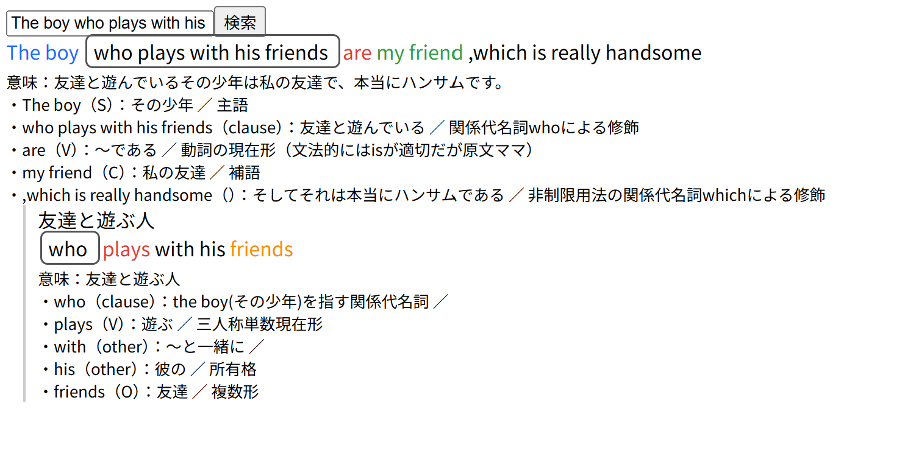

これはroleが空であることが原因とされ、プロンプトが十分に機能していないと推測されました。プロンプトを以下のように変更しました。

> The cause was that role was empty, and we inferred that the prompt was not working well enough. We changed the prompt as follows.

```python
"手順5:各segmentにrole(S/V/O/C/idiom/clause/other)、meaning(意味の解説)、caseInflection(格変化・活用の解説。無ければ空)を付ける。role=clauseの時だけclauseType(節の種類)も付ける。制限用法だけでなく非制限用法(例:「, which is really handsome」「, who ...」のようにカンマで始まる節)も、カンマごとrole=\"clause\"にする。\n"
```

起動したところ以下のように問題なく表示されました。

> After restarting, it was displayed correctly, as shown below.

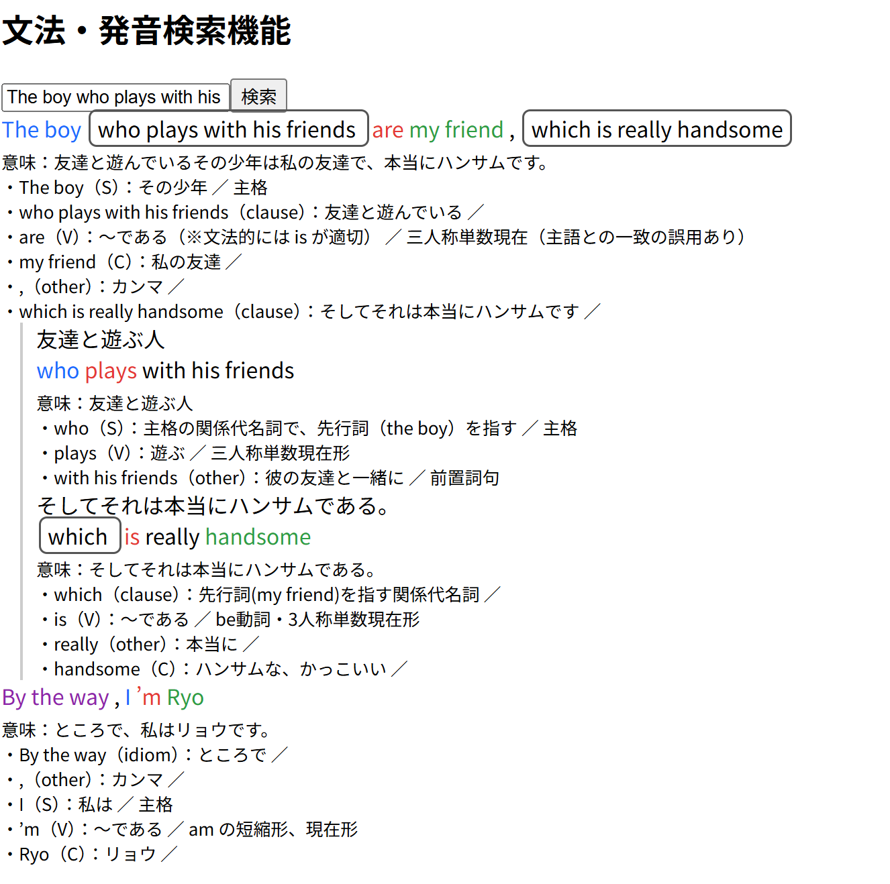

また「to call it a day and get some rest」を入力すると、中身が分解されずに無限に入れ子になる状態を解決するために、プロンプトが「to不定詞句はrole=clauseにまとめる」と言っているので、解析対象そのものがto不定詞句だと、それを丸ごと1個のclauseに再包装してしまうことを防ぐために、プロンプトを以下のように変更しました。

> In addition, when "to call it a day and get some rest" was entered, the contents were not broken down and became nested infinitely. Because the prompt says "group to-infinitive phrases as role=clause," when the target of analysis is itself a to-infinitive phrase, the model re-wraps the whole thing into a single clause. To prevent this, we changed the prompt as follows.

```text
"手順4:各文を『読む順のまま・一番外側の層だけ』でsegmentsに区切る。関係詞節・従属節・to不定詞句などの『さらに分解できるまとまり』はそれ以上分解せずrole=\"clause\"の1要素にまとめる(中は展開しない)。【最重要】解析対象そのものの全体を1つのsegment(特にrole=clause)にしてはいけない。解析対象は必ず内部を2つ以上のsegmentに分解する。role=\"clause\"にできるのは『解析対象の“内部”にある、より小さい節・句』だけで、解析対象と同じ範囲をclauseにしてはいけない。\n"
```

これにより、中身が分解されるようにしました。

> This makes the contents get broken down.

次に発音検索機能の実装に移りたいと思います。大まかな流れとしてバックエンドに文章と速度を送り、OpenAI TTSで速度を変えても音階が自然な音声を作ります。そしてフロントでそれを再生します。

> Next, we implement the pronunciation-search feature. The rough flow is: send the sentence and speed to the back end, and use OpenAI TTS to create audio whose pitch stays natural even when the speed changes. The front end then plays it.

まず発音検索でフロントから届くJSONの型を定義します。

> First, we define the type of the JSON sent from the front end for pronunciation search.

```python
class PronounceIn(BaseModel):
    text:str#読み上げる文章
    speed:float#読み上げる速度
```

また音声をそのまま返すのにFastAPIでResponseを追加します。

> We also add Response from FastAPI to return the audio as is.

```python
from fastapi import FastAPI, WebSocket, WebSocketDisconnect,Response
```

次に発音のエンドポイントを追加します。

> Next, we add the pronunciation endpoint.

```python
@app.post("/pronounce")
def pronounce(item:PronounceIn)
    result = openai_client.audio.speech.create(
        model = "tts-1"#speed対応のTTSモデル
        voice = "alloy"#声の種類
        input = item.text,#読み上げる文章
        speed = item.speed,#速度
    )
    return Response(content = result.content,media_type ="audio/mpeg")#音声をmedia_type ="audio/mpeg"でmp3音声として返答する
```

次にフロントで発音検索の入力文と読み上げ速度を保存する項目を追加します。

> Next, on the front end, we add items to store the pronunciation-search input text and the reading speed.

```tsx
const[pronInput,setPronInput] = useState('')//発音検索の入力文
  const[pronSpeed,setPronSpeed] = useState(1)//読み上げ速度（
```

そして実際に文章をTTSにして音声にして再生する関数を作ります。

> Then we create a function that actually turns the text into speech with TTS and plays it.

```tsx
async function playPronunciation() {
  const res = await fetch("http://localhost:8000/pronounce",{
    method:"POST",
    headers:{"Content-Type":"application/json"},
    body:JSON.stringify({text:pronInput,targetLang,speed:pronSpeed}),
  })
  const blob = await res.blob()          //返ってきた音声をblobとして受け取る
  const url = URL.createObjectURL(blob)  //そのblobを再生できる一時URLに変換
  new Audio(url).play()                  //音声を再生
}
```

実際にUIは以下のようになります。

> The actual UI looks like this.

```tsx
<h2>発音検索機能</h2>
       <input value={pronInput} onChange={(e)=>setPronInput(e.target.value)} placeholder="読み上げる文章"/>
       <label>
      速度 {pronSpeed}倍
      <input type="range" min={0.5} max={2} step={0.25} value={pronSpeed} onChange={(e)=>setPronSpeed(Number(e.target.value))}/>
      <button onClick={playPronunciation}>再生</button>
```

以上より目標の文章を発音検索できるようになりました。

> With this, the target sentence can now be searched for its pronunciation.

## 開発ログ / Development Log

### 2026/08/02①

会話内容が毎回上書きされるという問題が生じたため、チャット形式で会話履歴が残るように変更する。

> Since the conversation content was overwritten every time, we changed it so that the conversation history is kept in a chat format.

```tsx
const[messages,setMessages] = useState<{who:string,text:string}[]([]);
```

ここで{who:...,text:...}はオブジェクト１個の形とし、\[\]でその配列、\<\>でこの型をuseStateに伝える書き方になります。

> Here, {who:...,text:...} is the shape of a single object, \[\] is an array of them, and \<\> is the syntax for telling useState this type.

次にmessagesの今のリスト(prev)に新しいリストを次々と足していく。

> Next, new items are added one after another to the current list of messages (prev).

```tsx
 setMessages(prev => [...prev,{who:"You",text:msg.transcript}]);
```

ここで、prevという今のリストに...prevで全部展開をする。ここで\[...prev,新\]で古いの全部＋新しい１つの新しいリストの形になる。

> Here, ...prev expands everything in the current list prev, so \[...prev, new\] becomes a new list of all the old items plus one new item.

```text
style = {{display:"flex",flexDerection:"column",gap:"8px",maxWidth:"500px"}}
```

ここでは、flexで並べ、columnで縦に積む。そしてgapで8pxとして吹き出しの隙間を開けて、横いっぱいに吹き出しが広がらないようにmaxWidthを500pxに調整した。

> Here, flex lays them out and column stacks them vertically. gap is set to 8px to leave space between bubbles, and maxWidth is adjusted to 500px so the bubbles do not stretch across the full width.

```tsx
messages.map((m,i) => <div>...</div>
```

これで各メッセ―ジごとに\<div\>を一個ずつ作ることで、全メッセージが吹き出しになる。

> By creating one \<div\> per message, every message becomes a speech bubble.

```tsx
<div style = {{display:"flex",flexDirection:"column",gap:"8px",maxWidth:"500px"}}>
  {messages.map((m,i) => (
    <div key={i} style={{
      alignSelf:m.who === "You"?"flex-end":"flex-start",
      background:m.who === "You"?"#cce5ff":"#eeeeee",
      padding:"8px 12px",
      borderRadius:"12px",
    }}>
      {m.text}
    </div>
    ))}
    </div>
```

### 2026/08/02②

会話に成功したが、こちらの会話が途中で細かく区切られてしまうという問題が発生したため、沈黙を待つ時間を長くする。ここではバックエンドでAPIに送るJSONの中身を以下のように設定します。

> The conversation worked, but our own speech was being split into small pieces midway, so we lengthened the time spent waiting for silence. Here we set the contents of the JSON sent to the API from the back end as follows.

```text
"turn_detection":{
                            "type":"server_vad",
                            "silence_duration_ms":1200,#沈黙を1.2秒待つ
                        },
```

しかし、これでも意味的な区切りを理解できていないようなので、以下のように設定し直します。

> However, it still did not seem to understand semantic breaks, so we reconfigured it as follows.

```text
"turn_detection":{
                            "type":"server_vad",
                            "eagerness":"low",
                            "silence_duration_ms":1200, 
                        },#沈黙したら（無音が継続すれば終わり）と認識する
```

しかし、これではeagernessはsemantic_vad の設定なので無効になるため、

> However, eagerness is a setting of semantic_vad, so it has no effect here; therefore,

```text
"turn_detection":{
                            "type":"semantic_vad",
                            "eagerness":"low",
                        },#意味的に話し終わったかで区切る（eagerness:low=しっかり待つ）
```

これに変更しました。

> we changed it to this.

結果的に長文の返答に対応できるようになりました。

> As a result, it can now handle long replies.

### 2026/08/02③

履歴削除ボタンを追加

> Added a button to clear the history

```tsx
<button onClick={() => setMessages([])}>履歴を削除</button>
```

### 2026/08/29

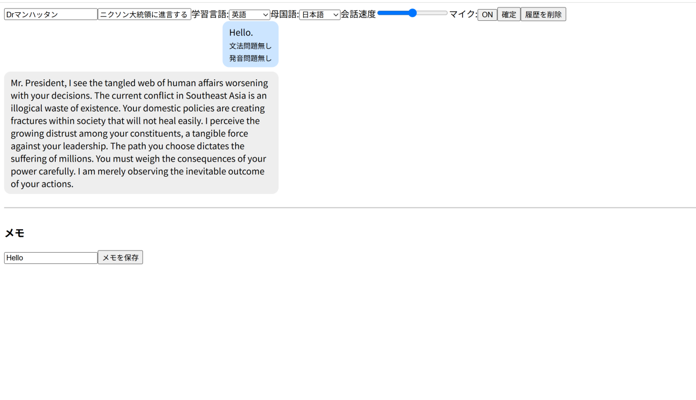

チャット欄（特にこちらの発言が偏って表示される）を修正するために、

> To fix the chat area (especially our own messages being displayed off to one side),

```text
 <div style = {{display:"flex",flexDirection:"column",gap:"8px",maxWidth:"500px"}}>
```

これにおいて、maxwidthをwidth:”100%”に変更し、Youチャット欄が画面の左端にくるようにします。さらに各吹き出しにmaxWidth:”50%”を追加します。

> here we change maxWidth to width:"100%" so that the You chat area sits at the left edge of the screen, and add maxWidth:"50%" to each bubble.

### 2026/09/03①

メモを削除できない問題が発生しましたが、これは

> A problem occurred where memos could not be deleted. This was because

```python
@app.delete("/delete")
```

なのに、フロントのメソッドがPOSTであったためであり、これをDELETEに変更することで解決しました。

> the endpoint is DELETE, but the front end's method was POST; changing it to DELETE solved the problem.

### 2026/09/03②

メモが重複して保存される問題が発生したため、これは

> A problem occurred where memos were saved in duplicate. This is because

```python
new_items = []#新しい要素を格納する変数
    for el in result["items"]:
        exists = conn.execute("SELECT 1 FROM memo_item WHERE text = ?",(el["text"],)).fetchone()
        if not exists:
            new_items.append(el)#表現が重複していなければ、その値を新しい要素を格納する変数に格納する
```

このループが実行される時、例えばresult\["items"\] = \[juicy, juicy\]の場合、一件目のjuicyはDBに無いため、new_itemsに追加されます。しかし二件目でもまだ一件目のjuicyはDBに保存されていないため、new_itemsにまた追加されてしまいます。そこでまずDBに保存する前に表現を変数に格納しておいて、その変数にその表現があればDBにINSERTしないようにします。具体的には以下の変数を用意します。

> when this loop runs, for example with result\["items"\] = \[juicy, juicy\], the first juicy is not in the DB, so it is added to new_items. But on the second item, the first juicy has still not been saved to the DB, so it gets added to new_items again. So before saving to the DB, we store the expressions in a variable, and if the expression is already in that variable, we do not INSERT it into the DB. Specifically, we prepare the following variable.

```python
 seen_texts = set()#同じ値が重複しない集合を作成
```

この変数はループ中にのみ、入力の表現を次々保存していき、もし処理の中で重複した表現がループで現れたら弾くように使います。具体的には以下のようにします。

> This variable keeps saving the input expressions one after another only during the loop, and is used to reject an expression if a duplicate appears during processing. Specifically, we do the following.

```python
 new_items = []#新しい要素を格納する変数
    seen_texts = set()#同じ値が重複しない集合を作成
    for el in result["items"]:
        text = el["text"]#表現のみ格納
        exists = conn.execute("SELECT 1 FROM memo_item WHERE text = ?",(el["text"],)).fetchone()
        if not exists and text not in seen_texts:#DBにも無く、今回の処理中にも重複して無ければ
            new_items.append(el)#表現が重複していなければ、その値を新しい要素を格納する変数に格納する
            seen_texts.add(text)#一時的に今回の処理の間だけ表現を保存
```

これにより、例えば入力で「AI and AI」と入力しても、「AI」としか表示されないようになりました。

> With this, for example, even if "AI and AI" is entered, only "AI" is shown.

### 2026/9/26~

Mingoで使用される音声録音には単なる発音内容だけではなく、話者の身元や性別、推定年齢、母語、感情状態や健康状態などの豊富な個人情報が含まれます。

> The voice recordings used in Mingo contain not only the pronunciation content but also a wealth of personal information, such as the speaker's identity, gender, estimated age, native language, emotional state, and health condition.

(Introduction,Andreas Nautsch,2019)

そのため、音声データの収集・保存・処理はデータ保護規制の対象となります。

> Therefore, the collection, storage, and processing of voice data are subject to data protection regulations.

特にEU　GDPRにおいて、生体データは「特定の技術的処理によって得られる、自然人の一意の識別を可能または確認する身体的・生理的・行動的特徴に関する個人データ」と定義されています。(2.1.1. At the EU level,Andreas Nautsch,2019)

> In particular, under the EU GDPR, biometric data is defined as "personal data resulting from specific technical processing relating to the physical, physiological or behavioural characteristics of a natural person, which allow or confirm the unique identification of that natural person." (2.1.1. At the EU level, Andreas Nautsch, 2019)

条文では特定の技術的処理を通じて個人の一意識別・認証に用いられる音声データも生体データに含まれると解釈されています。

> The text is interpreted to mean that voice data used for the unique identification or authentication of an individual through specific technical processing is also included in biometric data.

また米国のカリフォルニア州消費者プライバシー法などの法律では、生体情報の定義の中に音声録音や声紋が明確に例示されており、個人情報として規制されています。(2.1.2. In the US,Andreas Nautsch,2019)

> In the US, laws such as the California Consumer Privacy Act explicitly list voice recordings and voiceprints as examples in the definition of biometric information, regulating them as personal information. (2.1.2. In the US, Andreas Nautsch, 2019)

これに対する対策として、同意書の提示があります。

> One countermeasure is presenting a consent form.

まず音声データおよびそこから抽出される特徴量が個人・生体データとして扱われること、さらにその処理目的を明確に記載し、ユーザーから明示的な同意を取得します。

> First, we clearly state that voice data and the features extracted from it are treated as personal and biometric data, as well as the purpose of processing, and obtain explicit consent from the user.

次にWebSocketの/realtimeエンドポイントにOrigin検査がありません。

> Next, the WebSocket /realtime endpoint has no Origin check.

このOrigin検査とは、バックエンドがどこから接続を受けるとき、その接続を出すサイトの接続を無条件で受け入れてしまいます。つまり任意のWebサイトからAPIを呼べる状態になります。これにより悪意のあるサイトがこちらのGeminiやClaudeのAPIを勝手に不正利用される恐れがあります。また/hintなどのエンドポイントは毎回その都度呼ばれてしまうので乱用で課金が膨大化する恐れがあります。

> Without this Origin check, when the back end receives a connection, it unconditionally accepts connections from whatever site initiates them. In other words, the API can be called from any website. This creates a risk that malicious sites could misuse our Gemini and Claude APIs without permission. Also, since endpoints such as /hint are called every time, abuse could make charges balloon.

これらの対策は以下のようになります。。

> The countermeasures are as follows.

またエンドポイントのaccept()前にoriginを確認しまた無制限の想定外はclose(1008)するようにします。

> We also check the origin before accept() at the endpoint, and close(1008) anything unexpected or unrestricted.

他にもメモ本文・発音がLLMのプロンプトに混入で、悪意のある表現でLLMの挙動を誘導される可能性があります。

> In addition, memo text and pronunciation input are mixed into LLM prompts, so malicious expressions could steer the LLM's behavior.

これに対してプロンプトインジェクション対策としてAPIに対する指示とユーザー入力を明確にわけるといった対策をする必要があるでしょう。これによりシステム指示とユーザーデータが別の枠に入るので、モデルが「どちらの命令か」を区別しやすくなります。

> As a countermeasure against prompt injection, we should clearly separate the instructions to the API from the user input. This puts system instructions and user data in separate slots, making it easier for the model to tell "whose instruction this is."

まずユーザー認証についての実装方法を考察します。今回はAWSの「Cognito」というログインサービスを利用したいと考えます。

> First, we consider how to implement user authentication. This time we want to use AWS's login service, "Cognito."

流れとしては、ユーザーがログインするとCognitoが通行証であるJWTを渡します。次にMingoの画面はサーバーにアクセスするたびにこのJWTを見せ、サーバーはJWTが本物かCognitoの公開鍵で署名を確認し、期限が切れていないか、また自分宛てなものかを調べます。そして合格したユーザーのみを中に入れます。

> The flow is: when the user logs in, Cognito issues a JWT, which acts as a pass. Each time Mingo's screen accesses the server, it shows this JWT, and the server checks with Cognito's public key whether the JWT's signature is genuine, whether it has expired, and whether it is addressed to this app. Only users who pass are let in.

最初にアプリ全体をAuthProviderという、ログインのやり取りを代替えしてくれるreact-oidc-context というライブラリが用意している、Reactの部品（コンポーネント）で包みます。

> First, we wrap the whole app in AuthProvider, a React component provided by the react-oidc-context library, which handles the login exchange for us.

次のようにフロントのmain.tsxに行を追加します。

> We add the following lines to the front end's main.tsx.

```tsx
import { AuthProvider } from 'react-oidc-context'
```

そしてこのコンポーネントに「どこで、誰として、どうやってログインするか」を伝える名前と値のペアをまとめたオブジェクトを用意します。

> Then we prepare an object of name-value pairs that tells this component "where, as whom, and how to log in."

最初の値はauthority、つまりどのユーザープールを使うかを決定します。

> The first value is authority, which determines which user pool to use.

具体的には以下のような形になります。

> Specifically, it takes the following form.

```tsx
https://cognito-idp.{リージョン}.amazonaws.com/{ユーザープールID}
```

このリージョンには今回は東京であるap-northeast-1を使います。またユーザープールIDには今回発行されたap-southeast-2_QkRoNc1Eaを入れます。

> For the region we use ap-northeast-1 (Tokyo) this time, and for the user pool ID we enter the issued ap-southeast-2_QkRoNc1Ea.

次にクライアントIDを発行された情報であるor6n2iielpk6febma3fve0kbsを選択して記入します。これは自分は何のアプリかを名乗るための番号になります。

> Next, we fill in the client ID with the issued value or6n2iielpk6febma3fve0kbs. This is the number the app uses to identify itself.

さらにログインが終わったらどこに戻るのかを決定します。

> We also decide where to return to after login.

また今回はセキュリティ面からCognitoはJWTを渡さずまず引換券である（code)を使い、受け取り方法を設定します。

> For security, Cognito does not hand over the JWT directly; instead it first uses a claim ticket (code), so we set the response type accordingly.

最後にscopeでユーザーから欲しい情報の範囲を決定します。今回はメールアドレスを要求するので以下のようにします。

> Finally, scope determines the range of information we want from the user. This time we request the email address, as follows.

```text
scope: "openid email",
```

最後にログイン済みの状態のままURLを綺麗にします。これをすることでページが開かれるたびにエラーが起きないようにできます。

> Finally, we clean up the URL while staying logged in. This prevents errors every time the page is opened.

```tsx
 onSigninCallback: () => window.history.replaceState({}, document.title, window.location.pathname),
```

これはreplaceStateという現在の状態をページを再読み込みせず変更します。

> replaceState changes the current state without reloading the page.

そして最後にアプリ全体をこのログインで包むことで、App.txtのどこからでもJWTを使えるようにします。

> Finally, by wrapping the whole app in this login, the JWT can be used from anywhere in App.tsx.

```tsx
   <AuthProvider {...cognitoAuthConfig}>
    <App />
  </AuthProvider>
)
```

次にここで作成した受付であるAuthProviderにuseAuthでユーザーが認証を通過したかを問い合わせ、その認証の状態（読み込み中か、ログイン中か、ログイン後か）を識別してそれぞれで画面を切り替えます。そして同時にユーザーが取得したJWTを取り出します。

> Next, with useAuth we ask the AuthProvider "reception desk" created here whether the user has passed authentication, identify the authentication state (loading, logging in, or logged in), and switch the screen accordingly. At the same time, we take out the JWT the user obtained.

```text
import{useAuth} from 'react-oidc-context'
```

これはmain.tsxで\<App /\> を \<AuthProvider\> で包んだので、Appの中からこれにアクセスします。

> Since \<App /\> is wrapped in \<AuthProvider\> in main.tsx, we can access this from inside App.

```tsx
const auth = useAuth();
```

そしてauth.isLoadingがTrueなら確認作業中になり、auth.isAuthenticatedがTrueならログイン済みになります。まず確認作業中なら画面に読み込み中と表示します。

> If auth.isLoading is true, it is still checking; if auth.isAuthenticated is true, the user is logged in. First, while checking, we show "Loading" on the screen.

```tsx
if (auth.isLoading) return <p>読み込み中…</p>;
```

次にログインしていなければ、ログインボタンを出します。

> Next, if the user is not logged in, we show a login button.

```tsx
if (!auth.isAuthenticated) {
  return <button onClick={() => auth.signinRedirect()}>ログイン</button>;
}
```

ここでボタンが押されたらauth.signinRedirect()というログインするための別ページに移動します。

> When the button is pressed, auth.signinRedirect() navigates to a separate login page.

そして最後にJWTのうち、サーバーにこの機能を使ってよいという入場券であるaccess_tokenを格納し、auth.user（ログインしたユーザーの情報）が空（つまり未ログイン）ならundefinedを返すようにします。

> Finally, we store access_token—the part of the JWT that acts as an admission ticket allowing use of the server's features—and return undefined if auth.user (the logged-in user's information) is empty (that is, not logged in).

```tsx
const token = auth.user ?. access_token;
```

ここでこのtokenをサーバーに行くたびに自動で見せるようにします。

> Now we make this token be shown automatically every time we go to the server.

今では例えば発音検索機能には以下のようにサーバーの住所を付けるという機能があります。

> Currently, for example, the pronunciation-search feature attaches the server's address as follows.

```tsx
//==発音検索で入力文をTTSで音声で再生する関数 ==//
async function playPronunciation() {
  const res = await fetch("http://localhost:8000/pronounce",{
    method:"POST",
    headers:{"Content-Type":"application/json"},
    body:JSON.stringify({text:pronInput,targetLang,speed:pronSpeed}),
  })
  const blob = await res.blob()          //返ってきた音声をblobとして受け取る
  const url = URL.createObjectURL(blob)  //そのblobを再生できる一時URLに変換
  new Audio(url).play()                  //音声を再生
}
```

このうち以下の部分がそれに該当します。

> The following part corresponds to this.

```tsx
fetch("http://localhost:8000/pronounce"
```

このようにサーバーの住所を付け、さらにJWTを付けるという作業を1つの関数に任せ、既存の関数の変更を最小限にするようにします。

> We hand the work of attaching the server's address and also attaching the JWT to a single function, minimizing changes to existing functions.

```text
async function api(path:string,init:RequestInit={})
```

まずpath: stringで行先の住所の後半部分、例えばhttp://localhost:8000/pronounceなら/pronounceを指定します。init: RequestInitでは、RequestInitはブラウザが用意した型であり、fetchの注文票という意味を持ち、後のmethod・headers・body などを指定します。

> First, path: string specifies the latter part of the destination address—for example, /pronounce for http://localhost:8000/pronounce. For init: RequestInit, RequestInit is a type provided by the browser meaning fetch's "order form," which specifies method, headers, body, and so on.

全体の関数は以下のようになります。

> The whole function looks like this.

```tsx
async function api(path:string,init:RequestInit={}) {
  return fetch(`http://localhost:8000${path}`,{
    ...init,
    headers:{...init.headers,Authorization:'Bearer ${token}'},
  });
}
```

このうち...initはこれから呼ばれるmethod・headers・bodyなどをコピーし、そこにヘッダーをくっつけます。

> Here, ...init copies the method, headers, body, etc. that will be passed in, and the header is attached to them.

これを利用すると、発音検索機能は以下のようになります。

> Using this, the pronunciation-search feature looks like this.

```tsx
async function playPronunciation() {
  const res = await api("/pronounce",{
    method:"POST",
    headers:{"Content-Type":"application/json"},
    body:JSON.stringify({text:pronInput,targetLang,speed:pronSpeed}),
  })
  const blob = await res.blob()          //返ってきた音声をblobとして受け取る
  const url = URL.createObjectURL(blob)  //そのblobを再生できる一時URLに変換
  new Audio(url).play()                  //音声を再生
}
```

これを他の関数全てに適用していきます。

> We apply this to all other functions.

また次のようにWebSocketも同様に以下のように変更します。

> The WebSocket is changed in the same way, as follows.

```tsx
  const ws = new WebSocket('ws://localhost:8000/realtime?token=${token}');
```

次にサーバー側でこのJWTを審査する機能を追加してきます。

> Next, we add a feature on the server side that verifies this JWT.

まず今回はauth.pyという新しいファイルを作成して、検査係を作成します。

> First, we create a new file called auth.py and build the "inspector" in it.

```python
import os
import jwt                      # JWTを読む・確かめる道具
from jwt import PyJWKClient     # Cognitoの公開鍵を取ってくる道具
from dotenv import load_dotenv
from fastapi import Header, HTTPException

load_dotenv()  # .env を読む（main.py より先にこのファイルが読まれても困らないように）
REGION = os.environ["COGNITO_REGION"]
USER_POOL_ID = os.environ["COGNITO_USER_POOL_ID"]
CLIENT_ID = os.environ["COGNITO_CLIENT_ID"]
# 発行元（iss）：本物のCognitoなら必ずこの住所が書いてある
ISSUER = f"https://cognito-idp.{REGION}.amazonaws.com/{USER_POOL_ID}"
# 公開鍵の置き場所：Cognitoが世界に公開している
jwks_client = PyJWKClient(f"{ISSUER}/.well-known/jwks.json")
##== 実際に検査ををて、公開鍵か、方式はRS256か、署名は本物か、期限内か、発行元はMingoのプールか、などを審査し、合格ならclaims(ユーザーIDなど)を返答します。 ==##
def verify_token(token: str) -> dict:
    try:
        signing_key = jwks_client.get_signing_key_from_jwt(token)
        claims = jwt.decode(
            token,
            signing_key.key,
            algorithms=["RS256"],
            issuer=ISSUER,
            options={"require": ["exp", "iss", "token_use"]},
        )
    except jwt.PyJWTError:
        raise HTTPException(status_code=401, detail="invalid token")
    if claims.get("token_use") != "access" or claims.get("client_id") != CLIENT_ID:
        raise HTTPException(status_code=401, detail="invalid token")
    return claims
##== "Bearer" と JWT に分ける ==##
def get_current_user(authorization: str = Header(default="")) -> dict:
    scheme, _, token = authorization.partition(" ")
    if scheme.lower() != "bearer" or not token:
        raise HTTPException(status_code=401, detail="missing token")
    return verify_token(token)
```

次に、この検査係を全てのエンドポイントに配置していきます。

> Next, we place this inspector on every endpoint.

まずエンドポイントはitemで届いたJSONの型をチェックします。そして

> First, the endpoint checks the type of the JSON that arrived in item. Then,

```python
user:dict = Depends(get_current_user)
```

これを全てのエンドポイントに配置していきます。

> we place this on every endpoint.

Dependを使う理由として、FastAPIにこの関数を呼ぶようにするためです。

> The reason for using Depends is to have FastAPI call this function.

またuserにはもしエラーが無ければそのユーザーのIDなどが格納されます。

> Also, if there is no error, user stores that user's ID and other information.

全テーブルに user_id を追加し、検索・更新・削除を絞り込めるようにします。

> We add user_id to every table so that searches, updates, and deletions can be restricted to the user.

```python
    conn.execute("""CREATE TABLE IF NOT EXISTS memo_item(
        id INTEGER PRIMARY KEY AUTOINCREMENT,
        user_id TEXT NOT NULL,
        type TEXT NOT NULL,
        text TEXT NOT NULL,
        vector TEXT,
        created_at TEXT DEFAULT (datetime('now')),
        last_seen_at TEXT,
        half_life REAL DEFAULT 1.0,
        good INTEGER DEFAULT 0,
        bad INTEGER DEFAULT 0,
        hint_free_success INTEGER DEFAULT 0
    )""")
    ##== ダッシュボード用のDBを定義 ==##
    conn.execute("""CREATE TABLE IF NOT EXISTS mastered(
        id INTEGER PRIMARY KEY AUTOINCREMENT,
        user_id TEXT NOT NULL,
        text TEXT NOT NULL,
        mastered_at TEXT DEFAULT (datetime('now'))
    )""")
```

またメモ保存関数も以下のようになります。

> The memo-saving function also becomes as follows.

```python
@app.post("/memo")
def save_memo(item:MemoIn,user:dict = Depends(get_current_user)):
    user_id = user["sub"]#ログイン中のユーザーID
    result = split_memo(item.text)
    conn = sqlite3.connect("memo.db")

    #重複を除いた新しい要素だけを集める
    new_items = []#新しい要素を格納する変数
    seen_texts = set()#同じ値が重複しない集合を作成
    for el in result["items"]:
        text = el["text"]#表現のみ格納
        exists = conn.execute("SELECT 1 FROM memo_item WHERE user_id = ? AND text = ?",(user_id,el["text"],)).fetchone()
        if not exists and text not in seen_texts:#DBにも無く、今回の処理中にも重複して無ければ
            new_items.append(el)#表現が重複していなければ、その値を新しい要素を格納する変数に格納する
            seen_texts.add(text)#一時的に今回の処理の間だけ表現を保存
    #新しい要素のtextをまとめてベクトル化する
    if new_items:
        vectors = embed_texts([el["text"] for el in new_items])
        for el,vector in zip(new_items,vectors):
            conn.execute("INSERT INTO memo_item(user_id,type,text,vector) VALUES(?,?,?,?)",(user_id,el["type"],el["text"],vector,))
    conn.commit()
    conn.close()
    return{"status":"SAVED"}#フロントにJSONで返答する
```

進捗ダッシュボード機能、ヒント表示機能でも同様にします。

> We do the same for the progress dashboard feature and the hint display feature.

進捗ダッシュボード機能は以下のようになります。

> The progress dashboard feature looks like this.

```python
@app.get("/dashboard")
def dashboard(user:dict = Depends(get_current_user)):
    conn = sqlite3.connect("memo.db")
    rows = conn.execute("SELECT id,type,text,hint_free_success FROM memo_item WHERE user_id = ?",(user_id,)").fetchall()
    mastered_count = conn.execute("SELECT COUNT(*) FROM mastered WHERE user_id = ?",(user_id,)).fetchone()[0]#masterdから習得した表現（行）の数を習得し、(?.)タプルから[0]で?のみ取得する
    conn.close()
    learning = [{"id":id_,"type":type_,"text":text_,"hint_free_success":hfs_} for id_,type_,text_,hfs_ in rows]#rows = [(1,"word","juicy",2), (2,"idiom","get rid of",0)]から{"id":1,"type":"word","text":"juicy","hint_free_success":2},{"id":2,"type":"idiom","text":"get rid of","hint_free_success":0}のように(id, type, text, hint_free_success)の各行をid_, type_, text_, hfs_の4つの変数に分けて取り出し、{"id":id_, "type":type_, "text":text_, "hint_free_success":hfs_}という辞書を作る
    return{"mastered_count":mastered_count,"learning":learning}
```

ヒント機能は以下のようになります。

> The hint feature looks like this.

```python
@app.post("/hint")
def get_hint(item:HintIn,user:dict = Depends(get_current_user)):
    q_vec = json.loads(embed_texts([item.query])[0])#queryの一件目[0]をベクトル化し、それをPytonのリストに戻す
    conn = sqlite3.connect("memo.db")
    rows = conn.execute("SELECT type,text,vector,good,bad,julianday('now')-julianday(last_seen_at) AS delta_days FROM memo_item WHERE user_id = ?",(user["sub"],)).fetchall()#全メモから拾い
    conn.close()
    scored=[]
    for type_,text_,vector_,good_,bad_,delta_days_ in rows:#書くメモと類似度を計算
        if not vector_:#vectorが空（古いメモ）は飛ばす
            continue
        v = json.loads(vector_)
        sim = cosine_similarity(q_vec,v)
        p = recall_probability(good_,bad_,delta_days_)
        scored.append((sim,p,type_,text_))
    scored.sort(key=lambda s:s[0], reverse=True)#類似度s[0]が高い順に並べる。（reverse=Trueで適用する）特にsimが高い順に並べる
    relevant = scored[:5]#上位5件
    relevant.sort(key=lambda s:s[1])#さらにその中で想起確率s[1]が低い順
    top = relevant[:4]#さらにその中の上位５件
    hints = [{"type":t,"text":tx} for sim,p,t,tx in top]
    example = make_example(hints,item.query)
    return {"hints":hints,"example":example.get("example","")}
```

ヒントの使用状況の更新も以下のように変更します。

> Updating hint usage is also changed as follows.

```python
@app.post("/interaction")
def record_interaction(item:Interaction,user:dict = Depends(get_current_user)):
    user_id = user["sub"]
    conn = sqlite3.connect("memo.db")
    rows = conn.execute("SELECT id,text,good,bad,hint_free_success FROM memo_item WHERE user_id = ?",(user_id,)).fetchall()#全メモを取り出す
    all_texts = [r[1] for r in rows]#textのみ取り出す
    used = judge_used(item.utterance,all_texts)#実際に使われた表現
    for id_,text_,good_,bad_,hint_free_success_ in rows:
        is_used = text_ in used#実際に使われたか
        is_shown = text_ in item.shown#ヒントで見せたか
        if is_used and is_shown:#①ヒントを使った成功
            conn.execute("UPDATE memo_item SET good=good+1, last_seen_at=datetime('now') WHERE id=? AND user_id=?",(id_,user_id))
        elif is_used and not is_shown:#③ヒント無しで成功
            conn.execute("UPDATE memo_item SET good=good+2, hint_free_success=hint_free_success+1, last_seen_at=datetime('now') WHERE id=? AND user_id=?",(id_,user_id))
            if hint_free_success_ + 1 >= DELETE_MAX and recall_probability(good_+2, bad_, HALF_LIFE_MAX) >= 0.5:#習得済み
                conn.execute("DELETE FROM memo_item WHERE id=? AND user_id=?",(id_,user_id))
                conn.execute("INSERT INTO mastered(user_id,text) VALUES(?,?)",(user_id,text_))
        elif is_shown and not is_used:#②失敗（見たのに使わなかった）
            conn.execute("UPDATE memo_item SET bad=bad+1 WHERE id=?",AND user_id=?",(id_,user_id))
    conn.commit()
    conn.close()
    return {"status":"updated","used":used}
```

メモの削除も以下のように変更します。

> Deleting memos is also changed as follows.

```python
@app.delete("/delete")
def delete_memo(item:DeleteIn,user:dict = Depends(get_current_user)):
    conn = sqlite3.connect("memo.db")
    conn.execute("DELETE FROM memo_item WHERE id=? AND user_id=?",(item.id,user["sub"]))
    conn.commit()
    conn.close()
    return{"status":"deleted"}
```

またコード分析機能を自分だけが使えるようにフロントで切り替えられるようにします。

> We also make the code analysis feature switchable so that only we can use it.

これは.envファイルにENABLE_CODE_ANALYSIS=trueで自分のPCは今まで通り使え、何も書かない本番では機能ごとオフにできるようにします。

> With ENABLE_CODE_ANALYSIS=true in the .env file, it works as before on our own PC, and in production, where nothing is written, the whole feature can be turned off.

```python
ENABLE_CODE_ANALYSIS = os.environ.get("ENABLE_CODE_ANALYSIS","false").lower() == "true"
```

これでos.environ.get("ENABLE_CODE_ANALYSIS","false")で.envの値を読み、.lower()でTrueとTRUEを書いても問題がないように小文字に揃えます。そして== "true"で"true" のときだけ True、それ以外は全部 Falseにします。

> Here, os.environ.get("ENABLE_CODE_ANALYSIS","false") reads the value from .env, and .lower() converts it to lowercase so that writing True or TRUE also works. Then == "true" makes it True only when the value is "true," and False for everything else.

次にAIへの指示を切り替えられるようにします。

> Next, we make the instructions to the AI switchable.

元の指示文は以下のようです。

> The original instructions are as follows.

```python
def build_instructions(config:SessionConfig):
    return(
        f"You are {config.role}.The situation is:{config.situation}."
        f"When you answer use {config.targetLang}."
        f"Keep your replies 7 sentences."
        f"IMPORTANT: If the user asks you to check, read, explain, review, or fix any file or code, you MUST call the analyze_code tool. Never say you cannot access files. This rule overrides your persona and situation."
    )
```

これを以下のように切り替えられるようにします。

> We make them switchable as follows.

```python
def build_instructions(config:SessionConfig):
    text =(
        f"You are {config.role}.The situation is:{config.situation}."
        f"When you answer use {config.targetLang}."
        f"Keep your replies 7 sentences."
    )
    if ENABLE_CODE_ANALYSIS:
        text += f"IMPORTANT: If the user asks you to check, read, explain, review, or fix any file or code, you MUST call the analyze_code tool. Never say you cannot access files. This rule overrides your persona and situation."
    return text
```

さらにGeminiがそもそもそのClaude SDKの存在を知らせないように以下の箇所を変更します。

> In addition, we change the following part so that Gemini is not even told that the Claude SDK exists.

```text
gemini_config = {
        "response_modalities":["AUDIO"],#返事を音声にする
        "system_instruction":instructions,#指示文を入れる
        "input_audio_transcription":{"language_codes":[config.targetLang]},#自分の発言を文字起こしする
        "output_audio_transcription":{},#AIの発言を文字起こしする
        "tools":[CODE_TOOL],#コード分析ツール
    }
```

以下のように変更します。

> We change it as follows.

```python
    gemini_config = {
        "response_modalities":["AUDIO"],#返事を音声にする
        "system_instruction":instructions,#指示文を入れる
        "input_audio_transcription":{"language_codes":[config.targetLang]},#自分の発言を文字起こしする
        "output_audio_transcription":{},#AIの発言を文字起こしする
    }
    if ENABLE_CODE_ANALYSIS:
        gemini_config["tools"] = [CODE_TOOL]
```

次に1ユーザーあたりの呼び出し制限、プロンプトインジェクション対策を行います。

> Next, we implement a per-user call limit and countermeasures against prompt injection.

まず呼び出し制限からです。

> First, the call limit.

ここでは新しいテーブルに「誰が、どの入口（文法検索や文法解析などの機能、つまりエンドポイント）を、何日に何回呼んだか」を記録します。

> Here we record in a new table "who called which entry point (features such as grammar search and grammar analysis—that is, endpoints), on which day, and how many times."

```python
    conn.execute("""CREATE TABLE IF NOT EXISIS usage(
        user_id TEXT NOT NULL,
        endpoint TEXT NOT NULL,
        day TEXT NOT NULL,
        count INTEGER NOT NULL DEFAULT 0
        PRIMARY KEY(user_id,endpoint,day)
    )""")
```

ここで PRIMARY KEY(user_id,endpoint,day)で三つの組み合わせは一行だけ、つまり同じ人・同じ入口・同じ日の行が二つできないようにします。

> Here, PRIMARY KEY(user_id,endpoint,day) ensures that each combination of the three appears in only one row—that is, there cannot be two rows for the same person, the same entry point, and the same day.

次に１ユーザーの１日あたりの呼び出し上限を決定します。

> Next, we decide the daily call limit per user.

```text
LIMITS = {
    "memo":30,
    "hint":30,
    "interaction":1000,
    "grammar_search":50,
    "pronounce":50,
    "realtime":20,
}
```

大まかな仕組みとしては以下のようになります。

> The rough mechanism is as follows.

まずフロントが何かしらのエンドポイント（例えば/hint）を呼びます。そしてDBのエンドポイント（endpoint）にそのエンドポイントの名前を入れ、その名前をDBに書いて+1します。もし上限以内なら本物のエンドポイント関数が処理を実行し、上限以上ならフロントにエラーコードを返答するようにします。フロントはエラーコードを受け取り、それに伴った制限文を表示するようにします。

> First, the front end calls some endpoint (for example, /hint). The name of that endpoint is written into the endpoint column of the DB and its count is incremented by 1. If it is within the limit, the real endpoint function does its work; if it is over the limit, an error code is returned to the front end. The front end receives the error code and shows a corresponding limit message.

まず今日の呼び出し回数を+1して、その後の回数を返す関数を作成します。

> First, we create a function that increments today's call count by 1 and returns the count afterward.

まず以下のSQLを書きます。

> First, we write the following SQL.

```sql
INSERT INTO usage(user_id,endpoint,day,count)VALUES(?,?,date('now'),1)
```

これはあるユーザーの現在（その日）のカウントを数を1に初期設定します。

> This initializes the user's count for the current day to 1.

またもし同じユーザーに、同じ日に同じエンドポイントがあればカウントを1つ増やします。

> If the same user already has a row for the same endpoint on the same day, the count is incremented by 1 instead.

```text
ON CONFLICT(user_id,endpoint,day) DO UPDATE SET count = count + 1
```

またconn.execute( SQL , 値 )でSQLを実行し、(user_id,endpoint)をVALUEの値を入れ、

> conn.execute(SQL, values) runs the SQL, putting (user_id, endpoint) into the VALUES,

fetchone()でそのカウント数を取り出し、その一番目（つまり値だけ）を\[0\]でカウント数を数字で取り出します。全体の関数は以下のようになります。

> and fetchone() retrieves that count; \[0\] takes its first element (that is, just the value) as a number. The whole function looks like this.

```python
def count_usage(user_id,endpoint):
    conn = sqlite3.connect("memo.db")
    count = conn.execute(
        "INSERT INTO usage(user_id,endpoint,day,count)VALUES(?,?,date('now'),1)"
        "ON CONFLICT(user_id,endpoint,day) DO UPDATE SET count = count + 1"
        "RETURNING count",
        (user_id,endpoint),
    ).fetchone()[0]
    conn.commit()#変更を確定し、テーブルを作成
    conn.close()#DBへの接続を閉じる
    return count
```

次にJWTの検査とこの今日の呼び出し回数を+1して、その後の回数を返す関数をまとめた新しい関数を作成します。

> Next, we create a new function that combines the JWT check with the function that increments today's call count by 1 and returns the count afterward.

```python
def limited_user(request:Request,user:dict = Depends(get_current_user))#先にJWTの検査をして結果（ユーザーID）をuserに格納する
    endpoint = request.url.path#エンドポイントを格納
    if count_usage(user["sub"],endpoint) > DAILY_LIMITS[endpoint]:
        raise HTTPException(status_code = 429,detail = "daily limit reached")
    return user
```

この関数を全ての関数に適用していきます。

> We apply this function to all of the functions.

```python
def save_memo(item:MemoIn,user:dict = Depends(limited_user)):
def get_hint(item:HintIn,user:dict = Depends(limited_user)):
def record_interaction(item:Interaction,user:dict = Depends(limited_user)):
def dashboard(user:dict = Depends(limited_user)):
def grammar_serch(item:GrammarSearchIn,user:dict = Depends(limited_user)):
def pronounce(item:PronounceIn,user:dict = Depends(limited_user)):
```

また/realtimeエンドポイントにも同様の処理を施します。

> We apply the same processing to the /realtime endpoint as well.

```python
    if count_usage(user["sub"],"/realtime") > DAILY_LIMITS["/realtime"]:
        await websocket.close(code =1008)
        return
```

またフロントでもこれが表示されるようにします。

> We also make this visible on the front end.

今の全てのfetchにJWTを付ける関数を少し改良します。

> We slightly improve the current function that attaches the JWT to every fetch.

```tsx
async function api(path:string,init:RequestInit={}) {
  return fetch(`http://localhost:8000${path}`,{
    ...init,
    headers:{...init.headers,Authorization:`Bearer ${token}`},
  });
}
```

この時、すぐにfetchにJWTを付けたパスを返すのではなく、一旦値を格納して、その状態から、JWTの検査とこの今日の呼び出し回数を+1して、その後の回数を返す関数をまとめた新しい関数に書いてあるエラーコードを認識し、使用制限のメッセージを返答します。

> Instead of immediately returning the fetch with the JWT attached, we first store the result, then recognize the error code defined in the new function that combines the JWT check with the daily call counter, and show a usage-limit message.

```tsx
async function api(path:string,init:RequestInit={}) {
async function api(path:string,init:RequestInit={}) {
  const res = await fetch(`http://localhost:8000${path}`,{
    ...init,
    headers:{...init.headers,Authorization:`Bearer ${token}`},
  });
  if(res.status === 429){
    alert("利用制限に達しました。明日再利用できます")
  }
  return res;
}
```

AWSへ移します。具体的にはAmazon ECS Express Modeを使用し、サーバー、DB移行を行い、秘密情報はSecrets Managerへ送ります。

> Next, we move to AWS. Specifically, we use Amazon ECS Express Mode to migrate the server and DB, and send secrets to Secrets Manager.

ECS Express ModeはALB（ロードバランサー）という受付を置いて、利用者からのリクエストをコンテナに振り分けます。この受付は30秒ごとにコンテナに正常化どうか確認を行います。これをヘルスチェックと言います。

> ECS Express Mode places a reception desk called an ALB (load balancer) that distributes requests from users to containers. This reception desk checks every 30 seconds whether each container is healthy. This is called a health check.

ここで以下のようなエンドポイントを設置します。

> Here we add the following endpoint.

```python
@app.get("/health")
def health():
    return{"status":"ok"}
```

現在の形式では、画面をもらうときはhttp://localhost:5173（Vite)、APIを呼ぶときはhttp://localhost:8000(FastAPI)を呼んでいます。

> In the current setup, the screen is fetched from http://localhost:5173 (Vite), and the API is called at http://localhost:8000 (FastAPI).

もしこのままAWSに置くと、ユーザーのPCに8000番を探しに行き失敗してしまいます。

> If we put it on AWS as is, the user's browser would look for port 8000 on the user's own PC and fail.

ここでViteのproxy（代理人）機能を使用します。これを使うと、Viteの受付に「/memo宛てのリクエストが来たら、8000番に転送して」と頼んでおきます。

> Here we use Vite's proxy feature. With it, we ask Vite's reception desk: "When a request for /memo arrives, forward it to port 8000."

```tsx
import { defineConfig } from 'vite'
import react from '@vitejs/plugin-react'

const API = "http://localhost:8000"
export default defineConfig({
  plugins: [react()],
  server: {
    proxy: {//この窓口宛てのリクエストは、FastAPIに転送する
      "/memo": API,
      "/hint": API,
      "/interaction": API,
      "/dashboard": API,
      "/delete": API,
      "/grammar_search": API,
      "/pronounce": API,
      "/health": API,
      "/realtime": { target: API, ws: true },//WebSocketも転送する
    },
})
```

そしてフロントからlocalhost:8000を消しておきます。

> Then we remove localhost:8000 from the front end.

また以下の箇所を変更します。

> We also change the following part.

```tsx
  const ws = new WebSocket(`ws://localhost:8000/realtime?token=${token}`);
```

これでは住所がws://localhost:8000と固定されています。この場合、利用者のブラウザにとっては、localhostはそのユーザーのPCを示します。またws://ではAWSのページはhttps://（暗号化あり）であり、暗号化されたページから暗号化なしのws:// につなごうとすると、ブラウザが危ないと判断して止めます。

> Here the address is fixed as ws://localhost:8000. For the user's browser, localhost means that user's own PC. Also, the AWS page uses https:// (encrypted), and if an encrypted page tries to connect to an unencrypted ws:// address, the browser judges it unsafe and blocks it.

例えばfetch なら fetch("/memo") のように相対パス（住所を省略して窓口だけ書く）が使えました。しかしnew WebSocket() は、ws:// か wss:// から始まる完全な住所でないと受け付けません。

> For fetch, for example, we could use a relative path like fetch("/memo") (omitting the address and writing only the entry point). However, new WebSocket() only accepts a complete address starting with ws:// or wss://.

開いているページが自分のPC（http://localhost:5173）なら、バックエンドにはws://localhost:5173/realtime?...という風にVite が 8000 に転送します。

> If the open page is on our own PC (http://localhost:5173), the request goes to ws://localhost:5173/realtime?..., and Vite forwards it to port 8000.

しかし開いているページがAWS（https://mingo-xxxx.on.aws）なら、バックエンドにはwss://mingo-xxxx.on.aws/realtime?...という風にAWSに用意したFastAPIに直接送ります。

> But if the open page is on AWS (https://mingo-xxxx.on.aws), the request goes directly to the FastAPI on AWS, as wss://mingo-xxxx.on.aws/realtime?....

```tsx
//①今のページがhttps（PC）ならwss、それ以外（AWS）ならwsにします
    const wsProtocol = location.protocol === "https:" ? "wss" : "ws";

    //②接続先を確定
    const ws = new WebSocket(`${wsProtocol}://${location.host}/realtime?token=${token}`);
```

また戻り先の住所も自動にします。これはmain.tsxに書き込みます。

> We also make the return address automatic. This is written in main.tsx.

```tsx
const cognitoAuthConfig = {  
  authority: "https://cognito-idp.ap-southeast-2.amazonaws.com/ap-southeast-2_QkRoNc1Ea",
  client_id: "or6n2iielpk6febma3fve0kbs",
  redirect_uri: "window.location.origin",
  response_type: "code",
  scope: "openid email",
  onSigninCallback: () => window.history.replaceState({}, document.title, window.location.pathname),
};
```

次にFastAPIから画面を配る処理を施します。

> Next, we make FastAPI serve the screen.

まずビルドした画面のファイルを配る道具をインポートします。

> First, we import the tool that serves the built screen files.

```python
from fastapi.staticfiles import StaticFiles
```

そしてまず以下の変数にdistファイルを格納します。

> Then we first store the dist folder in the following variable.

```python
FRONTEND_DIR = os.path.join(os.path.dirname(__file__),"..","frontend","dist")
```

\_\_file\_\_ は「このファイル（main.py）自身の場所」という意味で、os.path.dirname(\_\_file\_\_)でバックエンドフォルダという意味になります。そして".."で1つ上のフォルダ（mingo）になります。また"frontend","dist"でそのdistファイルとなります。

> \_\_file\_\_ means "the location of this file (main.py) itself," and os.path.dirname(\_\_file\_\_) means the backend folder. ".." is one folder up (mingo), and "frontend","dist" points to the dist folder.

もしビルドした時に画面があれば以下の関数を実行します。

> If the built screen exists, we run the following.

```python
app.mount("/",StaticFiles(directory=FRONTEND_DIR,html = True),name = "frontend")
```

これは、mountで「この住所より下は、全部この係に任せる」という意味であり、"/"は一番上の住所（つまり全部）であり、StaticFiles(directory=...)ではフォルダの中のファイルをそのまま配るようにします。またhtml=Trueで/にアクセスされたらindex.htmlを返すようにします。

> Here, mount means "leave everything under this address to this handler," "/" is the top-level address (that is, everything), and StaticFiles(directory=...) serves the files in the folder as they are. html=True returns index.html when / is accessed.

また画面とAPIが同じプログラムに入ったので、CORSの設定を削除します。

> Also, since the screen and the API are now in the same program, we remove the CORS settings.

次に、テストを書きます。

> Next, we write tests.

テストはプログラムやアプリを作った時に、「期待通りに正しく動くか」「バグがないか」をあらかじめ確認する作業のこと(Abstract,Upulee Kanewala, James M. Bieman,2018)を言います。
その中でユニットテストはプログラム全体ではなく、関数やメソッドなどの「一番小さな部品（ユニット）」ごとに分けて行うテストのことです。(3.2. RQ2: Are there special characteristics or faults in scientific software or its development that make testing difficult?,Upulee Kanewala, James M. Bieman,2018)のことです。これによりバグの場所がすぐにわかるだけではなく、細かい部品の段階で計算誤差や間違いを直しておくことで全体を組んだ時に大きなトラブルになるのを防げます。ソフトウェアのテストはまず関数やモジュールなどの「一つの部品」のテストを行い、それら部品同士を「組み合わせたとき」にうなく連動するかを確かめるテストである結合テストを行い、最後に全体テストを行うのが一般的です。
今回テストする対象は、二つのベクトルの意味的な近さを測るコサイン類似度関数にします。これらは入力に対して、どちらも出力がある程度決まっていて、尚且つAIのAPIを呼び出さないためテストの対象に適切であると考えたからです。

今回はpytestを使用します。

> Software testing refers to the process of checking in advance whether a program or application works correctly as expected and whether it contains bugs (Kanewala & Bieman, 2018).Among the different types of software testing, unit testing is a type of testing in which a program is divided into its smallest components, or “units,” such as individual functions and methods, and each unit is tested separately (Kanewala & Bieman, 2018, Section 3.2, “RQ2: Are there special characteristics or faults in scientific software or its development that make testing difficult?”). Unit testing not only makes it easier to identify the location of bugs, but also helps prevent major problems when the entire system is assembled by detecting and correcting calculation errors and other problems at the individual component level.In general, software testing begins with testing individual components, such as functions or modules. Next, integration testing is performed to verify whether these components work correctly together when they are combined. Finally, system-level testing is conducted to verify the behavior of the entire system.For this project, the cosine similarity function, which measures the semantic similarity between two vectors, will be selected as the target of unit testing. This function is considered suitable for testing because its output is relatively predictable for a given input and it does not require calls to an AI API.For the unit tests, pytest will be used.


```python
import pytest
from main import cosine_similarity,recall_probability
```
これでまずimport pytestでpytestを取り出し、その下の関数でテストしたい関数をmain.pyから取り出します。
そしてコサイン類似関数において、関数の入力は以下のようになります。
def cosine_similarity(a,b):
ここで入力aと入力bの二つが同じ向きなら1、直角なら0、反対なら-1となるべきです。

まずaが1,2,3でbが1,2,3に設定します。このように複数の次元の入力にするのは、Mingoで使用しているOpenAI の text-embedding-3-large が作るは3000以上であるため、できるだけ複数の入力にする必要があるためです。
今回の場合、内積は1×1 + 2×2 + 3×3  = 1 + 4 + 9 = 14、長さはnorm_a = √(1² + 2² + 3²) =14、長さはnorm_b = √(1² + 2² + 3²) =14となり、結果として14 ÷ (√14 × √14) = 14 ÷ 14 = 1となります。
このテストは以下のようになります。

> First, `import pytest` is used to import the pytest framework. The function below it imports the function to be tested from `main.py`.

The input of the cosine similarity function is defined as follows:

```python
def cosine_similarity(a, b):
```

For this function, if the input vectors `a` and `b` point in the same direction, the result should be 1. If they are perpendicular to each other, the result should be 0. If they point in opposite directions, the result should be -1.

First, `a` is set to `[1, 2, 3]`, and `b` is also set to `[1, 2, 3]`. Multiple dimensions are used as inputs because the `text-embedding-3-large` model used by Mingo generates embeddings with more than 3,000 dimensions. Therefore, it is preferable to use multiple input dimensions rather than testing the function with only a single value.

In this case, the dot product is calculated as follows:

`1 × 1 + 2 × 2 + 3 × 3 = 1 + 4 + 9 = 14`

The magnitude (norm) of vector `a` is:

`norm_a = √(1² + 2² + 3²) = √14`

Similarly, the magnitude of vector `b` is:

`norm_b = √(1² + 2² + 3²) = √14`

Therefore, the cosine similarity is:

`14 ÷ (√14 × √14) = 14 ÷ 14 = 1`

Thus, because the two vectors are identical and point in exactly the same direction, the expected result is 1. The unit test is implemented as follows.

```python
def test_same_direction_is_1():
    assert cosine_similarity([1,2,3],[1,2,3]) == pytest.approx(1,0)
```
ここでassert 実際の結果 == 期待する結果とすることで期待する結果であれば合格、そうでなければ不合格とします。
またpytest.approx(1,0)はほぼ0ならOKという意味です。これはコンピュータは少数をほんの少しずれた値で計算することがあるからです。
次にA = [1, 0]、B = [0, 1]というベクトルが直角であるかを測るテストを書きます。
今回の場合、内積は1×0 + 0×1 = 0 + 0 = 0、長さはnorm_a = √(1² + 0²) = 1、norm_b = √(0² + 1²) = 1で結果は0 ÷ (1 × 1) = 0となります。

このテストは以下のようになります。


```python
def test_right_angle_is_0():
    assert cosine_similarity([1, 0], [0, 1]) == pytest.approx(0,0)
```
そしてA = [1, 2]、B = [-1, -2]というベクトルが反対であることを測るテストを書きます。
今回の場合、内積は1×(-1) + 2×(-2) = -1 - 4 = -5、長さは norm_a = √(1² + 2²)  = √5、norm_b = √((-1)² + (-2)²)   = √5 で結果は -5 ÷ (√5 × √5) = -5 ÷ 5 = -1となります。
このテストは以下のようになります。

```python
def test_opposite_direction_is_minus_1():
    assert cosine_similarity([1, 2], [-1, -2]) == pytest.approx(-1,0)
```

最後にMingoでメモの文の長さでベクトルの長さが変わっても、結果に影響しないことを確認する必要があります。
ここでA = [1, 2]、B = [10, 20]（同じ向きで、長さが10倍）というベクトルが、向きだけを比較し、長さは無視するというようにします。
内積は1×10 + 2×20  = 10 + 40 = 50、長さはnorm_a = √(1² + 2²)  = √5、norm_b = √(10² + 20²)   = √500 = 10√5で、結果は50 ÷ (√5 × 10√5) = 50 ÷ 50 = 1となります。
このテストは以下のようになります。

```python
def test_length_does_not_matter():
    assert cosine_similarity([1, 2], [10, 20]) == pytest.approx(1,0)
```
これらのテストはブラックボックステストとなります。これは「こう入れたら、こう出るはず」という外から見た約束を明記したテストであるためです。
元々、メモの文の長さでベクトルに長さが変わる可能性がありましたが、ユーザーはそれに関わらずに安心してメモを保存し、ヒントとして利用することができました。
ユニットテストには複数の種類があります。例えばプログラム内部の処理ルートをどれくらい実行できたかを基準にする構造テストがあります。(1.3 Categories of Test Data Adequacy Criteria,Zhu, Hall & May ,1997)
例えばプログラム内の全ての命令を少なくとも一回は実行させるテストである命令網羅や、「もし～なら」などのの条件分岐における「YES/NO」の全てのルートを通るテストです。(1.1 The Notion of Test Adequacy,Hall & May ,1997)
また変数に値を入力してから、その値を使うまでのデータの流れが正しいかを確認するテストであるデータフローテストがあります。
またプログラムにあえて小さな人口バグを混入させ、作成したテストがそのバグを正しく検出して退治できるかを調べるテストであるミューテーションテストや、条件判定の境目となる数値を重点的にテストし、判定のミスを見つけ出す境界値分析テストがあります(4.2 Program-Based Input-Space Partitioning,Zhu, Hall & May ,1997)
ユニットテストはコードのどれくらいの割合を実行できたか、どれくらいのバグを検出できたかを数値として客観的に確認できるため、テストの抜け漏れを防ぎ、いつテストを終了してよいかの明確な基準が得られます。
またシステム全体の完成を待たずに部品ごとのバグを早期に発見・修正できるため、完成後に重大な障害が発生する確率を大幅に減らし、システムの信頼性や安全性に対する客観的な確信を高めることができます。


AWSへデプロイします。

> We deploy to AWS.

まずCIとは作ったプログラムを頻繁に合体させ、壊れていないか自動でテストする、いわゆる継続的統合といいます。(II. FOUNDATIONS,Shahin, M., Babar, M. A., & Zhu, L. ,2017)

> First, CI—continuous integration—means frequently merging the programs we build and automatically testing whether anything is broken. (II. FOUNDATIONS, Shahin, M., Babar, M. A., & Zhu, L., 2017)

この仕組みでは、開発者達が何度も自分の作ったプログラムを持ちより（統合）、正しく動くかどうかの組み立てと確認（自動テスト）をシステムが自動で行います。

> In this approach, developers repeatedly bring together (integrate) the programs they have written, and the system automatically builds and verifies (automated tests) whether they work correctly.

これにより、バグや失敗を早い段階で見つけることでき、品質や作業の効率が高まります。

> This makes it possible to find bugs and failures early, improving quality and work efficiency.

CDには運用方法の違いによって、「継続的デリバリー」と「継続的デプロイ」の二つの段階・意味があります。まず継続的デリバリーとはテストをクリアして、いつでも本番公開できる状態に保つことをいいます。ここでは、自動テストなどを通って準備はいつでも完了していますが、最後の本番公開ボタンを押す作業だけは人間が手動で行います。

> Depending on how it is operated, CD has two stages or meanings: "continuous delivery" and "continuous deployment." Continuous delivery means keeping the software in a state where it passes the tests and can be released to production at any time. Here, everything is always ready after passing automated tests and so on, but the final step of pressing the production release button is done manually by a person.

継続的デプロイはテストを通過したら人間の手を挟まずに自動で本番公開まで完了させることをいいます。これは開発者が修正を保存すると、テストからユーザーの手元への配信まで一切の手動作業なしで全自動で行われます。

> Continuous deployment means that once the tests pass, the release to production is completed automatically without any human intervention. When a developer saves a fix, everything from testing to delivery into users' hands is fully automated, with no manual work at all.

これらのCI/CDには以下のようにメリットがあります。

> CI/CD has the following benefits.

まず開発した新機能や修正を素早く安全にユーザーへ届けることができます。

> First, newly developed features and fixes can be delivered to users quickly and safely.

また組み立てやテスト、公開作業の自動化により、手作業を減らすことができます。さらに素早くリリースできるため、ユーザーからのフィードバックを素早く収集して次の改善に活かせます。(Abstract,Shahin, M., Babar, M. A., & Zhu, L. ,2017)

> Automating building, testing, and releasing also reduces manual work. And because releases are faster, feedback from users can be collected quickly and used for the next improvement. (Abstract, Shahin, M., Babar, M. A., & Zhu, L., 2017)

GitHub Actionsは様々な作業を自動化してくれる機能です。

> GitHub Actions is a feature that automates a wide range of tasks.

(I. INTRODUCTION,Kinsman, T., Wessel, M., Gerosa, M. A., & Treude, C. 2021)

これは特定のきっかけが起きたらあらかじめ決めておいた処理を自動で実行するという仕組みになっています。具体的には新しいプログラムが提出されたとき、正しく動くかやルール通りに書かれているかを自動で検査します。また修正や追加が完了したプログラムを自動でサーバーへ送り、公開状態にします。

> It works by automatically running predefined processing when a specific trigger occurs. Specifically, when a new program is submitted, it automatically checks whether it works correctly and follows the rules. It can also automatically send programs whose fixes or additions are complete to a server and publish them.

この機能はプロジェクト内に専用の設定ファイルを作成することで動作します。(II. WORKFLOW AUTOMATION WITH GITHUB ACTIONS,Kinsman, T., Wessel, M., Gerosa, M. A., & Treude, C. 2021)

> This feature works by creating a dedicated configuration file in the project. (II. WORKFLOW AUTOMATION WITH GITHUB ACTIONS, Kinsman, T., Wessel, M., Gerosa, M. A., & Treude, C., 2021)

まずプロジェクトの中にある.github/workflows/というフォルダの中にYAMLという形式のファイルを作成します。次にコードが更新されたとき、新しい提案が届いた時などのイベントで自動処理を動かすかを記述します。

> First, we create a file in YAML format inside the .github/workflows/ folder in the project. Next, we describe on which events—such as when code is updated or when a new proposal arrives—the automated processing should run.

これにより手作業での確認やテストの手間を大幅に減らせるため、開発者がより重要な作業に集中でき、製品の品質や開発速度が上がります。

> This greatly reduces the effort of manual checking and testing, so developers can focus on more important work, and product quality and development speed improve.

前述した通り、各自が作ったプログラムを1つに統合する際、これまでは合体させて初めて動かないことが発覚するというトラブルが頻発していました。しかしこの自動化ツールを導入したら、採用されないプログラム提案の却下数が増加しました。これは一見ネガティブに見えますが、自動テストで不具合が即座に発見されて早めに弾かれるため、欠陥のあるコードが本体に混ざる重大トラブルを防げていることを示しています。また正式に合体されるプログラムについては1つの提案あたりの修正回数が減少しました。(V. DISCUSSION,Kinsman, T., Wessel, M., Gerosa, M. A., & Treude, C. 2021)

> As mentioned above, when integrating programs written by different people into one, trouble used to occur frequently where it was discovered only after merging that things did not work. However, after introducing this automation tool, the number of rejected program proposals increased. This may look negative at first, but it shows that defects are found immediately by automated tests and rejected early, preventing the serious trouble of defective code getting mixed into the main code. In addition, for programs that are formally merged, the number of revisions per proposal decreased. (V. DISCUSSION, Kinsman, T., Wessel, M., Gerosa, M. A., & Treude, C., 2021)

これは自動テストから即座にフィードバックがもらえるため、無駄なやり直しを減らして少ない手戻りで高品質な統合が可能になります。またプログラムが完成してからユーザーの元へ届ける手順も自動化されます。これは以前は手動で行っていたWebサイトの更新やパッケージの公開処理をデプロイ用のアクションが自動で実行します。これにより自動テストをクリアした安全なプログラムだけが自動で本番環境に送りだされるため、失敗のリスクを最小限に抑えながら、新しい機能をユーザーへ素早く届けることができます。

> This is because immediate feedback from automated tests reduces wasted rework, enabling high-quality integration with little back-and-forth. The steps for delivering the finished program to users are also automated: deployment actions automatically perform website updates and package publishing that used to be done manually. As a result, only safe programs that have passed automated tests are automatically sent to production, so new features can be delivered to users quickly while minimizing the risk of failure.

Mingoは フロント（React/TypeScript） と サーバー（FastAPI/Python） の2つでできているので、チェックも2列に分けます。

> Mingo consists of two parts—the front end (React/TypeScript) and the server (FastAPI/Python)—so the checks are also split into two tracks.

そもそもCIとは自分が手作業で打っているコマンドをGithubに代わりに打ってもらうことをいいます。まずは型チェックです。例えば()の閉じ忘れや見えない変数で画面が真っ白になります。またビルドできないと公開できません。さらに他人のメモが見えないようにする必要もあります。またテストコードは偽物のJWTなら入口全てでエラーを返すようにします。また検査係（verify_token）が、期限切れ・違うユーザープール・違うアプリ・IDトークン・alg: none を全部断るようにします。さらに他人のメモが見えない・変えられない・消せないようにし、分析機能のスイッチがオフならファイルを読まないようにします。

> CI is essentially having GitHub run the commands you would otherwise type by hand. The first is type checking: for example, a missing closing parenthesis or an undefined variable can turn the screen completely white. Also, if it cannot be built, it cannot be released. We also need to make sure other users' memos cannot be seen. The test code checks that every entry point returns an error for a fake JWT. It also checks that the inspector (verify_token) rejects all of the following: expired tokens, a different user pool, a different app, ID tokens, and alg: none. Furthermore, it ensures that other users' memos cannot be seen, changed, or deleted, and that no files are read when the analysis feature switch is off.

またCD（デプロイ）では自分のPCのMingoを他のユーザーが使えるようにします。画面は S3 + CloudFront、サーバーは EC2に置きます。

> In CD (deployment), we make Mingo, which runs on our own PC, available to other users. The screen is placed on S3 + CloudFront, and the server on EC2.


## 引用 / References

OpenAI,Pricing,

[<u>Pricing \| OpenAI API</u>](https://developers.openai.com/api/docs/pricing)

Google,Gemini Developer API,

[Gemini Developer API の料金  \|  Gemini API  \|  Google AI for Developers](https://ai.google.dev/gemini-api/docs/pricing?hl=ja)


Debadatta Patel(2026),Language Learning Apps Market Outlook

Aleksandar Petrov, Emanuele La Malfa, Philip H.S. Torr, Adel Bibi(2023),

Language Model Tokenizers Introduce Unfairness Between Languages

Watcharapol Wiboolyasarin(2025), AI-driven chatbots in second language education: A systematic review of their efficacy and pedagogical implications

Debadatta Patel(2026),Language Learning Apps Market Research Report 2034,

[Language Learning Apps Market Research Report 2034](https://marketintelo.com/report/language-learning-apps-market)

Conneau, A., et al. (2022). FLEURS: Few-shot Learning Evaluation of Universal Representations of Speech.

Shahul Es, Jithin James, Luis Espinosa-Anke, Steven Schockaert（2023）,RAGAS: Automated Evaluation of Retrieval Augmented Generation

Zhu, Hall & May (1997). Software unit test coverage and adequacy. ACM Computing Surveys


Retrieval-Augmented Generation for　Knowledge-Intensive NLP Tasks

Dongliang Ding1,2　& Ahmad Muhyiddin B Yusof(2025),Investigating the role of AI-powered conversation bots in enhancing L2 speaking skills and reducing speaking anxiety: a mixed methods study

Settles & Meeder (2016) ,A Trainable Spaced Repetition Model for Language Learning

Nur Basak Karatas(2025),Improving second language vocabulary learning and retention by leveraging memory enhancement techniques: A multidomain pedagogical approach

Andreas Nautsch,Preserving privacy in speaker and speech characterisation(2019)

Jaap-Henk Hoepman,Privacy Design Strategies(2024)

ダイレクト出版株式会社(2024),【OpenAI Embeddings API】文字列をベクトル化して意味の近さを計測してみよう,<https://qiita.com/kana_zzzz/items/aa1a92c9c35d566e4194>

Shahin, M., Babar, M. A., & Zhu, L. (2017). Continuous Integration, Delivery and Deployment: A Systematic Review on Approaches, Tools, Challenges and Practices. IEEE Access, 5, 3909–3943.

Kinsman, T., Wessel, M., Gerosa, M. A., & Treude, C. (2021). How Do Software Developers Use GitHub Actions to Automate Their Workflows? MSR 2021

Upulee Kanewala, James M. Bieman(2018),Testing Scientific Software: A Systematic Literature Review
